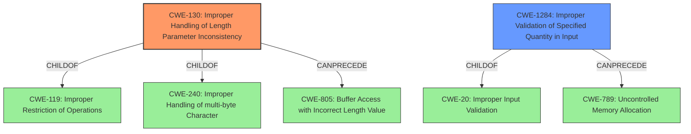

# Analysis for CVE-2022-3290

# Summary
| CWE ID | CWE Name | Confidence | CWE Abstraction Level | CWE Vulnerability Mapping Label | CWE-Vulnerability Mapping Notes |
|---|---|---|---|---|---|
| CWE-130 | Improper Handling of Length Parameter Inconsistency | 0.9 | Base | Allowed | Primary CWE |
| CWE-1284 | Improper Validation of Specified Quantity in Input | 0.7 | Base | Allowed | Secondary Candidate |

## Evidence and Confidence

*   **Confidence Score:** 0.9
*   **Evidence Strength:** HIGH

## Relationship Analysis
The primary CWE identified is CWE-130, which is a Base level CWE. This is related to CWE-240 and CWE-119 through ChildOf relationships. CWE-130 can also precede CWE-805 which deals with buffer access with incorrect length value which could be a subsequent weakness. CWE-1284 is related to CWE-20 and can precede CWE-789.

## Vulnerability Chain
The vulnerability chain starts with **improper handling of the length parameter** (CWE-130), which arises from **insufficient input validation** in the username field. This **lack of validation** may lead to a buffer overflow. An overly long username could lead to data corruption or application instability (DoS).

## Summary of Analysis
The initial assessment pointed towards CWE-NVD-Other based on similar CVE descriptions. However, after reviewing the root cause analysis and retriever results, a more specific CWE was identified.

The vulnerability stems from the **improper handling of length parameter inconsistency** (CWE-130) specifically related to the username field. The application **fails to limit the length of the username field**. This aligns with the description of CWE-130, which focuses on the product's inability to handle length fields that are inconsistent with the actual data length. This can lead to unexpected behavior and potential attacks. The retriever results also list CWE-130 as the top candidate with a high similarity score.

CWE-1284 (Improper Validation of Specified Quantity in Input) is also considered because the length of the username is a quantity that is not properly validated. While CWE-130 more directly addresses the inconsistency issue, CWE-1284 highlights the lack of validation as a contributing factor.

The evidence supporting this decision comes from the "CVE Reference Links Content Summary," which explicitly states that the root cause is the **lack of input validation** on the username field, which allowed excessively long usernames. The fix was to limit the username field length to 256 characters.

Other CWEs considered:

*   CWE-786 (Access of Memory Location Before Start of Buffer) and CWE-124 (Buffer Underwrite ('Buffer Underflow')): These were considered but are less relevant because the primary issue is the handling of the length parameter and not necessarily an underwrite condition.
*   CWE-805 (Buffer Access with Incorrect Length Value): This is a related CWE, but CWE-130 is more specific to the **improper handling of the length parameter** itself.
*   CWE-126 (Buffer Over-read): This could be a consequence, but the root cause is the improper handling of the length parameter.
*   CWE-835 (Loop with Unreachable Exit Condition ('Infinite Loop')): This doesn't directly apply as the vulnerability doesn't involve a loop with an unreachable exit condition.
*   CWE-614 (Sensitive Cookie in HTTPS Session Without 'Secure' Attribute): This is irrelevant to the described vulnerability.

The chosen CWEs are at the Base level of abstraction, which is the preferred level for mapping to the root causes of vulnerabilities. CWE-130 is the primary cause, and CWE-1284 is a contributing factor highlighting the lack of input validation.

# Enhanced Query for CVE-2022-3290

## Vulnerability Description
**Improper Handling of Length Parameter Inconsistency** in GitHub repository ikus060/rdiffweb prior to 2.4.8.

### Vulnerability Description Key Phrases
- **rootcause:** **Improper Handling of Length Parameter Inconsistency**
- **product:** ikus060/rdiffweb
- **version:** prior to 2.4.8

### CWE for similar CVE Descriptions
### Primary CWE Match
CWE-NVD-Other

#### Top CWEs
- CWE-NVD-Other (Count: 6)

## CVE Reference Links Content Summary
Based on the provided content, here's an analysis of CVE-2022-3290:

**Root cause of vulnerability:**
The vulnerability stems from the lack of input validation on the username field within the rdiffweb application. Specifically, the application did not limit the length of the username field, allowing for excessively long usernames.

**Weaknesses/vulnerabilities present:**
- **Insufficient input validation:** The application failed to enforce a maximum length for the username field.
- **Potential for buffer overflow (implied):** While not explicitly stated, the lack of input validation suggests a potential for buffer overflow issues if an excessively long username is used in contexts where limited buffer size is allocated.

**Impact of exploitation:**
- **Denial of Service (DoS) or application instability:** Although not explicitly mentioned the vulnerability may allow for a denial of service attack. It is likely that large inputs will cause exceptions and application instability.
- **Data corruption:** If an overly long username is accepted and processed, it could lead to unexpected behavior or data corruption depending on how the data is stored/used.

**Attack vectors:**
- **Web interface:** The vulnerability is exploitable through the web interface of the rdiffweb application when creating or updating a user.

**Required attacker capabilities/position:**
- **Access to the web interface:** The attacker needs to be able to access the part of the web application that handles user creation/modification
- **Basic knowledge:** Basic understanding of how the application works and the presence of the username field and how to insert a long username.

**Additional Notes:**

- The provided content includes the fix for the vulnerability which is to limit the username field length to 256 characters.
- The fix is associated with commit `667657c6fe2b336c90be37f37fb92f65df4feee3` in the `rdiffweb` repository.
- This commit also addresses similar vulnerabilities related to email and root directory length limits.
- The vulnerability was fixed in version 2.4.8 of rdiffweb.

## Retriever Results

### Top Combined Results

| Rank | CWE ID | Name | Abstraction | Usage  | Retrievers | Individual Scores |
|------|--------|------|-------------|-------|------------|-------------------|
| 1 | 130 | Improper Handling of Length Parameter Inconsistency | Base | Allowed | sparse | 0.249 |
| 2 | 786 | Access of Memory Location Before Start of Buffer | Base | Discouraged | sparse | 0.153 |
| 3 | 124 | Buffer Underwrite ('Buffer Underflow') | Base | Allowed | sparse | 0.134 |
| 4 | 1284 | Improper Validation of Specified Quantity in Input | Base | Allowed | sparse | 0.124 |
| 5 | 614 | Sensitive Cookie in HTTPS Session Without 'Secure' Attribute | Variant | Allowed | sparse | 0.120 |
| 6 | 805 | Buffer Access with Incorrect Length Value | Base | Allowed | dense | 0.461 |
| 7 | 839 | Numeric Range Comparison Without Minimum Check | Base | Allowed | graph | 0.002 |
| 8 | 126 | Buffer Over-read | Variant | Allowed | sparse | 0.119 |
| 9 | 289 | Authentication Bypass by Alternate Name | Base | Allowed | sparse | 0.112 |
| 10 | 835 | Loop with Unreachable Exit Condition ('Infinite Loop') | Base | Allowed | sparse | 0.112 |

# Complete CWE Specifications

## CWE-130: Improper Handling of Length Parameter Inconsistency
**Abstraction:** Base
**Status:** Incomplete

### Description
The product parses a formatted message or structure, but it does not handle or incorrectly handles a length field that is inconsistent with the actual length of the associated data.

### Extended Description
If an attacker can manipulate the length parameter associated with an input such that it is inconsistent with the actual length of the input, this can be leveraged to cause the target application to behave in unexpected, and possibly, malicious ways. One of the possible motives for doing so is to pass in arbitrarily large input to the application. Another possible motivation is the modification of application state by including invalid data for subsequent properties of the application. Such weaknesses commonly lead to attacks such as buffer overflows and execution of arbitrary code.

### Alternative Terms
length manipulation
length tampering

### Relationships
ChildOf -> CWE-240
ChildOf -> CWE-119
ChildOf -> CWE-119
CanPrecede -> CWE-805

### Mapping Guidance
**Usage:** Allowed
**Rationale:** This CWE entry is at the Base level of abstraction, which is a preferred level of abstraction for mapping to the root causes of vulnerabilities.
**Comments:** Carefully read both the name and description to ensure that this mapping is an appropriate fit. Do not try to 'force' a mapping to a lower-level Base/Variant simply to comply with this preferred level of abstraction.
**Reasons:**
- Acceptable-Use

### Additional Notes
**[Relationship]** This probably overlaps other categories including zero-length issues.

### Observed Examples
- **CVE-2014-0160:** Chain: "Heartbleed" bug receives an inconsistent length parameter (CWE-130) enabling an out-of-bounds read (CWE-126), returning memory that could include private cryptographic keys and other sensitive data.
- **CVE-2009-2299:** Web application firewall consumes excessive memory when an HTTP request contains a large Content-Length value but no POST data.
- **CVE-2001-0825:** Buffer overflow in internal string handling routine allows remote attackers to execute arbitrary commands via a length argument of zero or less, which disables the length check.

## CWE-786: Access of Memory Location Before Start of Buffer
**Abstraction:** Base
**Status:** Incomplete

### Description
The product reads or writes to a buffer using an index or pointer that references a memory location prior to the beginning of the buffer.

### Extended Description
This typically occurs when a pointer or its index is decremented to a position before the buffer, when pointer arithmetic results in a position before the beginning of the valid memory location, or when a negative index is used.

### Alternative Terms
None

### Relationships
ChildOf -> CWE-119
ChildOf -> CWE-119
ChildOf -> CWE-119

### Mapping Guidance
**Usage:** Discouraged
**Rationale:** The CWE entry might be misused when lower-level CWE entries might be available. It also overlaps existing CWE entries and might be deprecated in the future.
**Comments:** If the "Access" operation is known to be a read or a write, then investigate children of entries such as CWE-787: Out-of-bounds Write and CWE-125: Out-of-bounds Read.
**Reasons:**
- Potential Deprecation
- Frequent Misuse

### Observed Examples
- **CVE-2002-2227:** Unchecked length of SSLv2 challenge value leads to buffer underflow.
- **CVE-2007-4580:** Buffer underflow from a small size value with a large buffer (length parameter inconsistency, CWE-130)
- **CVE-2007-1584:** Buffer underflow from an all-whitespace string, which causes a counter to be decremented before the buffer while looking for a non-whitespace character.

## CWE-124: Buffer Underwrite ('Buffer Underflow')
**Abstraction:** Base
**Status:** Incomplete

### Description
The product writes to a buffer using an index or pointer that references a memory location prior to the beginning of the buffer.

### Extended Description
This typically occurs when a pointer or its index is decremented to a position before the buffer, when pointer arithmetic results in a position before the beginning of the valid memory location, or when a negative index is used.

### Alternative Terms
buffer underrun: Some prominent vendors and researchers use the term "buffer underrun". "Buffer underflow" is more commonly used, although both terms are also sometimes used to describe a buffer under-read (CWE-127).

### Relationships
ChildOf -> CWE-786
ChildOf -> CWE-787

### Mapping Guidance
**Usage:** Allowed
**Rationale:** This CWE entry is at the Base level of abstraction, which is a preferred level of abstraction for mapping to the root causes of vulnerabilities.
**Comments:** Carefully read both the name and description to ensure that this mapping is an appropriate fit. Do not try to 'force' a mapping to a lower-level Base/Variant simply to comply with this preferred level of abstraction.
**Reasons:**
- Acceptable-Use

### Additional Notes
**[Relationship]** This could be resultant from several errors, including a bad offset or an array index that decrements before the beginning of the buffer (see CWE-129).

### Observed Examples
- **CVE-2021-24018:** buffer underwrite in firmware verification routine allows code execution via a crafted firmware image
- **CVE-2002-2227:** Unchecked length of SSLv2 challenge value leads to buffer underflow.
- **CVE-2007-4580:** Buffer underflow from a small size value with a large buffer (length parameter inconsistency, CWE-130)

## CWE-1284: Improper Validation of Specified Quantity in Input
**Abstraction:** Base
**Status:** Incomplete

### Description
The product receives input that is expected to specify a quantity (such as size or length), but it does not validate or incorrectly validates that the quantity has the required properties.

### Extended Description

Specified quantities include size, length, frequency, price, rate, number of operations, time, and others. Code may rely on specified quantities to allocate resources, perform calculations, control iteration, etc. When the quantity is not properly validated, then attackers can specify malicious quantities to cause excessive resource allocation, trigger unexpected failures, enable buffer overflows, etc.

### Alternative Terms
None

### Relationships
ChildOf -> CWE-20
ChildOf -> CWE-20
CanPrecede -> CWE-789

### Mapping Guidance
**Usage:** Allowed
**Rationale:** This CWE entry is at the Base level of abstraction, which is a preferred level of abstraction for mapping to the root causes of vulnerabilities.
**Comments:** Carefully read both the name and description to ensure that this mapping is an appropriate fit. Do not try to 'force' a mapping to a lower-level Base/Variant simply to comply with this preferred level of abstraction.
**Reasons:**
- Acceptable-Use

### Additional Notes
**[Maintenance]** This entry is still under development and will continue to see updates and content improvements.

### Observed Examples
- **CVE-2022-21668:** Chain: Python library does not limit the resources used to process images that specify a very large number of bands (CWE-1284), leading to excessive memory consumption (CWE-789) or an integer overflow (CWE-190).
- **CVE-2008-1440:** lack of validation of length field leads to infinite loop
- **CVE-2008-2374:** lack of validation of string length fields allows memory consumption or buffer over-read

## CWE-614: Sensitive Cookie in HTTPS Session Without 'Secure' Attribute
**Abstraction:** Variant
**Status:** Draft

### Description
The Secure attribute for sensitive cookies in HTTPS sessions is not set, which could cause the user agent to send those cookies in plaintext over an HTTP session.

### Extended Description
Not provided

### Alternative Terms
None

### Relationships
ChildOf -> CWE-319

### Mapping Guidance
**Usage:** Allowed
**Rationale:** This CWE entry is at the Variant level of abstraction, which is a preferred level of abstraction for mapping to the root causes of vulnerabilities.
**Comments:** Carefully read both the name and description to ensure that this mapping is an appropriate fit. Do not try to 'force' a mapping to a lower-level Base/Variant simply to comply with this preferred level of abstraction.
**Reasons:**
- Acceptable-Use

### Observed Examples
- **CVE-2004-0462:** A product does not set the Secure attribute for sensitive cookies in HTTPS sessions, which could cause the user agent to send those cookies in plaintext over an HTTP session with the product.
- **CVE-2008-3663:** A product does not set the secure flag for the session cookie in an https session, which can cause the cookie to be sent in http requests and make it easier for remote attackers to capture this cookie.
- **CVE-2008-3662:** A product does not set the secure flag for the session cookie in an https session, which can cause the cookie to be sent in http requests and make it easier for remote attackers to capture this cookie.

## CWE-805: Buffer Access with Incorrect Length Value
**Abstraction:** Base
**Status:** Incomplete

### Description
The product uses a sequential operation to read or write a buffer, but it uses an incorrect length value that causes it to access memory that is outside of the bounds of the buffer.

### Extended Description
When the length value exceeds the size of the destination, a buffer overflow could occur.

### Alternative Terms
None

### Relationships
ChildOf -> CWE-119
ChildOf -> CWE-119
ChildOf -> CWE-119

### Mapping Guidance
**Usage:** Allowed
**Rationale:** This CWE entry is at the Base level of abstraction, which is a preferred level of abstraction for mapping to the root causes of vulnerabilities.
**Comments:** Carefully read both the name and description to ensure that this mapping is an appropriate fit. Do not try to 'force' a mapping to a lower-level Base/Variant simply to comply with this preferred level of abstraction.
**Reasons:**
- Acceptable-Use

### Observed Examples
- **CVE-2011-1959:** Chain: large length value causes buffer over-read (CWE-126)
- **CVE-2011-1848:** Use of packet length field to make a calculation, then copy into a fixed-size buffer
- **CVE-2011-0105:** Chain: retrieval of length value from an uninitialized memory location

## CWE-839: Numeric Range Comparison Without Minimum Check
**Abstraction:** Base
**Status:** Incomplete

### Description
The product checks a value to ensure that it is less than or equal to a maximum, but it does not also verify that the value is greater than or equal to the minimum.

### Extended Description

Some products use signed integers or floats even when their values are only expected to be positive or 0. An input validation check might assume that the value is positive, and only check for the maximum value. If the value is negative, but the code assumes that the value is positive, this can produce an error. The error may have security consequences if the negative value is used for memory allocation, array access, buffer access, etc. Ultimately, the error could lead to a buffer overflow or other type of memory corruption.

The use of a negative number in a positive-only context could have security implications for other types of resources. For example, a shopping cart might check that the user is not requesting more than 10 items, but a request for -3 items could cause the application to calculate a negative price and credit the attacker's account.

### Alternative Terms
Signed comparison: The "signed comparison" term is often used to describe when the product uses a signed variable and checks it to ensure that it is less than a maximum value (typically a maximum buffer size), but does not verify that it is greater than 0.

### Relationships
ChildOf -> CWE-1023
CanPrecede -> CWE-195
CanPrecede -> CWE-682
CanPrecede -> CWE-119
CanPrecede -> CWE-124

### Mapping Guidance
**Usage:** Allowed
**Rationale:** This CWE entry is at the Base level of abstraction, which is a preferred level of abstraction for mapping to the root causes of vulnerabilities.
**Comments:** Carefully read both the name and description to ensure that this mapping is an appropriate fit. Do not try to 'force' a mapping to a lower-level Base/Variant simply to comply with this preferred level of abstraction.
**Reasons:**
- Acceptable-Use

### Observed Examples
- **CVE-2010-1866:** Chain: integer overflow (CWE-190) causes a negative signed value, which later bypasses a maximum-only check (CWE-839), leading to heap-based buffer overflow (CWE-122).
- **CVE-2009-1099:** Chain: 16-bit counter can be interpreted as a negative value, compared to a 32-bit maximum value, leading to buffer under-write.
- **CVE-2011-0521:** Chain: kernel's lack of a check for a negative value leads to memory corruption.

## CWE-126: Buffer Over-read
**Abstraction:** Variant
**Status:** Draft

### Description
The product reads from a buffer using buffer access mechanisms such as indexes or pointers that reference memory locations after the targeted buffer.

### Extended Description
This typically occurs when the pointer or its index is incremented to a position beyond the bounds of the buffer or when pointer arithmetic results in a position outside of the valid memory location to name a few. This may result in exposure of sensitive information or possibly a crash.

### Alternative Terms
None

### Relationships
ChildOf -> CWE-125
ChildOf -> CWE-788

### Mapping Guidance
**Usage:** Allowed
**Rationale:** This CWE entry is at the Variant level of abstraction, which is a preferred level of abstraction for mapping to the root causes of vulnerabilities.
**Comments:** Carefully read both the name and description to ensure that this mapping is an appropriate fit. Do not try to 'force' a mapping to a lower-level Base/Variant simply to comply with this preferred level of abstraction.
**Reasons:**
- Acceptable-Use

### Additional Notes
**[Relationship]** These problems may be resultant from missing sentinel values (CWE-463) or trusting a user-influenced input length variable.

### Observed Examples
- **CVE-2022-1733:** Text editor has out-of-bounds read past end of line while indenting C code
- **CVE-2014-0160:** Chain: "Heartbleed" bug receives an inconsistent length parameter (CWE-130) enabling an out-of-bounds read (CWE-126), returning memory that could include private cryptographic keys and other sensitive data.
- **CVE-2009-2523:** Chain: product does not handle when an input string is not NULL terminated, leading to buffer over-read or heap-based buffer overflow.

## CWE-289: Authentication Bypass by Alternate Name
**Abstraction:** Base
**Status:** Incomplete

### Description
The product performs authentication based on the name of a resource being accessed, or the name of the actor performing the access, but it does not properly check all possible names for that resource or actor.

### Extended Description
Not provided

### Alternative Terms
None

### Relationships
ChildOf -> CWE-1390

### Mapping Guidance
**Usage:** Allowed
**Rationale:** This CWE entry is at the Base level of abstraction, which is a preferred level of abstraction for mapping to the root causes of vulnerabilities.
**Comments:** Carefully read both the name and description to ensure that this mapping is an appropriate fit. Do not try to 'force' a mapping to a lower-level Base/Variant simply to comply with this preferred level of abstraction.
**Reasons:**
- Acceptable-Use

### Additional Notes
**[Relationship]** Overlaps equivalent encodings, canonicalization, authorization, multiple trailing slash, trailing space, mixed case, and other equivalence issues.

**[Theoretical]** Alternate names are useful in data driven manipulation attacks, not just for authentication.

### Observed Examples
- **CVE-2003-0317:** Protection mechanism that restricts URL access can be bypassed using URL encoding.
- **CVE-2004-0847:** Bypass of authentication for files using "\" (backslash) or "%5C" (encoded backslash).

## CWE-835: Loop with Unreachable Exit Condition ('Infinite Loop')
**Abstraction:** Base
**Status:** Incomplete

### Description
The product contains an iteration or loop with an exit condition that cannot be reached, i.e., an infinite loop.

### Extended Description
Not provided

### Alternative Terms
None

### Relationships
ChildOf -> CWE-834
ChildOf -> CWE-834

### Mapping Guidance
**Usage:** Allowed
**Rationale:** This CWE entry is at the Base level of abstraction, which is a preferred level of abstraction for mapping to the root causes of vulnerabilities.
**Comments:** Carefully read both the name and description to ensure that this mapping is an appropriate fit. Do not try to 'force' a mapping to a lower-level Base/Variant simply to comply with this preferred level of abstraction.
**Reasons:**
- Acceptable-Use

### Observed Examples
- **CVE-2022-22224:** Chain: an operating system does not properly process malformed Open Shortest Path First (OSPF) Type/Length/Value Identifiers (TLV) (CWE-703), which can cause the process to enter an infinite loop (CWE-835)
- **CVE-2022-25304:** A Python machine communication platform did not account for receiving a malformed packet with a null size, causing the receiving function to never update the message buffer and be caught in an infinite loop.
- **CVE-2011-1027:** Chain: off-by-one error (CWE-193) leads to infinite loop (CWE-835) using invalid hex-encoded characters.

