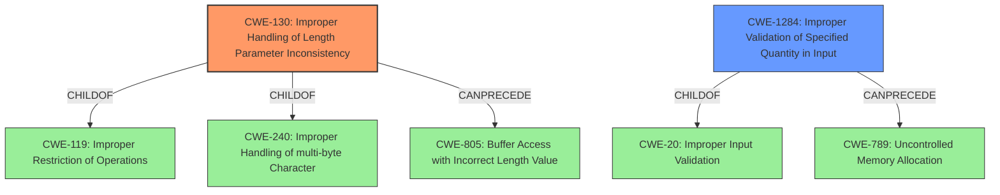

# Analysis Report for CVE-2022-3290

# Vulnerability Analysis Report: CVE-2022-3290

## Description


## Analysis (with Relationship Data)

# Summary
| CWE ID | CWE Name | Confidence | CWE Abstraction Level | CWE Vulnerability Mapping Label | CWE-Vulnerability Mapping Notes |
|---|---|---|---|---|---|
| CWE-130 | Improper Handling of Length Parameter Inconsistency | 0.9 | Base | Allowed | Primary CWE |
| CWE-1284 | Improper Validation of Specified Quantity in Input | 0.7 | Base | Allowed | Secondary Candidate |

## Evidence and Confidence

*   **Confidence Score:** 0.9
*   **Evidence Strength:** HIGH

## Relationship Analysis
The primary CWE identified is CWE-130, which is a Base level CWE. This is related to CWE-240 and CWE-119 through ChildOf relationships. CWE-130 can also precede CWE-805 which deals with buffer access with incorrect length value which could be a subsequent weakness. CWE-1284 is related to CWE-20 and can precede CWE-789.



## Vulnerability Chain
The vulnerability chain starts with **improper handling of the length parameter** (CWE-130), which arises from **insufficient input validation** in the username field. This **lack of validation** may lead to a buffer overflow. An overly long username could lead to data corruption or application instability (DoS).

## Summary of Analysis
The initial assessment pointed towards CWE-NVD-Other based on similar CVE descriptions. However, after reviewing the root cause analysis and retriever results, a more specific CWE was identified.

The vulnerability stems from the **improper handling of length parameter inconsistency** (CWE-130) specifically related to the username field. The application **fails to limit the length of the username field**. This aligns with the description of CWE-130, which focuses on the product's inability to handle length fields that are inconsistent with the actual data length. This can lead to unexpected behavior and potential attacks. The retriever results also list CWE-130 as the top candidate with a high similarity score.

CWE-1284 (Improper Validation of Specified Quantity in Input) is also considered because the length of the username is a quantity that is not properly validated. While CWE-130 more directly addresses the inconsistency issue, CWE-1284 highlights the lack of validation as a contributing factor.

The evidence supporting this decision comes from the "CVE Reference Links Content Summary," which explicitly states that the root cause is the **lack of input validation** on the username field, which allowed excessively long usernames. The fix was to limit the username field length to 256 characters.

Other CWEs considered:

*   CWE-786 (Access of Memory Location Before Start of Buffer) and CWE-124 (Buffer Underwrite ('Buffer Underflow')): These were considered but are less relevant because the primary issue is the handling of the length parameter and not necessarily an underwrite condition.
*   CWE-805 (Buffer Access with Incorrect Length Value): This is a related CWE, but CWE-130 is more specific to the **improper handling of the length parameter** itself.
*   CWE-126 (Buffer Over-read): This could be a consequence, but the root cause is the improper handling of the length parameter.
*   CWE-835 (Loop with Unreachable Exit Condition ('Infinite Loop')): This doesn't directly apply as the vulnerability doesn't involve a loop with an unreachable exit condition.
*   CWE-614 (Sensitive Cookie in HTTPS Session Without 'Secure' Attribute): This is irrelevant to the described vulnerability.

The chosen CWEs are at the Base level of abstraction, which is the preferred level for mapping to the root causes of vulnerabilities. CWE-130 is the primary cause, and CWE-1284 is a contributing factor highlighting the lack of input validation.


## CWE Relationship Analysis

Current CWEs represent these abstraction levels: .


### Vulnerability Chain Analysis

**Chain starting from CWE-240:**
- 240 (Improper Handling of Inconsistent Structural Elements) - ROOT


**Chain starting from CWE-835:**
- 835 (Loop with Unreachable Exit Condition ('Infinite Loop')) - ROOT


### CWE Relationship Diagram

```mermaid
graph TD
    classDef primary fill:#f96,stroke:#333,stroke-width:2px
    classDef secondary fill:#69f,stroke:#333
    classDef tertiary fill:#9e9,stroke:#333
```


*Report generated on 2025-03-30 19:47:16*
