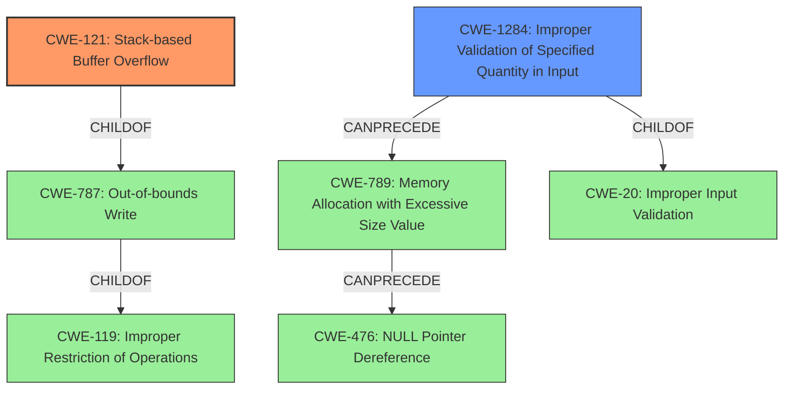

# Analysis Report for CVE-2022-32959

# Vulnerability Analysis Report: CVE-2022-32959

## Description


## Analysis (with Relationship Data)

# Summary
| CWE ID | CWE Name | Confidence | CWE Abstraction Level | CWE Vulnerability Mapping Label | CWE-Vulnerability Mapping Notes |
|---|---|---|---|---|---|
| CWE-121 | Stack-based Buffer Overflow | 1.0 | Variant | Primary | Allowed |
| CWE-1284 | Improper Validation of Specified Quantity in Input | 0.9 | Base | Secondary | Allowed |

## Evidence and Confidence

*   **Confidence Score:** 0.95
*   **Evidence Strength:** HIGH

## Relationship Analysis
The primary CWE is CWE-121, a variant of CWE-787 and CWE-119. CWE-1284 can precede CWE-789, which can lead to CWE-476. The chain involves **improper input validation** (CWE-1284) potentially leading to memory allocation issues or other vulnerabilities like buffer overflows (CWE-121).



## Vulnerability Chain
The vulnerability chain starts with **insufficient parameter length validation** (CWE-1284), which leads to a **stack-based buffer overflow** (CWE-121). This overflow can then allow an attacker to execute arbitrary code, manipulate system data, or terminate the service.

## Summary of Analysis
The initial analysis clearly points to a **stack-based buffer overflow** due to **insufficient parameter length validation**. The retriever results and similar CVE descriptions strongly suggest CWE-121 and CWE-1284 as relevant CWEs.

The primary weakness is the **stack-based buffer overflow (CWE-121)**. The root cause is the **insufficient parameter length validation (CWE-1284)**. The vulnerability description states: "HiCOS client-side citizen digital certificate component has a **stack-based buffer overflow** vulnerability when reading IC card due to **insufficient parameter length validation for OS information**." The "CVE Reference Links Content Summary" confirms this by stating that the component does not perform parameter length validation when reading the OS information, leading to the overflow.

CWE-121 is a Variant that is a child of both CWE-787 (Out-of-bounds Write) and CWE-119 (Improper Restriction of Operations within the Bounds of a Memory Buffer). Given the specific mention of a "stack-based" overflow, CWE-121 is a more precise match than its parents.

CWE-1284 (Improper Validation of Specified Quantity in Input) is also a good fit as a secondary CWE, representing the root cause of the vulnerability which is the lack of validation of the length of the OS information being read from the IC card.

The retriever results also listed CWE-190 (Integer Overflow or Wraparound), CWE-130 (Improper Handling of Length Parameter Inconsistency), CWE-20 (Improper Input Validation), CWE-125 (Out-of-bounds Read), and CWE-789 (Memory Allocation with Excessive Size Value). These were considered but not chosen because they either represent a different type of weakness (integer overflow) or are too general (improper input validation). CWE-130 could be considered, but CWE-1284 better captures the **lack of validation** of the length parameter.

Based on the evidence, CWE-121 and CWE-1284 are the most appropriate CWEs for this vulnerability. The selection is based on the vulnerability description, key phrases, CVE reference summary, and the retriever results. The relationships between the CWEs help to understand the chain of events leading to the vulnerability. The chosen CWEs are at the optimal level of specificity, with CWE-121 being a Variant and CWE-1284 being a Base.


## CWE Relationship Analysis

Current CWEs represent these abstraction levels: .


### Vulnerability Chain Analysis

**Chain starting from CWE-190:**
- 190 (Integer Overflow or Wraparound) - ROOT


**Chain starting from CWE-130:**
- 130 (Improper Handling of Length Parameter Inconsistency) - ROOT


### CWE Relationship Diagram

```mermaid
graph TD
    classDef primary fill:#f96,stroke:#333,stroke-width:2px
    classDef secondary fill:#69f,stroke:#333
    classDef tertiary fill:#9e9,stroke:#333
```


*Report generated on 2025-03-31 02:24:39*
