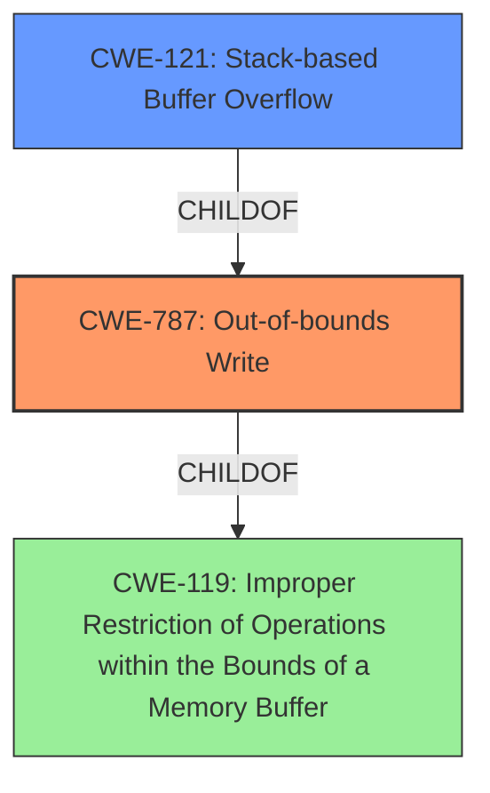

# Enhanced Analysis for CVE-2022-3296

# Summary
| CWE ID | CWE Name | Confidence | CWE Abstraction Level | CWE Vulnerability Mapping Label | CWE-Vulnerability Mapping Notes |
|---|---|---|---|---|---|
| CWE-787 | Out-of-bounds Write | 1.0 | Base | Primary | Allowed |
| CWE-121 | Stack-based Buffer Overflow | 0.8 | Variant | Secondary | Allowed |
| CWE-119 | Improper Restriction of Operations within the Bounds of a Memory Buffer | 0.5 | Class | Secondary | Discouraged |

## Evidence and Confidence

*   **Confidence Score:** 0.9
*   **Evidence Strength:** HIGH

## Relationship Analysis
The primary CWE is CWE-787, which is a base-level CWE indicating a write operation outside the intended buffer. CWE-121, Stack-based Buffer Overflow is a variant of CWE-787 indicating where the buffer is allocated on the stack. CWE-119 is a class-level CWE that is a more general form of buffer access errors. The vulnerability is a stack-based buffer overflow, so CWE-787 and CWE-121 are more specific and better suited than CWE-119.



## Vulnerability Chain
The vulnerability chain starts with the **stack-based buffer overflow** in the `ex_finally()` function when handling an unexpected `:finally` statement. The **root cause** is writing data beyond the allocated size of a buffer on the stack (CWE-787), which overwrites adjacent data. The worst-case impact is denial of service (DoS), but it could potentially allow for arbitrary code execution.

## Summary of Analysis
The initial assessment and criticism both point towards a buffer overflow, specifically a stack-based one. The evidence from the vulnerability description, especially the key phrases "**stack-based buffer overflow**" and the CVE reference summary describing a stack buffer overflow in the `ex_finally()` function, strongly supports this. The relationship graph reinforces the decision to choose CWE-787 and CWE-121 as they are more specific than the more generic CWE-119.

The selection of CWE-787 and CWE-121 is at the optimal level of specificity because they accurately represent the nature and location of the buffer overflow, as supported by the provided evidence. The fact that the overflow is stack-based is crucial information that CWE-121 captures. The mapping guidance for CWE-119 discourages its use when more specific CWEs are available, further justifying the choice of CWE-787 and CWE-121.

Relevant CWE Information:

# Enhanced Context (25 CWEs)
The following CWEs were identified as potentially relevant to this vulnerability:

## CWE-131: Incorrect Calculation of Buffer Size
This CWE was considered but rejected because the vulnerability is not caused by an incorrect calculation of buffer size, but by writing beyond the allocated buffer.

## CWE-191: Integer Underflow (Wrap or Wraparound)
This CWE was considered but rejected because the vulnerability is not related to integer underflow.

## CWE-124: Buffer Underwrite ('Buffer Underflow')
This CWE was considered but rejected because the vulnerability is a buffer overflow (write past the end of the buffer), not a buffer underflow (write before the beginning of the buffer).

## CWE-667: Improper Locking
This CWE was considered but rejected because the vulnerability is not related to improper locking.

## CWE-126: Buffer Over-read
This CWE was considered but rejected because the vulnerability is a buffer overflow (write), not a buffer over-read.

## CWE-805: Buffer Access with Incorrect Length Value
This CWE was considered but rejected because the vulnerability isn't explicitly linked to an incorrect length value used during the buffer access, but rather the fact of writing outside the buffer bounds.

## CWE-119: Improper Restriction of Operations within the Bounds of a Memory Buffer
This CWE was considered and included as a secondary candidate because it is a more general description of buffer access errors. However, the description provides enough evidence to choose more specific CWEs.

## CWE-125: Out-of-bounds Read
This CWE was considered but rejected because the vulnerability is a buffer overflow (write), not a buffer over-read.

## CWE-788: Access of Memory Location After End of Buffer
This CWE was considered but rejected because CWE-787 Out-of-bounds Write is a better fit.

## CWE-404: Improper Resource Shutdown or Release
This CWE was considered but rejected because the vulnerability is not related to improper resource shutdown or release.

## CWE-190: Integer Overflow or Wraparound
This CWE was considered but rejected because the vulnerability is not related to integer overflow.

## CWE-1284: Improper Validation of Specified Quantity in Input
This CWE was considered but rejected because the vulnerability is not explicitly caused by the product not validating the quantity of input.

## CWE-128: Wrap-around Error
This CWE was considered but rejected because the vulnerability is not directly related to wrap-around errors.

## CWE-170: Improper Null Termination
This CWE was considered but rejected because the vulnerability doesn't involve improper null termination.

## CWE-681: Incorrect Conversion between Numeric Types
This CWE was considered but rejected because the vulnerability is not caused by an incorrect conversion between numeric types.

## CWE-195: Signed to Unsigned Conversion Error
This CWE was considered but rejected because the vulnerability is not caused by a signed to unsigned conversion error.

## CWE-463: Deletion of Data Structure Sentinel
This CWE was considered but rejected because the vulnerability is not caused by deletion of a data structure sentinel.

## CWE-1339: Insufficient Precision or Accuracy of a Real Number
This CWE was considered but rejected because the vulnerability is not related to insufficient precision or accuracy of a real number.

## CWE-120: Buffer Copy without Checking Size of Input ('Classic Buffer Overflow')
This CWE was considered but rejected because while the vulnerability is a buffer overflow, it's more generally an out-of-bounds write and not specifically a buffer copy without checking size.

## CWE-787: Out-of-bounds Write
This CWE was chosen as the primary CWE because it accurately describes the **weakness** of writing data past the end of the allocated buffer. The vulnerability description key phrases contain "**stack-based buffer overflow**". The CVE Reference Links Content Summary identifies a "**Stack Buffer Overflow**" as the primary **weakness**.

## CWE-121: Stack-based Buffer Overflow
This CWE was chosen as a secondary CWE because it provides more specific information about where the buffer is allocated (on the stack). The vulnerability description key phrases contain "**stack-based buffer overflow**".


## CWE Relationship Analysis

Current CWEs represent these abstraction levels: .


### Vulnerability Chain Analysis

**Chain starting from CWE-121:**
- 121 (Stack-based Buffer Overflow) - ROOT


**Chain starting from CWE-119:**
- 119 (Improper Restriction of Operations within the Bounds of a Memory Buffer) - ROOT


### CWE Relationship Diagram

```mermaid
graph TD
    classDef primary fill:#f96,stroke:#333,stroke-width:2px
    classDef secondary fill:#69f,stroke:#333
    classDef tertiary fill:#9e9,stroke:#333
```