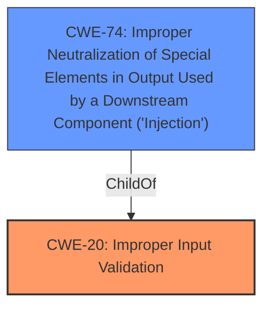

# Raw Analyzer Response for CVE-2022-33011

# Summary
| CWE ID | CWE Name | Confidence | CWE Abstraction Level | CWE Vulnerability Mapping Label | CWE-Vulnerability Mapping Notes |
|---|---|---|---|---|---|
| CWE-20 | Improper Input Validation | 0.9 | Class | Primary | Allowed-with-Review |
| CWE-74 | Improper Neutralization of Special Elements in Output Used by a Downstream Component ('Injection') | 0.7 | Class | Secondary | Discouraged |

## Evidence and Confidence

*   **Confidence Score:** 0.8
*   **Evidence Strength:** HIGH

## Relationship Analysis
The primary relationship that influenced the CWE selection was the parent-child relationship. CWE-20 is a broad class encompassing many types of input validation issues. While the specific injection vector involves the Host header, the fundamental problem is the **lack of validation** of this externally-controlled input.

## Vulnerability Chain
The vulnerability chain starts with the **lack of input validation** (CWE-20) on the `$_SERVER['SERVER_NAME']` variable, which leads to the possibility of **HTTP Host Header Injection** and ultimately enables **Account Takeover**.

## Summary of Analysis
Initially, CWE-74 (Improper Neutralization of Special Elements in Output Used by a Downstream Component ('Injection')) seemed like a potential fit due to the "host header injection attack" vector. However, after considering the root cause, the vulnerability stems from the **lack of validation** of the `$_SERVER['SERVER_NAME']` variable, which is derived from the HTTP Host header. Therefore, CWE-20 (Improper Input Validation) is the more appropriate primary CWE.

The evidence from the "CVE Reference Links Content Summary" clearly states: "The vulnerability stems from the application's reliance on the `$_SERVER['SERVER_NAME']` variable to construct the base URL for password reset links. The application **does not properly validate or sanitize** this value, allowing an attacker to inject a malicious hostname." This explicitly points to **improper input validation** as the root cause.

CWE-74 can be considered a secondary CWE because the **lack of validation** leads to the injection. However, CWE-74 is a Class-level CWE, and the guidance discourages its use when lower-level CWEs are more appropriate. In this case, there isn't a more specific child of CWE-20 that fits perfectly, so using the Class-level CWE is acceptable with review.

The final decision is based on the principle of mapping the root cause. The vulnerability originates from **insufficient validation** of the Host header, making CWE-20 the primary weakness.

Relevant CWE Information:

# Enhanced Context (25 CWEs)
The following CWEs were identified as potentially relevant to this vulnerability:

## CWE-74: Improper Neutralization of Special Elements in Output Used by a Downstream Component ('Injection')
**Abstraction Level**: Class
**Similarity Score**: 0.77
**Source**: dense

**Description**:
The product constructs all or part of a command, data structure, or record using externally-influenced input from an upstream component, but it does not neutralize or incorrectly neutralizes special elements that could modify how it is parsed or interpreted when it is sent to a downstream component.

**Mapping Guidance**:
- Usage: Discouraged
- Rationale: CWE-74 is high-level and often misused when lower-level weaknesses are more appropriate.

### Technical Explanation for CWE-20: Improper Input Validation
The vulnerability's core issue is the **lack of proper input validation** of the `$_SERVER['SERVER_NAME']` variable. This variable is used to construct the base URL for password reset links. Without validation, an attacker can inject a malicious hostname via the Host header.

*   **How the vulnerability's details match the CWE's characteristics:** The application fails to adequately verify and sanitize input from the Host header, leading to the injection of malicious data.
*   **The security implications and potential impact:** An attacker can perform an account takeover by poisoning password reset links.
*   **Any parent-child relationships or chain patterns that influenced your mapping:** The parent-child relationship between CWE-20 and CWE-74 influenced the initial consideration, but the root cause points directly to the **lack of validation**.
*   **Whether the weakness is primary or secondary in the vulnerability:** The **lack of validation** is the primary weakness.
*   **How the official MITRE mapping guidance influenced your decision:** The guidance to prefer more specific CWEs was considered.

### Technical Explanation for CWE-74: Improper Neutralization of Special Elements in Output Used by a Downstream Component ('Injection')
While the vulnerability leads to injection, the root cause is the **lack of input validation**. CWE-74 describes the act of injection but doesn't fully capture the initial **failure to validate**.

*   **How the vulnerability's details match the CWE's characteristics:** The application uses externally-influenced input (Host header) without proper neutralization, leading to a downstream component (password reset link) being affected.
*   **The security implications and potential impact:** An attacker can perform an account takeover by poisoning password reset links.
*   **Any parent-child relationships or chain patterns that influenced your mapping:** Considered as a secondary effect stemming from the primary issue of **missing input validation**.
*   **Whether the weakness is primary or secondary in the vulnerability:** Secondary.
*   **How the official MITRE mapping guidance influenced your decision:** The guidance discourages the use of CWE-74 when lower-level weaknesses are more appropriate, which in this case is CWE-20.

### Other CWEs Considered But Not Used
*   **CWE-79 (Improper Neutralization of Input During Web Page Generation ('Cross-site Scripting'))**: While the impact is on a web page (password reset link), the injection isn't directly into the web page's content. It's in the construction of the URL itself.
*   **CWE-93 (Improper Neutralization of CRLF Sequences ('CRLF Injection'))**: Not applicable as the injection isn't related to CRLF sequences.
*   **CWE-78 (Improper Neutralization of Special Elements used in an OS Command ('OS Command Injection'))**: Not applicable as the injection isn't related to OS commands.
*   **CWE-941 (Incorrectly Specified Destination in a Communication Channel)**: While the host header influences the destination, the root cause is more about the **lack of validation** of that input.
*   **CWE-290 (Authentication Bypass by Spoofing)**: The attack leads to account takeover, but the core issue isn't a flaw in the authentication algorithm itself. It's the **improper handling** of the Host header that allows the attacker to control the password reset process.