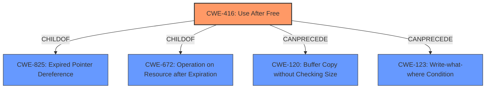

# Analysis for CVE-2022-3307

# Summary

| CWE ID | CWE Name | Confidence | CWE Abstraction Level | CWE Vulnerability Mapping Label | CWE-Vulnerability Mapping Notes |
|---|---|---|---|---|---|
| CWE-416 | Use After Free | 1.0 | Variant | Allowed | Primary CWE |

## Evidence and Confidence

*   **Confidence Score:** 1.0
*   **Evidence Strength:** HIGH

## Relationship Analysis
The primary CWE is CWE-416, which is a variant. It has hierarchical relationships (ChildOf) with CWE-825 and CWE-672. It also has chain relationships (CanPrecede) with CWE-120 and CWE-123. The variant level is appropriate due to the specific nature of the vulnerability being a use-after-free condition.

## Vulnerability Chain
The vulnerability chain starts with the **use after free** condition (CWE-416), which leads to **heap corruption**. The root cause is the improper handling of memory, resulting in a dangling pointer being accessed after the memory has been freed. This can lead to arbitrary code execution, data corruption, or denial of service.

## Summary of Analysis
The analysis is based on the provided evidence, which includes the vulnerability description, key phrases, and CVE reference links content summary. The vulnerability description clearly states a "**use after free**" condition. The key phrases section also identifies "**use after free**" as the root cause and "**heap corruption**" as a weakness. The CVE reference links content summary reinforces this by stating the root cause is "**Use after free**" and the weakness/vulnerability is "**Use after free** in Media".

The retriever results also strongly suggest CWE-416 as the primary candidate.

The selection of CWE-416 is at the optimal level of specificity, as it directly describes the nature of the vulnerability.

Relevant CWE Information:

# Enhanced Context (25 CWEs)

## CWE-404: Improper Resource Shutdown or Release
**Abstraction Level**: Class
**Similarity Score**: 0.80
**Source**: dense

This CWE was considered because a use-after-free can be viewed as a specific type of improper resource release. However, CWE-404 is a class-level CWE, and CWE-416 provides a more specific description of the vulnerability, making it a better fit.

## CWE-226: Sensitive Information in Resource Not Removed Before Reuse
**Abstraction Level**: Base
**Similarity Score**: 0.79
**Source**: dense

This CWE was not selected as it focuses on sensitive information, which is not the primary aspect of this vulnerability.

## CWE-415: Double Free
**Abstraction Level**: Variant
**Similarity Score**: 0.79
**Source**: dense

This CWE was not selected because the vulnerability is specifically a use-after-free, not a double free.

## CWE-366: Race Condition within a Thread
**Abstraction Level**: Base
**Similarity Score**: 0.78
**Source**: dense

This CWE was considered because race conditions can sometimes lead to use-after-free vulnerabilities. However, there is no direct evidence of a race condition in the vulnerability description.

## CWE-667: Improper Locking
**Abstraction Level**: Class
**Similarity Score**: 0.77
**Source**: dense

This CWE was not selected as it is related to locking mechanisms, which are not mentioned in the description.

## CWE-416: Use After Free
**Abstraction Level**: Variant
**Similarity Score**: 0.76
**Source**: dense

This is the selected CWE, as it directly matches the vulnerability description. The vulnerability involves reusing memory after it has been freed.

## CWE-131: Incorrect Calculation of Buffer Size
**Abstraction Level**: Base
**Similarity Score**: 0.75
**Source**: dense

This CWE was not selected as it focuses on buffer size calculations, which are not mentioned in the description.

## CWE-754: Improper Check for Unusual or Exceptional Conditions
**Abstraction Level**: Class
**Similarity Score**: 0.75
**Source**: dense

This CWE was not selected as it is a general class-level CWE and does not specifically describe the use-after-free condition.

## CWE-824: Access of Uninitialized Pointer
**Abstraction Level**: Base
**Similarity Score**: 0.75
**Source**: dense

This CWE was not selected as the issue is using memory after it has been freed.

## CWE-908: Use of Uninitialized Resource
**Abstraction Level**: Base
**Similarity Score**: 0.75
**Source**: dense

This CWE was not selected as the issue is using memory after it has been freed.

## CWE-911: Improper Update of Reference Count
**Abstraction Level**: Base
**Similarity Score**: 4481.18
**Source**: sparse

This CWE was not selected as it focuses on reference counting, which is not mentioned in the description.

## CWE-190: Integer Overflow or Wraparound
**Abstraction Level**: Base
**Similarity Score**: 4219.82
**Source**: sparse

This CWE was not selected as it focuses on integer overflows, which are not mentioned in the description.

## CWE-252: Unchecked Return Value
**Abstraction Level**: Base
**Similarity Score**: 4197.06
**Source**: sparse

This CWE was not selected as it focuses on unchecked return values, which are not mentioned in the description.

## CWE-123: Write-what-where Condition
**Abstraction Level**: base
**Similarity Score**: 5.03
**Source**: graph

While use-after-free could lead to write-what-where, it's a consequence, not the root cause.

## CWE-120: Buffer Copy without Checking Size of Input ('Classic Buffer Overflow')
**Abstraction Level**: base
**Similarity Score**: 4.33
**Source**: graph

This is not the root cause.

## CWE-825: Expired Pointer Dereference
**Abstraction Level**: base
**Similarity Score**: 4.33
**Source**: graph

CWE-825 is a parent of CWE-416 but CWE-416 is more specific.

## CWE-787: Out-of-bounds Write
**Abstraction Level**: base
**Similarity Score**: 4.33
**Source**: graph

While UAF can lead to out-of-bounds write, the root cause is the UAF.

## CWE-170: Improper Null Termination
**Abstraction Level**: base
**Similarity Score**: 4.33
**Source**: graph

Not related.

## CWE-1341: Multiple Releases of Same Resource or Handle
**Abstraction Level**: base
**Similarity Score**: 4.33
**Source**: graph

Similar to double-free, but UAF is different.

## CWE-1284: Improper Validation of Specified Quantity in Input
**Abstraction Level**: base
**Similarity Score**: 4.33
**Source**: graph

Not related.

## CWE-619: Dangling Database Cursor ('Cursor Injection')
**Abstraction Level**: base
**Similarity Score**: 4.33
**Source**: graph

Not related.