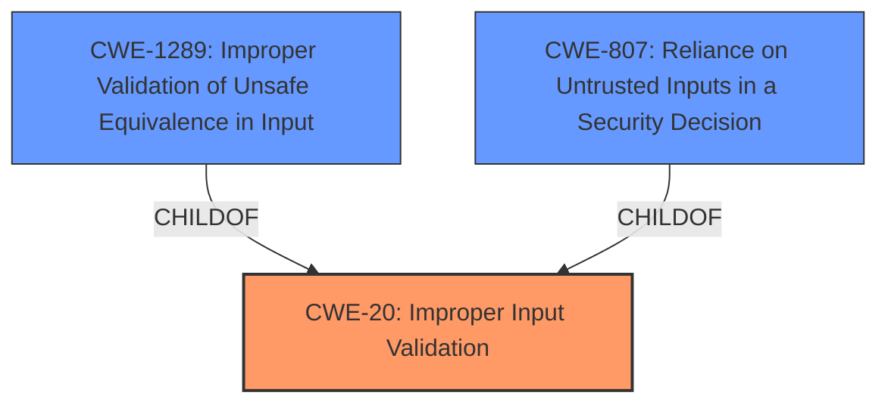

# Raw Analyzer Response for CVE-2022-3312

# Summary
| CWE ID | CWE Name | Confidence | CWE Abstraction Level | CWE Vulnerability Mapping Label | CWE-Vulnerability Mapping Notes |
|---|---|---|---|---|---|
| CWE-20 | Improper Input Validation | 0.8 | Class | Primary | Discouraged. The vulnerability is caused by **insufficient validation of untrusted input**. |
| CWE-1289 | Improper Validation of Unsafe Equivalence in Input | 0.6 | Base | Secondary | Allowed. This CWE describes the scenario of not validating that the input is equivalent to a potentially unsafe value. |
| CWE-807 | Reliance on Untrusted Inputs in a Security Decision | 0.5 | Base | Secondary | Allowed. This CWE describes the scenario of the product using a protection mechanism that relies on the existence or values of an input, but the input can be modified by an untrusted actor in a way that bypasses the protection mechanism |

## Evidence and Confidence

*   **Confidence Score:** 0.8
*   **Evidence Strength:** HIGH

## Relationship Analysis
The primary CWE is CWE-20, which is a Class-level weakness. The retriever results also include CWE-1289 and CWE-807, which are Base-level weaknesses. CWE-20 is a more general weakness, while CWE-1289 describes the specific scenario of not validating that the input is equivalent to a potentially unsafe value. CWE-807 describes the scenario of the product using a protection mechanism that relies on the existence or values of an input, but the input can be modified by an untrusted actor in a way that bypasses the protection mechanism.

## Vulnerability Chain
The vulnerability chain starts with the **insufficient validation of untrusted input** (CWE-20), which allows a local attacker to bypass managed device restrictions. The vulnerability is exploited via physical access to the device.

## Summary of Analysis
The vulnerability is caused by the **insufficient validation of untrusted input** in the VPN component of Google Chrome on ChromeOS. This allows a local attacker with physical access to the device to bypass managed device restrictions.

The primary CWE is CWE-20 (**Improper Input Validation**), because the root cause of the vulnerability is the **insufficient validation of untrusted input**. However, CWE-20 is a Class-level CWE and the mapping guidance discourages its use. CWE-1289 (Improper Validation of Unsafe Equivalence in Input) and CWE-807 (Reliance on Untrusted Inputs in a Security Decision) are more specific Base-level CWEs that could be considered as secondary CWEs.
CWE-1289 is a good fit because it describes the scenario of not validating that the input is equivalent to a potentially unsafe value.
CWE-807 is also a good fit because it describes the scenario of the product using a protection mechanism that relies on the existence or values of an input, but the input can be modified by an untrusted actor in a way that bypasses the protection mechanism

I am choosing CWE-20 as the primary CWE because the description indicates that the root cause is a validation issue of the VPN input.
I am selecting CWE-1289 and CWE-807 as secondary because the validation pertains to unsafe equivalence and relies on untrusted input.

Relevant CWE Information:

# Enhanced Context (25 CWEs)

## CWE-1289: Improper Validation of Unsafe Equivalence in Input
**Abstraction Level**: Base
**Similarity Score**: 0.76
**Source**: dense

**Description**:
The product receives an input value that is used as a resource identifier or other type of reference, but it does not validate or incorrectly validates that the input is equivalent to a potentially-unsafe value.

**Mapping Guidance**:
- Usage: Allowed
- Rationale: This CWE entry is at the Base level of abstraction, which is a preferred level of abstraction for mapping to the root causes of vulnerabilities.

## CWE-807: Reliance on Untrusted Inputs in a Security Decision
**Abstraction Level**: Base
**Similarity Score**: 0.75
**Source**: dense

**Description**:
The product uses a protection mechanism that relies on the existence or values of an input, but the input can be modified by an untrusted actor in a way that bypasses the protection mechanism.

**Mapping Guidance**:
- Usage: Allowed
- Rationale: This CWE entry is at the Base level of abstraction, which is a preferred level of abstraction for mapping to the root causes of vulnerabilities.

## CWE-356: Product UI does not Warn User of Unsafe Actions
This CWE was not selected because the description says "bypass managed device restrictions via physical access to the device", and this does not indicate that a warning was not presented to the user in the UI before performing an unsafe action.

## CWE-357: Insufficient UI Warning of Dangerous Operations
This CWE was not selected because the description says "bypass managed device restrictions via physical access to the device", and this does not indicate that an insufficient warning was presented to the user in the UI before performing a dangerous operation.

## CWE-416: Use After Free
This CWE was not selected because the description says "bypass managed device restrictions via physical access to the device", and this does not indicate any memory corruption or use-after-free condition.

## CWE-843: Access of Resource Using Incompatible Type ('Type Confusion')
This CWE was not selected because the description says "bypass managed device restrictions via physical access to the device", and this does not indicate any type confusion.

## CWE-451: User Interface (UI) Misrepresentation of Critical Information
This CWE was not selected because the description says "bypass managed device restrictions via physical access to the device", and this does not indicate any UI misrepresentation.

## CWE-120: Buffer Copy without Checking Size of Input ('Classic Buffer Overflow')
This CWE was not selected because the description says "bypass managed device restrictions via physical access to the device", and this does not indicate a buffer overflow.

## CWE-404: Improper Resource Shutdown or Release
This CWE was not selected because the description says "bypass managed device restrictions via physical access to the device", and this does not indicate an improper resource shutdown or release.

## CWE-113: Improper Neutralization of CRLF Sequences in HTTP Headers ('HTTP Request/Response Splitting')
This CWE was not selected because the description says "bypass managed device restrictions via physical access to the device", and this does not indicate an improper neutralization of CRLF sequences in HTTP headers.

## CWE-284: Improper Access Control
This CWE was not selected because the description says "bypass managed device restrictions via physical access to the device", and while this is an access control issue, CWE-284 is too high-level.