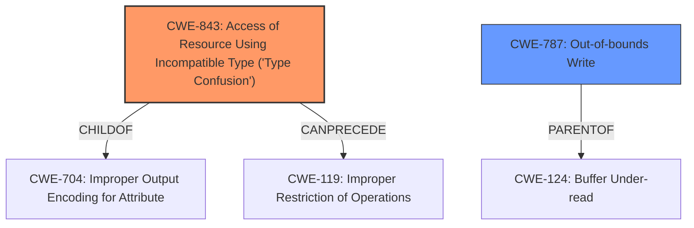

# Raw Analyzer Response for CVE-2022-3315

# Summary
| CWE ID | CWE Name | Confidence | CWE Abstraction Level | CWE Vulnerability Mapping Label | CWE-Vulnerability Mapping Notes |
|---|---|---|---|---|---|
| CWE-843 | Access of Resource Using Incompatible Type ('Type Confusion') | 1 | Base | Allowed | Primary CWE |
| CWE-787 | Out-of-bounds Write | 0.5 | Base | Allowed | Secondary Candidate |

## Evidence and Confidence

*   **Confidence Score:** 0.8
*   **Evidence Strength:** HIGH

## Relationship Analysis
The primary CWE, CWE-843 [CWE-843: Access of Resource Using Incompatible Type ('Type Confusion')], is a base-level CWE, which is the preferred level of abstraction. It has a child relationship to CWE-704 [CWE-704: Improper Output Encoding for Attribute]. CWE-843 [CWE-843: Access of Resource Using Incompatible Type ('Type Confusion')] can precede CWE-119 [CWE-119: Improper Restriction of Operations within the Bounds of a Memory Buffer], indicating a potential overflow. CWE-787 [CWE-787: Out-of-bounds Write] is another base-level CWE which is a parent to CWE-124 [CWE-124: Buffer Under-read].

## Vulnerability Chain
The vulnerability chain begins with a **type confusion** (**WEAKNESS**) in the Blink engine, potentially leading to heap corruption.
  - The root cause is **confusion in Blink**.
  - The **impact** is heap corruption.

## Summary of Analysis
The primary assessment is based on the vulnerability description and the provided CVE reference links. The description explicitly states "Type **confusion in Blink**" and the CVE reference link confirms this. The primary CWE match from similar CVE descriptions is CWE-843 [CWE-843: Access of Resource Using Incompatible Type ('Type Confusion')], further supporting this selection. The relationship analysis suggests a potential path from type confusion to out-of-bounds write. The final decision prioritizes the explicit mention of type confusion and its confirmation in the provided evidence.

The vulnerability description states: "Type **confusion in Blink** in Google Chrome prior to 106.0.5249.62 allowed a remote attacker to potentially exploit heap corruption via a crafted HTML page. (Chromium security severity Low)"
The CVE Reference Links Content Summary states: "Type **confusion in Blink**."

CWE-843 [CWE-843: Access of Resource Using Incompatible Type ('Type Confusion')] is at the optimal level of specificity because it directly addresses the root cause of the vulnerability. The other considered CWEs, such as CWE-787 [CWE-787: Out-of-bounds Write], represent potential consequences of the type confusion but do not capture the initial error.

Relevant CWE Information:

# Enhanced Context (25 CWEs)

## CWE-404: Improper Resource Shutdown or Release
**Abstraction Level**: Class
**Similarity Score**: 0.79
**Source**: dense

**Description**:
The product does not release or incorrectly releases a resource before it is made available for re-use.

**Mapping Guidance**:
- Usage: Allowed-with-Review
- Rationale: This CWE entry is a Class and might have Base-level children that would be more appropriate

*   **Reason for not selecting:** This CWE is not directly related to the **type confusion** (**WEAKNESS**) described in the vulnerability.

## CWE-226: Sensitive Information in Resource Not Removed Before Reuse
**Abstraction Level**: Base
**Similarity Score**: 0.77
**Source**: dense

**Description**:
The product releases a resource such as memory or a file so that it can be made available for reuse, but it does not clear or "zeroize" the information contained in the resource before the product performs a critical state transition or makes the resource available for reuse by other entities.

**Mapping Guidance**:
- Usage: Allowed
- Rationale: This CWE entry is at the Base level of abstraction, which is a preferred level of abstraction for mapping to the root causes of vulnerabilities.

*   **Reason for not selecting:** This CWE is not directly related to the **type confusion** (**WEAKNESS**) described in the vulnerability.

## CWE-843: Access of Resource Using Incompatible Type ('Type Confusion')
**Abstraction Level**: Base
**Similarity Score**: 0.77
**Source**: dense

**Description**:
The product allocates or initializes a resource such as a pointer, object, or variable using one type, but it later accesses that resource using a type that is incompatible with the original type.

**Mapping Guidance**:
- Usage: Allowed
- Rationale: This CWE entry is at the Base level of abstraction, which is a preferred level of abstraction for mapping to the root causes of vulnerabilities.

*   **Reason for selecting:** This CWE directly matches the **type confusion** (**WEAKNESS**) described in the vulnerability.

## CWE-131: Incorrect Calculation of Buffer Size
**Abstraction Level**: Base
**Similarity Score**: 0.77
**Source**: dense

**Description**:
The product does not correctly calculate the size to be used when allocating a buffer, which could lead to a buffer overflow.

**Mapping Guidance**:
- Usage: Allowed
- Rationale: This CWE entry is at the Base level of abstraction, which is a preferred level of abstraction for mapping to the root causes of vulnerabilities.

*   **Reason for not selecting:** This CWE is not directly related to the **type confusion** (**WEAKNESS**) described in the vulnerability.

## CWE-667: Improper Locking
**Abstraction Level**: Class
**Similarity Score**: 0.77
**Source**: dense

**Description**:
The product does not properly acquire or release a lock on a resource, leading to unexpected resource state changes and behaviors.

**Mapping Guidance**:
- Usage: Allowed-with-Review
- Rationale: This CWE entry is a Class and might have Base-level children that would be more appropriate

*   **Reason for not selecting:** This CWE is not directly related to the **type confusion** (**WEAKNESS**) described in the vulnerability.

## CWE-366: Race Condition within a Thread
**Abstraction Level**: Base
**Similarity Score**: 0.76
**Source**: dense

**Description**:
If two threads of execution use a resource simultaneously, there exists the possibility that resources may be used while invalid, in turn making the state of execution undefined.

**Mapping Guidance**:
- Usage: Allowed
- Rationale: This CWE entry is at the Base level of abstraction, which is a preferred level of abstraction for mapping to the root causes of vulnerabilities.

*   **Reason for not selecting:** This CWE is not directly related to the **type confusion** (**WEAKNESS**) described in the vulnerability.

## CWE-681: Incorrect Conversion between Numeric Types
**Abstraction Level**: Base
**Similarity Score**: 0.76
**Source**: dense

**Description**:
When converting from one data type to another, such as long to integer, data can be omitted or translated in a way that produces unexpected values. If the resulting values are used in a sensitive context, then dangerous behaviors may occur.

**Mapping Guidance**:
- Usage: Allowed
- Rationale: This CWE entry is at the Base level of abstraction, which is a preferred level of abstraction for mapping to the root causes of vulnerabilities.

*   **Reason for not selecting:** This CWE is not directly related to the **type confusion** (**WEAKNESS**) described in the vulnerability, although type conversion could be related to type confusion.

## CWE-191: Integer Underflow (Wrap or Wraparound)
**Abstraction Level**: Base
**Similarity Score**: 0.76
**Source**: dense

**Description**:
The product subtracts one value from another, such that the result is less than the minimum allowable integer value, which produces a value that is not equal to the correct result.

**Mapping Guidance**:
- Usage: Allowed
- Rationale: This CWE entry is at the Base level of abstraction, which is a preferred level of abstraction for mapping to the root causes of vulnerabilities.

*   **Reason for not selecting:** This CWE is not directly