# Enhanced Analysis for CVE-2022-3316

# Summary
| CWE ID | CWE Name | Confidence | CWE Abstraction Level | CWE Vulnerability Mapping Label | CWE-Vulnerability Mapping Notes |
|---|---|---|---|---|---|
| CWE-20 | Improper Input Validation | 1.0 | Class | Primary CWE | Allowed-with-Review |

## Evidence and Confidence

*   **Confidence Score:** 1.0
*   **Evidence Strength:** HIGH

## Relationship Analysis
The primary CWE is CWE-20, which is a class-level CWE. The retriever results offered several potential Base and Variant CWEs, but none were a good fit. CWE-20 is a parent of several CWEs related to specific input validation issues.

```mermaid
graph TD
    cwe20["CWE-20: Improper Input Validation"]
    cwe356["CWE-356: Product UI does not Warn User of Unsafe Actions"]
    cwe357["CWE-357: Insufficient UI Warning of Dangerous Operations"]
    cwe843["CWE-843: Access of Resource Using Incompatible Type ('Type Confusion')"]
    cwe416["CWE-416: Use After Free"]
    cwe451["CWE-451: User Interface (UI) Misrepresentation of Critical Information"]
    cwe1021["CWE-1021: Improper Restriction of Rendered UI Layers or Frames"]
    cwe123["CWE-123: Write-what-where Condition"]
    cwe404["CWE-404: Improper Resource Shutdown or Release"]
    cwe116["CWE-116: Improper Encoding or Escaping of Output"]
    cwe911["CWE-911: Improper Update of Reference Count"]
    
    cwe356 -->|CHILDOF| cwe20
    cwe357 -->|CHILDOF| cwe20
    cwe843 -->|CHILDOF| cwe20
    cwe416 -->|CHILDOF| cwe20
    cwe451 -->|CHILDOF| cwe20
    cwe1021 -->|CHILDOF| cwe20
    cwe123 -->|CHILDOF| cwe20
    cwe404 -->|CHILDOF| cwe20
    cwe116 -->|CHILDOF| cwe20
    cwe911 -->|CHILDOF| cwe20
    
    classDef primary fill:#f96,stroke:#333,stroke-width:2px
    classDef secondary fill:#69f,stroke:#333
    classDef tertiary fill:#9e9,stroke:#333
    class cwe20 primary
    class cwe356,cwe357,cwe843,cwe416,cwe451,cwe1021,cwe123,cwe404,cwe116,cwe911 secondary
```



## Vulnerability Chain
The vulnerability chain starts with the **insufficient validation of untrusted input**, which leads to a bypass of a security feature.

## Summary of Analysis
The vulnerability description explicitly states **"Insufficient validation of untrusted input"** as the root cause. The CVE Reference Links Content Summary also reiterates this. This directly aligns with CWE-20 (Improper Input Validation).

The retriever results listed several potential CWEs. However, these were discarded because they describe the impact, rather than the root cause, or are not closely related to input validation.

*   CWE-356 (Product UI does not Warn User of Unsafe Actions) and CWE-357 (Insufficient UI Warning of Dangerous Operations) relate to UI warnings, which is not the primary issue.
*   CWE-843 (Access of Resource Using Incompatible Type ('Type Confusion')) is related to type confusion, not input validation.
*   CWE-416 (Use After Free) is a memory management issue, not directly related to input validation.
*   CWE-451 (User Interface (UI) Misrepresentation of Critical Information) focuses on UI misrepresentation, which is not the core problem here.
* CWE-1021 (Improper Restriction of Rendered UI Layers or Frames) relates to clickjacking and UI layering issues, not input validation.
* CWE-123 (Write-what-where Condition) is a more specific consequence of memory corruption.
* CWE-404 (Improper Resource Shutdown or Release) is a resource management issue.
* CWE-116 (Improper Encoding or Escaping of Output) relates to output encoding.
* CWE-911 (Improper Update of Reference Count) is a memory management issue.

The selected CWE, CWE-20, is at the Class level because the description does not provide enough information to determine a more specific Base or Variant CWE.

Relevant CWE Information:

## CWE-404: Improper Resource Shutdown or Release
**Abstraction Level**: Class
**Similarity Score**: 0.79
**Source**: dense

**Description**:
The product does not release or incorrectly releases a resource before it is made available for re-use.

**Mapping Guidance**:
- Usage: Allowed-with-Review
- Rationale: This CWE entry is a Class and might have Base-level children that would be more appropriate

## CWE-911: Improper Update of Reference Count
**Abstraction Level**: Base
**Similarity Score**: 0.78
**Source**: dense

**Description**:
The product uses a reference count to manage a resource, but it does not update or incorrectly updates the reference count.

**Mapping Guidance**:
- Usage: Allowed
- Rationale: This CWE entry is at the Base level of abstraction, which is a preferred level of abstraction for mapping to the root causes of vulnerabilities.

## CWE-226: Sensitive Information in Resource Not Removed Before Reuse
**Abstraction Level**: Base
**Similarity Score**: 0.78
**Source**: dense

**Description**:
The product releases a resource such as memory or a file so that it can be made available for reuse, but it does not clear or "zeroize" the information contained in the resource before the product performs a critical state transition or makes the resource available for reuse by other entities.

**Mapping Guidance**:
- Usage: Allowed
- Rationale: This CWE entry is at the Base level of abstraction, which is a preferred level of abstraction for mapping to the root causes of vulnerabilities.

## CWE-1289: Improper Validation of Unsafe Equivalence in Input
**Abstraction Level**: Base
**Similarity Score**: 0.77
**Source**: dense

**Description**:
The product receives an input value that is used as a resource identifier or other type of reference, but it does not validate or incorrectly validates that the input is equivalent to a potentially-unsafe value.

**Mapping Guidance**:
- Usage: Allowed
- Rationale: This CWE entry is at the Base level of abstraction, which is a preferred level of abstraction for mapping to the root causes of vulnerabilities.

## CWE-667: Improper Locking
**Abstraction Level**: Class
**Similarity Score**: 0.76
**Source**: dense

**Description**:
The product does not properly acquire or release a lock on a resource, leading to unexpected resource state changes and behaviors.

**Mapping Guidance**:
- Usage: Allowed-with-Review
- Rationale: This CWE entry is a Class and might have Base-level children that would be more appropriate

## CWE-41: Improper Resolution of Path Equivalence
**Abstraction Level**: Base
**Similarity Score**: 0.75
**Source**: dense

**Description**:
The product is vulnerable to file system contents disclosure through path equivalence. Path equivalence involves the use of special characters in file and directory names. The associated manipulations are intended to generate multiple names for the same object.

**Mapping Guidance**:
- Usage: Allowed
- Rationale: This CWE entry is at the Base level of abstraction, which is a preferred level of abstraction for mapping to the root causes of vulnerabilities.

## CWE-665: Improper Initialization
**Abstraction Level**: Class
**Similarity Score**: 0.75
**Source**: dense

**Description**:
The product does not initialize or incorrectly initializes a resource, which might leave the resource in an unexpected state when it is accessed or used.

**Mapping Guidance**:
- Usage: Discouraged
- Rationale: This CWE entry is a level-1 Class (i.e., a child of a Pillar). It might have lower-level children that would be more appropriate

## CWE-451: User Interface (UI) Misrepresentation of Critical Information
**Abstraction Level**: Class
**Similarity Score**: 0.75
**Source**: dense

**Description**:
The user interface (UI) does not properly represent critical information to the user, allowing the information - or its source - to be obscured or spoofed. This is often a component in phishing attacks.

**Mapping Guidance**:
- Usage: Allowed-with-Review
- Rationale: This CWE entry is a Class and might have Base-level children that would be more appropriate

## CWE-6


## CWE Relationship Analysis

Current CWEs represent these abstraction levels: .


### Vulnerability Chain Analysis

**Chain starting from CWE-226:**
- 226 (Sensitive Information in Resource Not Removed Before Reuse) - ROOT


**Chain starting from CWE-6:**
- 6 (J2EE Misconfiguration: Insufficient Session-ID Length) - ROOT


### CWE Relationship Diagram

```mermaid
graph TD
    classDef primary fill:#f96,stroke:#333,stroke-width:2px
    classDef secondary fill:#69f,stroke:#333
    classDef tertiary fill:#9e9,stroke:#333
```