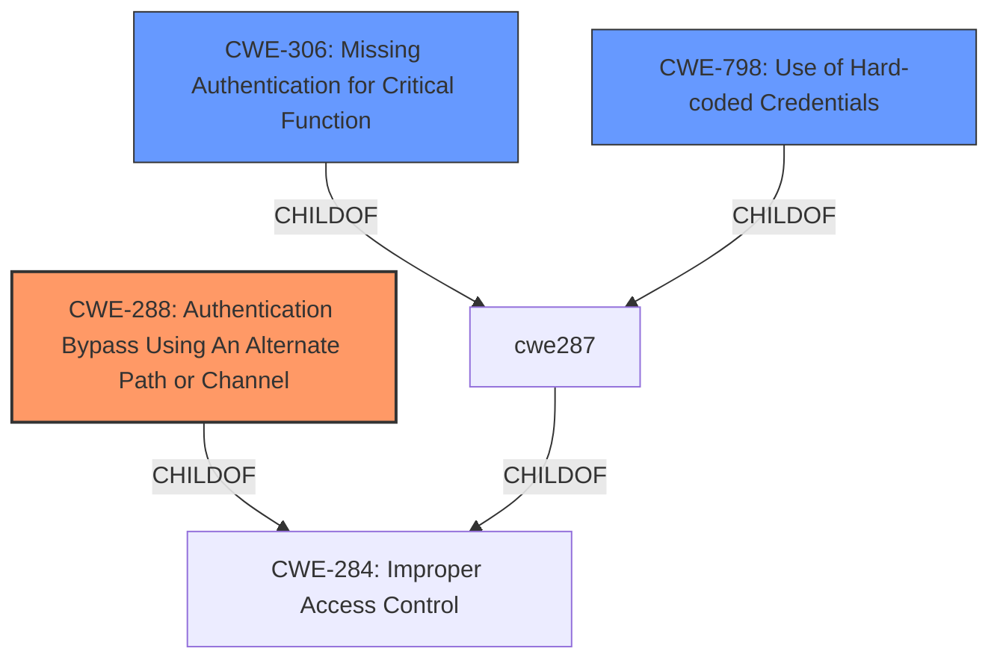

# Raw Analyzer Response for CVE-2022-33174

# Summary
| CWE ID | CWE Name | Confidence | CWE Abstraction Level | CWE Vulnerability Mapping Label | CWE-Vulnerability Mapping Notes |
|---|---|---|---|---|---|
| CWE-288 | Authentication Bypass Using an Alternate Path or Channel | 0.9 | Base | Allowed | Primary CWE |
| CWE-306 | Missing Authentication for Critical Function | 0.7 | Base | Allowed | Secondary Candidate |
| CWE-798 | Use of Hard-coded Credentials | 0.6 | Base | Allowed | Secondary Candidate |

## Evidence and Confidence

*   **Confidence Score:** 0.8
*   **Evidence Strength:** HIGH

## Relationship Analysis
The primary CWE selected is CWE-288 (Authentication Bypass Using an Alternate Path or Channel), which is at the Base level. This choice is influenced by the vulnerability description indicating an alternate path bypassing authentication. CWE-288 is related to CWE-306 (Missing Authentication for Critical Function) as CWE-288 can be considered a specific type of missing authentication where a critical function is accessible through an alternate path without proper authentication. CWE-798 (Use of Hard-coded Credentials) is included as a secondary concern because the ultimate impact of the authentication bypass is access to usernames and passwords stored in cleartext.

## Vulnerability Chain
The vulnerability chain starts with the **improper authentication** check in `/usr/lib/libweb.so`. By sending a crafted HTTP request with an empty `tmpToken` cookie, the authentication check is bypassed. This leads to unauthorized access to sensitive information, including the username and password stored in cleartext. Therefore, the chain is: **Improper Authentication** -> **Authorization Bypass** -> **Exposure of Sensitive Information**.

## Summary of Analysis
The initial analysis focused on the **remote authorization bypass** as the key weakness. The evidence from the CVE Reference Links Content Summary supports this. The `checkUserLevel()` function **fails** to properly validate the `tmpToken` cookie, allowing an attacker to bypass authentication by sending an empty string. The vulnerability description states, "To exploit the vulnerability, an attacker must send an HTTP packet to the data retrieval interface (/cgi/get_param.cgi) with the tmpToken cookie set to an empty string followed by a semicolon. This bypasses an active session authorization check. This can be then used to fetch the values of protected sys.passwd and sys.su.name fields that contain the username and password in cleartext."

The selection of CWE-288 (Authentication Bypass Using an Alternate Path or Channel) is based on the fact that the attacker is using a specific alternate path (setting the `tmpToken` to an empty string) to bypass the authentication check. While CWE-306 (Missing Authentication for Critical Function) could also apply, CWE-288 is more specific as it highlights the use of an alternate path or channel to achieve the bypass. CWE-798 (Use of Hard-coded Credentials) is included because the system stores usernames and passwords in cleartext, accessible after the bypass, amplifying the impact.

The chosen CWEs are at the base level of abstraction, providing a detailed representation of the vulnerability. The analysis is heavily based on the provided evidence, with a confidence score of 0.8.

Relevant CWE Information:

# Enhanced Context (25 CWEs)
The following CWEs were identified as potentially relevant to this vulnerability:

## CWE-288: Authentication Bypass Using an Alternate Path or Channel
**Abstraction Level**: Base
**Similarity Score**: 0.77
**Source**: dense

**Description**:
The product requires authentication, but the product has an alternate path or channel that does not require authentication.

**Mapping Guidance**:
- Usage: Allowed
- Rationale: This CWE entry is at the Base level of abstraction, which is a preferred level of abstraction for mapping to the root causes of vulnerabilities.

**Justification**: This CWE perfectly aligns with the vulnerability where setting `tmpToken` to an empty string acts as an alternate path that bypasses the intended authentication mechanism.

## CWE-306: Missing Authentication for Critical Function
**Abstraction Level**: Base
**Similarity Score**: 6693.22
**Source**: sparse

**Description**:
The product does not perform any authentication for functionality that requires a provable user identity or consumes a significant amount of resources.

**Mapping Guidance**:
- Usage: Allowed
- Rationale: This CWE entry is at the Base level of abstraction, which is a preferred level of abstraction for mapping to the root causes of vulnerabilities.

**Justification**: While CWE-288 is more precise, CWE-306 is also relevant because the vulnerability essentially results in a critical function (access to sensitive data) being accessible without proper authentication.

## CWE-798: Use of Hard-coded Credentials
**Abstraction Level**: Base
**Similarity Score**: 0.75
**Source**: dense

**Description**:
The product contains hard-coded credentials, such as a password or cryptographic key.

**Mapping Guidance**:
- Usage: Allowed
- Rationale: This CWE entry is at the Base level of abstraction, which is a preferred level of abstraction for mapping to the root causes of vulnerabilities.

**Justification**: The vulnerability allows access to usernames and passwords stored in cleartext. While not strictly hard-coded, the sensitive data is stored in a manner that makes it easily accessible after bypassing authentication, amplifying the impact.

## Other CWEs Considered and Rejected:
*   CWE-284 (Improper Access Control): Rejected as it is too high-level (Pillar).
*   CWE-863 (Incorrect Authorization): Rejected in favor of the more specific CWE-288 and CWE-306.
*   CWE-287 (Improper Authentication): Rejected as it is a Class-level CWE, and CWE-288 and CWE-306 are more specific Base-level CWEs.
*   CWE-613 (Insufficient Session Expiration): Not directly applicable as the vulnerability is about bypassing authentication, not about session expiration.
*   CWE-639 (Authorization Bypass Through User-Controlled Key): While it could be argued that the `tmpToken` is a user-controlled key, the primary issue is the bypass itself, making CWE-288 a better fit.