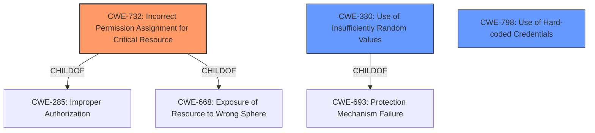

# Analysis Report for CVE-2022-33175

# Vulnerability Analysis Report: CVE-2022-33175

## Description


## Analysis (with Relationship Data)

# Summary
| CWE ID | CWE Name | Confidence | CWE Abstraction Level | CWE Vulnerability Mapping Label | CWE-Vulnerability Mapping Notes |
|---|---|---|---|---|---|
| CWE-732 | Incorrect Permission Assignment for Critical Resource | 0.9 | Class | Allowed-with-Review | Primary CWE: The **insecure permissions setting** on the user.token field allowed unauthorized access. |
| CWE-330 | Use of Insufficiently Random Values | 0.7 | Class | Discouraged | Secondary CWE: The session tokens are generated using a **weak random number generator**. |
| CWE-798 | Use of Hard-coded Credentials | 0.6 | Base | Allowed | Secondary CWE: The admin's password is stored in plaintext. |

## Evidence and Confidence

*   **Confidence Score:** 0.8
*   **Evidence Strength:** HIGH

## Relationship Analysis
The primary CWE is CWE-732, representing the **incorrect permission assignment** on the user.token field, a Class-level CWE. CWE-330 and CWE-798 are secondary CWEs that contribute to the overall risk. CWE-330 describes the use of **insufficiently random values** for session token generation and CWE-798 describes the **use of hard-coded credentials** for the admin password.



## Vulnerability Chain
The vulnerability chain starts with the **insecure permissions setting** on the user.token field (CWE-732). This leads to the disclosure of active session IDs. The session tokens are generated using a **weak random number generator** (CWE-330). Finally, the administrator's password is stored in plaintext (CWE-798), making it easily readable when the session token is obtained.

## Summary of Analysis
The initial assessment focused on the **insecure permissions setting**, the **weak session token**, and the **plaintext password storage**. The final decision is based on the provided evidence, relationship analysis, and mapping guidance.

The vulnerability description clearly states that the **insecure permissions setting** on the user.token field allows unauthorized access to session IDs. This aligns with the description of CWE-732, "Incorrect Permission Assignment for Critical Resource," which states, "The product specifies permissions for a security-critical resource in a way that allows that resource to be read or modified by unintended actors."

The CVE Reference Links Content Summary provides further support for this classification: "The root cause is an authenticated session token leak vulnerability in the `/cgi/get_param.cgi` endpoint of Powertek PDU firmware. The vulnerability stems from the fact that the endpoint, when queried with the `xml` parameter for the "user" group, discloses the active session tokens."

The weak random number generator used for session token generation is classified as CWE-330, "Use of Insufficiently Random Values." This classification is supported by the CVE Reference Links Content Summary, which states, "The session tokens are generated using a weak random number generator with limited entropy (20 bits)."

The plaintext password storage is classified as CWE-798, "Use of Hard-coded Credentials" because while it doesn't appear to be truly hardcoded, it is sensitive data stored in an insecure manner, and is being used as an equivalent to a credential. This is supported by "Plaintext Password Storage: The admin's password is stored in plaintext, making it easily readable when the session token is obtained."

The selected CWEs are at the optimal level of specificity, as they accurately represent the weaknesses present in the vulnerability.

Relevant CWE Information:

# Enhanced Context (25 CWEs)

## CWE-330: Use of Insufficiently Random Values
**Abstraction Level**: Class
**Similarity Score**: 0.80
**Source**: dense

**Description**:
The product uses insufficiently random numbers or values in a security context that depends on unpredictable numbers.

**Mapping Guidance**:
- Usage: Discouraged
- Rationale: This CWE entry is a level-1 Class (i.e., a child of a Pillar). It might have lower-level children that would be more appropriate

**Technical Explanation:**
The vulnerability description mentions that session tokens are generated using a weak random number generator with limited entropy. This aligns with CWE-330, which describes the use of insufficiently random values in a security context. The impact is that an attacker can potentially predict or brute-force the session tokens, gaining unauthorized access to the system.
**Relationship Impact:**
CWE-330 is a Class-level CWE, and its parent is CWE-693, "Protection Mechanism Failure."
**Mapping Justification:**
CWE-330 is considered because the root cause indicates that the session tokens are generated with a weak random number generator.
**Confidence Score:** 0.7

## CWE-732: Incorrect Permission Assignment for Critical Resource
**Abstraction Level**: Class
**Similarity Score**: N/A
**Source**: N/A

**Description**:
The product specifies permissions for a security-critical resource in a way that allows that resource to be read or modified by unintended actors.

**Mapping Guidance**:
- Usage: Allowed-with-Review
- Rationale: While the name itself indicates an assignment of permissions for resources, this is often misused for vulnerabilities in which "permissions" are not checked, which is an "authorization" weakness (CWE-285 or descendants) within CWE's model [REF-1287].

**Technical Explanation:**
The vulnerability description states that there is an **insecure permissions setting** on the user.token field. This aligns with CWE-732, which describes the incorrect assignment of permissions for critical resources. The impact is that unauthorized users can access sensitive information, such as active session IDs.
**Relationship Impact:**
CWE-732 is a Class-level CWE, and its parents are CWE-285, "Improper Authorization," and CWE-668, "Exposure of Resource to Wrong Sphere."
**Mapping Justification:**
CWE-732 is chosen as the primary CWE because the root cause of the vulnerability is the **insecure permissions setting** on the user.token field.
**Confidence Score:** 0.9

## CWE-798: Use of Hard-coded Credentials
**Abstraction Level**: Base
**Similarity Score**: N/A
**Source**: N/A

**Description**:
The product contains hard-coded credentials, such as a password or cryptographic key.

**Mapping Guidance**:
- Usage: Allowed
- Rationale: This CWE entry is at the Base level of abstraction, which is a preferred level of abstraction for mapping to the root causes of vulnerabilities.

**Technical Explanation:**
The vulnerability description mentions that the admin's password is stored in plaintext. While not technically hardcoded, storing a password in plaintext is functionally equivalent to a hardcoded credential because it can be easily accessed and used by an attacker.
**Relationship Impact:**
CWE-798 is a Base-level CWE.
**Mapping Justification:**
CWE-798 is considered due to the presence of a plaintext password, which is functionally equivalent to a hardcoded credential.
**Confidence Score:** 0.6

## Other CWE Considerations

*   CWE-863 (Incorrect Authorization), CWE-306 (Missing Authentication for Critical Function), and CWE-425 (Direct Request ('Forced Browsing')) were considered, but they did not accurately represent the root cause of the vulnerability. The **insecure permissions setting** is better captured by CWE-732.


## CWE Relationship Analysis

Current CWEs represent these abstraction levels: .


### Vulnerability Chain Analysis

**Chain starting from CWE-425:**
- 425 (Direct Request ('Forced Browsing')) - ROOT


**Chain starting from CWE-693:**
- 693 (Protection Mechanism Failure) - ROOT


### CWE Relationship Diagram

```mermaid
graph TD
    classDef primary fill:#f96,stroke:#333,stroke-width:2px
    classDef secondary fill:#69f,stroke:#333
    classDef tertiary fill:#9e9,stroke:#333
```


*Report generated on 2025-03-30 14:09:55*
