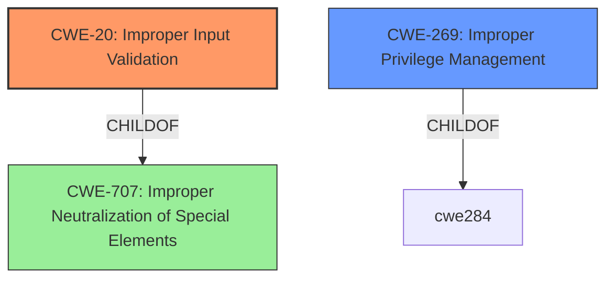

# Raw Analyzer Response for CVE-2022-33190

# Summary
| CWE ID | CWE Name | Confidence | CWE Abstraction Level | CWE Vulnerability Mapping Label | CWE-Vulnerability Mapping Notes |
|---|---|---|---|---|---|
| CWE-20 | Improper Input Validation | 0.9 | Class | Primary | Discouraged |
| CWE-269 | Improper Privilege Management | 0.6 | Class | Secondary | Discouraged |

## Evidence and Confidence

*   **Confidence Score:** 0.8
*   **Evidence Strength:** HIGH

## Relationship Analysis
The primary relationship considered was the ChildOf relationship to CWE-707, highlighting the broad scope of CWE-20. The decision to map to CWE-20 stems from the **improper input validation** root cause, leading to an escalation of privileges. While CWE-269 is also related, it represents a broader class of privilege management issues.

## Vulnerability Chain
The chain of events can be described as follows:
1.  **Root Cause:** **Improper input validation** (CWE-20)
2.  **Impact:** Escalation of privilege.

## Summary of Analysis
The initial assessment focused on the **improper input validation** as the root cause, aligning with the provided vulnerability description. The CVE Reference Links Content Summary reinforced this assessment, explicitly stating "**Improper input validation**" as the root cause and weakness.

The Retriever Results suggested several CWEs, including CWE-691 (Insufficient Control Flow Management), CWE-277 (Insecure Inherited Permissions), CWE-284 (Improper Access Control), CWE-287 (Improper Authentication), and CWE-269 (Improper Privilege Management). However, CWE-20 (Improper Input Validation) aligns most directly with the vulnerability description. While privilege escalation is the impact, the root cause is the failure to properly validate input, which is best represented by CWE-20.

CWE-20 is a Class-level CWE, and the mapping guidance discourages its use when more specific CWEs are available. However, the available information does not provide enough detail to identify a more specific variant. Therefore, CWE-20 is the most appropriate choice based on the available evidence.

CWE-269 (Improper Privilege Management) was considered as a secondary CWE since the impact is privilege escalation, but the root cause is still the input validation.

Relevant CWE Information:

# Enhanced Context (25 CWEs)

## CWE-1289: Improper Validation of Unsafe Equivalence in Input
**Abstraction Level**: Base
**Similarity Score**: 0.78
**Source**: dense
Not selected as it is too specific, the vulnerability description is more general.

## CWE-807: Reliance on Untrusted Inputs in a Security Decision
**Abstraction Level**: Base
**Similarity Score**: 0.77
**Source**: dense
Not selected because the vulnerability description focuses on the **improper input validation** rather than the reliance on untrusted inputs in a security decision.

## CWE-274: Improper Handling of Insufficient Privileges
**Abstraction Level**: Base
**Similarity Score**: 0.76
**Source**: dense
Not selected because the root cause is **improper input validation**, not the handling of insufficient privileges.

## CWE-691: Insufficient Control Flow Management
**Abstraction Level**: Pillar
**Similarity Score**: 0.76
**Source**: dense
Not selected because it is a very high-level pillar, and it does not accurately represent the root cause of the vulnerability.

## CWE-1288: Improper Validation of Consistency within Input
**Abstraction Level**: Base
**Similarity Score**: 0.75
**Source**: dense
Not selected as the input validation is not necessarily about the consistency of the input, but more about the **improper input validation** in general.

## CWE-664: Improper Control of a Resource Through its Lifetime
**Abstraction Level**: Pillar
**Similarity Score**: 0.75
**Source**: dense
Not selected as the root cause is related to the **improper input validation** and not the control of a resource through its lifetime.

## CWE-703: Improper Check or Handling of Exceptional Conditions
**Abstraction Level**: Pillar
**Similarity Score**: 0.75
**Source**: dense
Not selected because it is a very high-level pillar, and it does not accurately represent the root cause of the vulnerability.

## CWE-653: Improper Isolation or Compartmentalization
**Abstraction Level**: Class
**Similarity Score**: 0.75
**Source**: dense
Not selected as the root cause is related to the **improper input validation** and not improper isolation.

## CWE-693: Protection Mechanism Failure
**Abstraction Level**: Pillar
**Similarity Score**: 0.75
**Source**: dense
Not selected because it is a very high-level pillar, and it does not accurately represent the root cause of the vulnerability.

## CWE-280: Improper Handling of Insufficient Permissions or Privileges
**Abstraction Level**: Base
**Similarity Score**: 0.75
**Source**: dense
Not selected because the root cause is **improper input validation**, not the handling of insufficient permissions or privileges.

## CWE-863: Incorrect Authorization
**Abstraction Level**: Class
**Similarity Score**: 5632.37
**Source**: sparse
Not selected as the root cause is **improper input validation**, not incorrect authorization.

## CWE-639: Authorization Bypass Through User-Controlled Key
**Abstraction Level**: Base
**Similarity Score**: 5557.06
**Source**: sparse
Not selected as the root cause is **improper input validation**, not authorization bypass through a user-controlled key.

## CWE-287: Improper Authentication
**Abstraction Level**: Class
**Similarity Score**: 5542.28
**Source**: sparse
Not selected as the root cause is **improper input validation**, not improper authentication.

## CWE-1390: Weak Authentication
**Abstraction Level**: Class
**Similarity Score**: 5534.83
**Source**: sparse
Not selected as the root cause is **improper input validation**, not weak authentication.

## CWE-1284: Improper Validation of Specified Quantity in Input
**Abstraction Level**: Base
**Similarity Score**: 5511.69
**Source**: sparse
Not selected as it is too specific, the vulnerability description is more general.

## CWE-22: Improper Limitation of a Pathname to a Restricted Directory ('Path Traversal')
**Abstraction Level**: base
**Similarity Score**: 4.33
**Source**: graph
Not selected as it is too specific, the vulnerability description is more general.

## CWE-770: Allocation of Resources Without Limits or Throttling
**Abstraction Level**: base
**Similarity Score**: 4.33
**Source**: graph
Not selected as it is too specific, the vulnerability description is more general.

## CWE-73: External Control of File Name or Path
**Abstraction Level**: base
**Similarity Score**: 4.33
**Source**: graph
Not selected as it is too specific, the vulnerability description is more general.

## CWE-190: Integer Overflow or Wraparound
**Abstraction Level**: base
**Similarity Score**: 4.33
**Source**: graph
Not selected as it is too specific, the vulnerability description is more general.

## CWE-193: Off-by-one Error
**Abstraction Level**: base
**Similarity Score**: 4.33
**Source**: graph
Not selected as it is too specific, the vulnerability description is more general.

## CWE-613: Insufficient Session Expiration
**Abstraction Level**: base
**Similarity Score**: 4.33
**Source**: graph
Not selected as it is too specific, the vulnerability description is more general.

## CWE-266: Incorrect Privilege Assignment
**Abstraction Level**: base
**Similarity Score**: 3.64
**Source**: graph
Not selected as it is too specific, the vulnerability description is more general.

## CWE-322: Key Exchange without Entity Authentication
**Abstraction Level**: base
**Similarity Score**: 3.57
**Source**: graph
Not selected as it is too specific, the vulnerability description is more general.

## CWE-843: Access of Resource Using Incompatible Type ('Type Confusion')
**Abstraction Level**: base
**Similarity Score**: 3.44
**Source**: graph
Not selected as it is