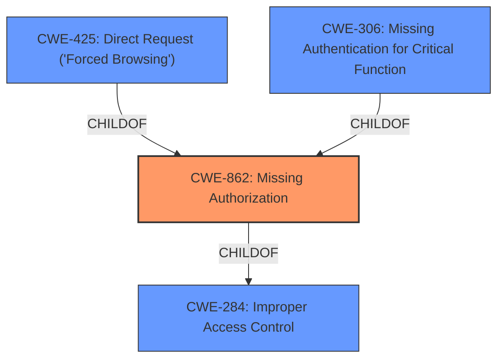

# Analysis for CVE-2022-33198

# Summary
| CWE ID | CWE Name | Confidence | CWE Abstraction Level | CWE Vulnerability Mapping Label | CWE-Vulnerability Mapping Notes |
|---|---|---|---|---|---|
| CWE-862 | Missing Authorization | 0.9 | Class | Primary | Allowed-with-Review |
| CWE-306 | Missing Authentication for Critical Function | 0.7 | Base | Secondary | Allowed |
| CWE-425 | Direct Request ('Forced Browsing') | 0.6 | Base | Secondary | Allowed |

## Evidence and Confidence

*   **Confidence Score:** 0.8
*   **Evidence Strength:** HIGH

## Relationship Analysis
The primary CWE is CWE-862, which is a Class-level weakness indicating that the product lacks an authorization check. CWE-862 is a child of the Pillar CWE-284 (Improper Access Control). CWE-306 (Missing Authentication) and CWE-425 (Direct Request) are also related and considered as secondary options. CWE-306 indicates the absence of authentication for critical functions, and CWE-425 highlights the lack of authorization enforcement on restricted URLs. These relationships help in understanding the specific type of access control failure.

## Vulnerability Chain
The vulnerability chain starts with the **lack of proper authorization** (CWE-862) in the Accordions plugin. Due to this **missing authorization**, unauthenticated users can directly send requests (CWE-425) to modify WordPress options, leading to an Unauthenticated WordPress Options Change. The absence of authentication (CWE-306) exacerbates this issue, as no user identity is verified before allowing access to critical functions.

## Summary of Analysis
The initial analysis indicated a **broken access control** issue, where the Accordions plugin **lacked proper authorization, authentication, or nonce token checks**.

The retriever results suggested several CWEs, with CWE-472 (External Control of Assumed-Immutable Web Parameter) having a high-density score. However, the vulnerability description explicitly mentions **broken access control** due to **missing authorization**. Thus, CWE-862 (Missing Authorization) is chosen as the primary CWE.

CWE-862 (Missing Authorization) is a Class-level CWE, and the guidance suggests examining its children for a better fit. However, none of the children provide a more accurate representation of the vulnerability than CWE-862 itself.

CWE-306 (Missing Authentication for Critical Function) and CWE-425 (Direct Request) are considered secondary CWEs as they highlight the absence of authentication and the direct accessibility of restricted URLs, respectively.

The selection is based on the evidence from the "CVE Reference Links Content Summary," which states that the vulnerability is due to a **Broken Access Control** issue and the plugin **lacks proper authorization, authentication, or nonce token checks**. The high CVSS score of 9.8 also indicates the severity of the vulnerability.

Relevant CWE Information:

# Enhanced Context (25 CWEs)
The following CWEs were identified as potentially relevant to this vulnerability:

## CWE-472: External Control of Assumed-Immutable Web Parameter
**Abstraction Level**: Base
**Similarity Score**: 0.78
**Source**: dense

**Description**:
The web application does not sufficiently verify inputs that are assumed to be immutable but are actually externally controllable, such as hidden form fields.

**Mapping Guidance**:
- Usage: Allowed
- Rationale: This CWE entry is at the Base level of abstraction, which is a preferred level of abstraction for mapping to the root causes of vulnerabilities.

## CWE-862: Missing Authorization
**Abstraction Level**: Class
**Similarity Score**: 5443.57
**Source**: sparse

**Description**:
The product does not perform an authorization check when an actor attempts to access a resource or perform an action.

**Mapping Guidance**:
- Usage: Allowed-with-Review
- Rationale: This CWE entry is a Class and might have Base-level children that would be more appropriate

## CWE-306: Missing Authentication for Critical Function
**Abstraction Level**: Base
**Similarity Score**: 0.027
**Source**: sparse

**Description**:
The product does not perform any authentication for functionality that requires a provable user identity or consumes a significant amount of resources.

**Mapping Guidance**:
- Usage: Allowed
- Rationale: This CWE entry is at the Base level of abstraction, which is a preferred level of abstraction for mapping to the root causes of vulnerabilities.

## CWE-425: Direct Request ('Forced Browsing')
**Abstraction Level**: Base
**Similarity Score**: 0.026
**Source**: sparse

**Description**:
The web application does not adequately enforce appropriate authorization on all restricted URLs, scripts, or files.

**Mapping Guidance**:
- Usage: Allowed
- Rationale: This CWE entry is at the Base level of abstraction, which is a preferred level of abstraction for mapping to the root causes of vulnerabilities.

### CWEs Considered But Not Used:

*   **CWE-352: Cross-Site Request Forgery (CSRF):** While CSRF could be a potential attack vector, the root cause is the **missing authorization**, making CWE-862 more appropriate.
*   **CWE-284: Improper Access Control:** This is a Pillar-level CWE and too broad. The more specific CWE-862 is preferred.
*   **CWE-472: External Control of Assumed-Immutable Web Parameter:** This CWE is relevant if the vulnerability involves manipulating hidden form fields or cookies. While possible, the primary issue is the **lack of authorization**, not the manipulation of parameters.
*   **CWE-863: Incorrect Authorization:** This implies that there is authorization logic but it is flawed. The vulnerability indicates the complete **lack of authorization checks**, making CWE-862 more fitting.
*   **CWE-1390: Weak Authentication:** While authentication might be weak, the description points to a complete **lack of authentication and authorization**, making CWE-306 and CWE-862 more accurate.