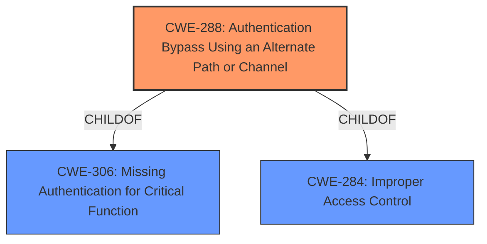

# Raw Analyzer Response for CVE-2022-33202

# Summary
| CWE ID  | CWE Name                                            | Confidence | CWE Abstraction Level | CWE Vulnerability Mapping Label | CWE-Vulnerability Mapping Notes |
| :------- | :-------------------------------------------------- | :--------- | :---------------------- | :------------------------------ | :------------------------------ |
| CWE-288 | Authentication Bypass Using an Alternate Path or Channel | 1.0        | Base                    | Primary                       | Allowed                       |

## Evidence and Confidence

*   **Confidence Score:** 1.0
*   **Evidence Strength:** HIGH

## Relationship Analysis
The primary CWE, CWE-288 **(Authentication Bypass Using an Alternate Path or Channel)**, is a Base-level CWE that directly addresses the **authentication bypass vulnerability** achieved through alternative paths or channels. It has a ChildOf relationship with CWE-306 **(Missing Authentication for Critical Function)** and CWE-284 **(Improper Access Control)**. While CWE-306 could be considered, CWE-288 is more specific to the use of alternate paths, making it a better fit. CWE-284 is a high-level Pillar, and therefore less appropriate.

## Vulnerability Chain
The vulnerability chain involves the following sequence:
1.  **Root Cause:** **Authentication bypass vulnerability** due to alternative paths/channels (CWE-288).
2.  **Impact:** Unauthorized login, leading to information disclosure and potential device malfunction.

## Summary of Analysis
The analysis is based on the provided evidence, including the vulnerability description and CVE reference links. The primary CWE is CWE-288, which directly aligns with the **authentication bypass vulnerability** through alternative paths or channels.

The vulnerability description states: "**Authentication bypass vulnerability** in the setup screen of L2Blocker(on-premise) Ver4.8.5 and earlier and L2Blocker(Cloud) Ver4.8.5 and earlier allows an adjacent attacker to perform an unauthorized login and obtain the stored information or cause a malfunction of the device by using alternative paths or channels for Sensor."

The CVE Reference Links Content Summary confirms this, stating: "The root cause is an **authentication bypass vulnerability** present in the L2Blocker Sensor setup screen. This vulnerability allows attackers to bypass login authentication using alternative paths or channels. The vulnerability is categorized as CWE-288 (Authentication Bypass Using an Alternate Path or Channel)."

The graph relationships confirm that CWE-288 is a more specific child of CWE-306 and CWE-284, making it a more precise classification. The selection of CWE-288 is at the optimal level of specificity, as it directly describes the root cause without being overly broad.

CWE-287 **(Improper Authentication)**, CWE-285 **(Improper Authorization)**, and CWE-284 **(Improper Access Control)** were considered but deemed too general. CWE-306 **(Missing Authentication for Critical Function)** was considered, but the "alternate path" aspect made CWE-288 a better fit. CWE-522 **(Insufficiently Protected Credentials)** was considered, but there's no evidence to suggest that the credentials were stolen or leaked, so it was not selected.