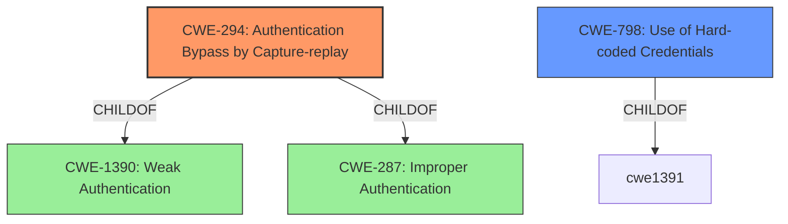

# Enhanced Analysis for CVE-2022-33208

# Summary
| CWE ID  | CWE Name                                      | Confidence | CWE Abstraction Level | CWE Vulnerability Mapping Label | CWE-Vulnerability Mapping Notes |
| :-------- | :--------------------------------------------- | :---------- | :---------------------- | :------------------------------ | :------------------------------ |
| CWE-294   | Authentication Bypass by Capture-replay       | 1          | Base                   | Primary                         | Allowed                        |
| CWE-798   | Use of Hard-coded Credentials                 | 0.7          | Base                   | Secondary                       | Allowed                        |

## Evidence and Confidence

*   **Confidence Score:** 0.9
*   **Evidence Strength:** HIGH

## Relationship Analysis
The primary relationship is that **CWE-294** [Authentication Bypass by Capture-replay] is a child of **CWE-1390** [Weak Authentication] and **CWE-287** [Improper Authentication]. The other CWEs considered, such as **CWE-798** [Use of Hard-coded Credentials], are peers or related through other hierarchical connections but do not directly address the core **capture-replay** mechanism described in the vulnerability.



## Vulnerability Chain
The vulnerability chain starts with the **capture-replay** mechanism (**CWE-294**) which allows an attacker to bypass authentication, leading to unauthorized access to the controller and potential modification of settings or disruption of industrial processes.

## Summary of Analysis
The primary assessment is based on the explicit description of the vulnerability as a **capture-replay** issue leading to authentication bypass. The evidence is strong, as highlighted by the "CVE Reference Links Content Summary" section, which states, "The vulnerability stems from an 'Authentication Bypass by Capture-replay' issue (**CWE-294**) present in the communication functions". The retriever results also list **CWE-294** [Authentication Bypass by Capture-replay] as the top match.

The selection of **CWE-294** [Authentication Bypass by Capture-replay] is at the optimal level of specificity because it accurately captures the technical mechanism of the vulnerability. While other CWEs like **CWE-287** [Improper Authentication] could be considered, they are too high-level and do not describe the specific **capture-replay** weakness. **CWE-798** [Use of Hard-coded Credentials] was only included because it was referenced in the CVE reference link section but it was deemed to be a different CVE and not part of this particular vulnerability.

Relevant CWE Information:

# Enhanced Context (25 CWEs)

## CWE-294: Authentication Bypass by Capture-replay
**Abstraction:** Base
**Status:** Incomplete

### Description
A **capture-replay flaw** exists when the design of the product makes it possible for a malicious user to sniff network traffic and bypass authentication by replaying it to the server in question to the same effect as the original message (or with minor changes).

### Extended Description
Capture-replay attacks are common and can be difficult to defeat without cryptography. They are a subset of network injection attacks that rely on observing previously-sent valid commands, then changing them slightly if necessary and resending the same commands to the server.

### Alternative Terms
None

### Relationships
ChildOf -> **CWE-1390**
ChildOf -> **CWE-287**

### Mapping Guidance
**Usage:** Allowed
**Rationale:** This CWE entry is at the Base level of abstraction, which is a preferred level of abstraction for mapping to the root causes of vulnerabilities.
**Comments:** Carefully read both the name and description to ensure that this mapping is an appropriate fit. Do not try to 'force' a mapping to a lower-level Base/Variant simply to comply with this preferred level of abstraction.
**Reasons:**
- Acceptable-Use

### Observed Examples
-   **CVE-2005-3435:** product authentication succeeds if user-provided MD5 hash matches the hash in its database; this can be subjected to replay attacks.
-   **CVE-2007-4961:** Chain: cleartext transmission of the MD5 hash of password (**CWE-319**) enables attacks against a server that is susceptible to replay (**CWE-294**).

## CWE-798: Use of Hard-coded Credentials
**Abstraction:** Base
**Status:** Draft

### Description
The product contains **hard-coded credentials**, such as a password or cryptographic key.

### Extended Description
There are two main variations:
* Inbound: the product contains an authentication mechanism that checks the input credentials against a **hard-coded** set of credentials.
* Outbound: the product connects to another system or component, and it contains **hard-coded credentials** for connecting to that component.

### Alternative Terms
None

### Relationships
ChildOf -> **CWE-1391**
ChildOf -> **CWE-287**
ChildOf -> **CWE-344**
ChildOf -> **CWE-671**
PeerOf -> **CWE-257**

### Mapping Guidance
**Usage:** Allowed
**Rationale:** This CWE entry is at the Base level of abstraction, which is a preferred level of abstraction for mapping to the root causes of vulnerabilities.
**Comments:** Carefully read both the name and description to ensure that this mapping is an appropriate fit. Do not try to 'force' a mapping to a lower-level Base/Variant simply to comply with this preferred level of abstraction.
**Reasons:**
- Acceptable-Use

### Observed Examples
- **CVE-2022-29953:** Condition Monitor firmware has a maintenance interface with **hard-coded credentials**
- **CVE-2022-29960:** Engineering Workstation uses **hard-coded cryptographic keys** that could allow for unathorized filesystem access and privilege escalation
- **CVE-2022-29964:** Distributed Control System (DCS) has **hard-coded passwords** for local shell access

## CWE-522: Insufficiently Protected Credentials
**Abstraction:** Class
**Status:** Incomplete

### Description
The product transmits or stores authentication credentials, but it uses an insecure method that is susceptible to unauthorized interception and/or retrieval.

### Extended Description
Not provided

### Alternative Terms
None

### Relationships
ChildOf -> **CWE-1390**
ChildOf -> **CWE-287**
ChildOf -> **CWE-668**

### Mapping Guidance
**Usage:** Allowed-with-Review
**Rationale:** This CWE entry is a Class and might have Base-level children that would be more appropriate
**Comments:** Examine children of this entry to see if there is a better fit
**Reasons:**
- Abstraction

### Observed Examples
- **CVE-2022-30018:** A messaging platform serializes all elements of User/Group objects, making private information available to adversaries
- **CVE-2022-29959:** Initialization file contains credentials that can be decoded using a "simple string transformation"
- **CVE-2022-35411:** Python-based RPC framework enables pickle functionality by default, allowing clients to unpickle untrusted data.

## CWE-288: Authentication Bypass Using an Alternate Path or Channel
**Abstraction:** Base
**Status:** Incomplete

### Description
The product requires authentication, but the product has an alternate path or channel that does not require authentication.

### Extended Description
Not provided

### Alternative Terms
None

### Relationships
ChildOf -> **CWE-306**
ChildOf -> **CWE-284**
PeerOf -> **CWE-420**

### Mapping Guidance
**Usage:** Allowed
**Rationale:** This CWE entry is at the Base level of abstraction, which is a preferred level of abstraction for mapping to the root causes of vulnerabilities.
**Comments:** Carefully read both the name and description to ensure that this mapping is an appropriate fit. Do not try to 'force' a mapping to a lower-level Base/Variant simply to comply with this preferred level of abstraction.
**Reasons:**
- Acceptable-Use

### Observed Examples
- **CVE-2000-1179:** Router allows remote attackers to read system logs without authentication by directly connecting to the login screen and


## CWE Relationship Analysis

Current CWEs represent these abstraction levels: .


### Vulnerability Chain Analysis

**Chain starting from CWE-671:**
- 671 (Lack of Administrator Control over Security) - ROOT


**Chain starting from CWE-344:**
- 344 (Use of Invariant Value in Dynamically Changing Context) - ROOT


### CWE Relationship Diagram

```mermaid
graph TD
    classDef primary fill:#f96,stroke:#333,stroke-width:2px
    classDef secondary fill:#69f,stroke:#333
    classDef tertiary fill:#9e9,stroke:#333
```