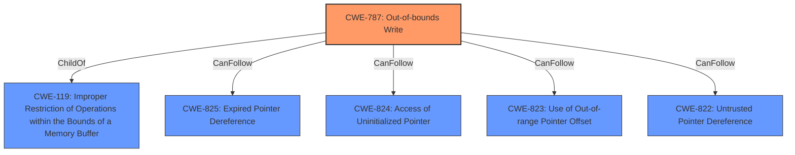

# Enhanced Analysis for CVE-2022-33234

# Summary
| CWE ID | CWE Name | Confidence | CWE Abstraction Level | CWE Vulnerability Mapping Label | CWE-Vulnerability Mapping Notes |
|---|---|---|---|---|---|
| CWE-787 | Out-of-bounds Write | 0.8 | Base | Allowed | Primary CWE |

## Evidence and Confidence

*   **Confidence Score:** 0.8
*   **Evidence Strength:** MEDIUM

## Relationship Analysis
The primary CWE selected is CWE-787 (**Out-of-bounds Write**), which is a Base level CWE. It is related to CWE-119 (**Improper Restriction of Operations within the Bounds of a Memory Buffer**) as a ChildOf. Several other CWEs like CWE-825 (**Expired Pointer Dereference**), CWE-824 (**Access of Uninitialized Pointer**), CWE-823 (**Use of Out-of-range Pointer Offset**), and CWE-822 (**Untrusted Pointer Dereference**) can follow CWE-787. This indicates that an out-of-bounds write can lead to a variety of subsequent issues.



## Vulnerability Chain
The chain of events starts with a **configuration weakness**, leading to **memory corruption**, specifically an out-of-bounds write. The initial **configuration weakness** allows for data to be written outside the intended memory boundaries.

## Summary of Analysis
The vulnerability description mentions a **configuration weakness** leading to **memory corruption** in the video component of Snapdragon products. The retriever results indicate that CWE-787 (**Out-of-bounds Write**) is the best match, which aligns with the description of **memory corruption** due to a write operation exceeding buffer boundaries. The description of CWE-787 matches the vulnerability's description, and it is at the Base level of abstraction, which is preferred.

CWE-822 (**Untrusted Pointer Dereference**) was considered, but the description focuses more on the use of untrusted pointers, which isn't directly stated in the provided vulnerability description. The vulnerability description states "**configuration weakness**" leading to **memory corruption** which is closest to out-of-bounds write.

CWE-1285 (**Improper Validation of Specified Index, Position, or Offset in Input**) was also considered because of its relation to indices and offsets, but the description doesn't specifically mention improper validation, only a **configuration weakness**. Also, CWE-1285 is the parent of CWE-129 which also was considered.

Therefore, based on the available information, CWE-787 is the most appropriate mapping due to its direct relation to the **memory corruption** caused by writing outside of intended buffer boundaries.

Relevant CWE Information:
- **CWE-787**: The product writes data past the end, or before the beginning, of the intended buffer. The vulnerability description mentions a **configuration weakness** that leads to **memory corruption**, which aligns with an out-of-bounds write.


## CWE Relationship Analysis

Current CWEs represent these abstraction levels: .


### Vulnerability Chain Analysis

**Chain starting from CWE-825:**
- 825 (Expired Pointer Dereference) - ROOT


**Chain starting from CWE-823:**
- 823 (Use of Out-of-range Pointer Offset) - ROOT


### CWE Relationship Diagram

```mermaid
graph TD
    classDef primary fill:#f96,stroke:#333,stroke-width:2px
    classDef secondary fill:#69f,stroke:#333
    classDef tertiary fill:#9e9,stroke:#333
```