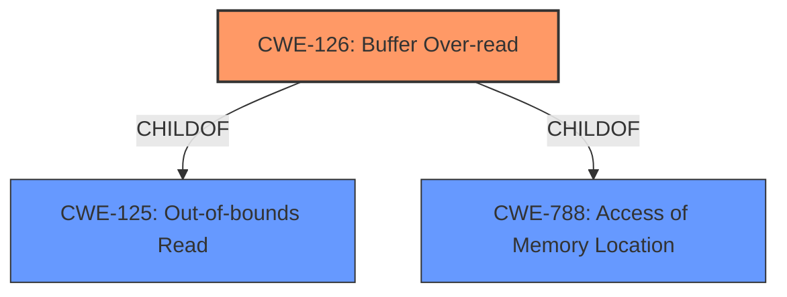

# Raw Analyzer Response for CVE-2022-33236

# Summary
| CWE ID    | CWE Name                      | Confidence | CWE Abstraction Level | CWE Vulnerability Mapping Label | CWE-Vulnerability Mapping Notes |
| --------- | ----------------------------- | ---------- | ----------------------- | ------------------------------- | ------------------------------- |
| CWE-126   | Buffer Over-read              | 0.9        | Variant                | Allowed                         | Primary CWE                     |

## Evidence and Confidence

*   **Confidence Score:** 0.9
*   **Evidence Strength:** HIGH

## Relationship Analysis
The primary relationship that influenced my decision was the direct match of the vulnerability description to CWE-126. CWE-126 is a Variant of CWE-125 (Out-of-bounds Read) and CWE-788 (Access of Memory Location). The variant level of abstraction is appropriate, as it is the most specific that directly applies.

## Vulnerability Chain
The vulnerability chain consists of a **buffer over-read** due to parsing cipher suite info attributes in the WLAN firmware, leading to a denial of service.

## Summary of Analysis
The vulnerability description explicitly states a "**buffer over-read**" in the WLAN firmware. The "Vulnerability Description Key Phrases" section also identifies "**buffer over-read**" as the root cause.

CWE-126 (Buffer Over-read) is a Variant level CWE that describes: "The product reads from a buffer using buffer access mechanisms such as indexes or pointers that reference memory locations after the targeted buffer." The description of CWE-126 directly aligns with the vulnerability description, making it the most appropriate CWE.

The retriever results also list CWE-126 as the top combined result with a score of 0.397.

CWE-20 (Improper Input Validation) was considered because a **buffer over-read** can often stem from a lack of proper input validation. However, CWE-20 is a Class level CWE and is discouraged unless a more specific CWE cannot be found. Since CWE-126 directly describes the **buffer over-read**, it is the more appropriate choice.
CWE-1284 (Improper Validation of Specified Quantity in Input) was also considered, but the description does not indicate issues with validating the size of the buffer, but that the firmware is reading past the end of the buffer.
CWE-787 (Out-of-bounds Write) was considered, but the description explicitly mentions an over-read and not an out-of-bounds write.
CWE-805 (Buffer Access with Incorrect Length Value) was considered. However, the description explicitly mentions an over-read and not an incorrect length value.
CWE-125 (Out-of-bounds Read) was considered. However, CWE-126 is a variant of this CWE and more specific for the reported vulnerability.

The evidence provided is sufficient to confidently assign CWE-126 as the primary CWE.