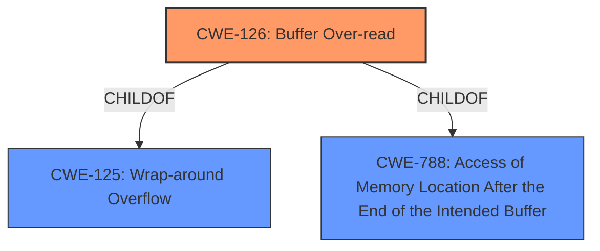

# Analysis Report for CVE-2022-33237

# Vulnerability Analysis Report: CVE-2022-33237

## Description


## Analysis (with Relationship Data)

# Summary
| CWE ID | CWE Name | Confidence | CWE Abstraction Level | CWE Vulnerability Mapping Label | CWE-Vulnerability Mapping Notes |
|---|---|---|---|---|---|
| CWE-126 | Buffer Over-read | 1.0 | Variant | Allowed | Primary CWE |

## Evidence and Confidence

*   **Confidence Score:** 1.0
*   **Evidence Strength:** HIGH

## Relationship Analysis
The primary relationship that influenced my decision was the ChildOf relationship between CWE-126 and its parents, CWE-125 and CWE-788. However, the vulnerability description clearly indicates an "over-read" condition, making CWE-126 the most accurate choice. There are no relevant chain relationships in this case.



## Vulnerability Chain
The vulnerability chain is relatively simple: A **buffer over-read** occurs while processing PPE threshold in WLAN firmware, leading to a transient denial of service. The root cause is the **buffer over-read**, and the impact is denial of service.

## Summary of Analysis
The initial analysis strongly suggests CWE-126 (Buffer Over-read) as the most appropriate classification, given the explicit mention of "**buffer over-read**" in the vulnerability description.

The description states: "Transient DOS due to **buffer over-read** in WLAN firmware while processing PPE threshold." This directly aligns with the description of CWE-126: "The product reads from a buffer using buffer access mechanisms such as indexes or pointers that reference memory locations after the targeted buffer."

The retriever results also lists CWE-126 as the top combined result.

The CWE-126 is at the Variant level of abstraction, which is a preferred level of abstraction for mapping to the root causes of vulnerabilities.

Therefore, based on the provided evidence and the CWE specifications, CWE-126 is the optimal choice.

Relevant CWE Information:

# Enhanced Context (25 CWEs)

## CWE-126: Buffer Over-read
**Abstraction:** Variant
**Status:** Draft

### Description
The product reads from a buffer using buffer access mechanisms such as indexes or pointers that reference memory locations after the targeted buffer.

### Extended Description
This typically occurs when the pointer or its index is incremented to a position beyond the bounds of the buffer or when pointer arithmetic results in a position outside of the valid memory location to name a few. This may result in exposure of sensitive information or possibly a crash.

### Alternative Terms
None

### Relationships
ChildOf -> CWE-125
ChildOf -> CWE-788

### Mapping Guidance
**Usage:** Allowed
**Rationale:** This CWE entry is at the Variant level of abstraction, which is a preferred level of abstraction for mapping to the root causes of vulnerabilities.
**Comments:** Carefully read both the name and description to ensure that this mapping is an appropriate fit. Do not try to 'force' a mapping to a lower-level Base/Variant simply to comply with this preferred level of abstraction.
**Reasons:**
- Acceptable-Use

### Additional Notes
**[Relationship]** These problems may be resultant from missing sentinel values (CWE-463) or trusting a user-influenced input length variable.

### Observed Examples
- **CVE-2022-1733:** Text editor has out-of-bounds read past end of line while indenting C code
- **CVE-2014-0160:** Chain: "Heartbleed" bug receives an inconsistent length parameter (CWE-130) enabling an out-of-bounds read (CWE-126), returning memory that could include private cryptographic keys and other sensitive data.
- **CVE-2009-2523:** Chain: product does not handle when an input string is not NULL terminated, leading to buffer over-read or heap-based buffer overflow.

Other CWEs Considered and Rejected:

*   CWE-1314: Missing Write Protection for Parametric Data Values - This CWE is related to missing write protection for sensor data, which is not relevant to the described vulnerability.
*   CWE-822: Untrusted Pointer Dereference - While a **buffer over-read** might involve pointers, the core issue is the out-of-bounds access, not necessarily an untrusted pointer.
*   CWE-823: Use of Out-of-range Pointer Offset - Similar to CWE-822, this is related but not as directly applicable as CWE-126. The problem is the read, not the pointer offset itself.
*   CWE-124: Buffer Underwrite ('Buffer Underflow') - This is the opposite of the described vulnerability (over-read vs. underwrite).
*   CWE-1285: Improper Validation of Specified Index, Position, or Offset in Input - While this might be a contributing factor, the direct cause is the **buffer over-read** itself.
*   CWE-787: Out-of-bounds Write - This describes a write operation, not a read operation.
*   CWE-367: Time-of-check Time-of-use (TOCTOU) Race Condition - This is not relevant to the described vulnerability.
*   CWE-415: Double Free - This is not relevant to the described vulnerability.
*   CWE-252: Unchecked Return Value - This is not directly relevant, as the issue is not a failure to check a return value.


## CWE Relationship Analysis

Current CWEs represent these abstraction levels: .


### Vulnerability Chain Analysis

**Chain starting from CWE-823:**
- 823 (Use of Out-of-range Pointer Offset) - ROOT


**Chain starting from CWE-822:**
- 822 (Untrusted Pointer Dereference) - ROOT


### CWE Relationship Diagram

```mermaid
graph TD
    classDef primary fill:#f96,stroke:#333,stroke-width:2px
    classDef secondary fill:#69f,stroke:#333
    classDef tertiary fill:#9e9,stroke:#333
```


*Report generated on 2025-03-30 19:59:25*
