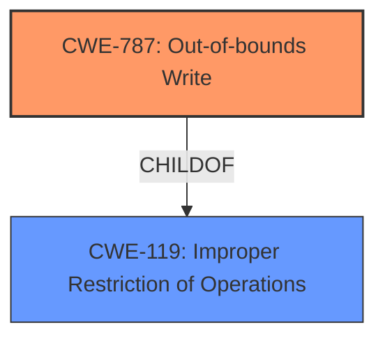

# Analysis Report for CVE-2022-33243

# Vulnerability Analysis Report: CVE-2022-33243

## Description


## Analysis (with Relationship Data)

# Summary
| CWE ID | CWE Name | Confidence | CWE Abstraction Level | CWE Vulnerability Mapping Label | CWE-Vulnerability Mapping Notes |
|---|---|---|---|---|---|
| CWE-787 | Out-of-bounds Write | 0.9 | Base | Allowed | Primary CWE |
| CWE-119 | Improper Restriction of Operations within the Bounds of a Memory Buffer | 0.5 | Class | Discouraged | Secondary Candidate |

## Evidence and Confidence

*   **Confidence Score:** 0.9
*   **Evidence Strength:** HIGH

## Relationship Analysis
The primary CWE, CWE-787 **CWE-787: Out-of-bounds Write**, is a base-level CWE and a child of CWE-119 **CWE-119: Improper Restriction of Operations within the Bounds of a Memory Buffer**, indicating a hierarchical relationship where the former is a specific type of the latter. This relationship influenced the decision to choose CWE-787 as the primary CWE due to its greater specificity. The relationship CANFOLLOW indicates potential follow-on weaknesses that could arise as a result of CWE-787.



## Vulnerability Chain
The vulnerability chain starts with **improper access control**, leading to **memory corruption**, specifically an out-of-bounds write.

## Summary of Analysis
The initial analysis focused on identifying the root cause and the type of memory corruption. The vulnerability description clearly states "**improper access control**" as the root cause, resulting in "**memory corruption**". The retriever results indicated that CWE-787 **CWE-787: Out-of-bounds Write** is the top candidate. The description of CWE-787, "The product writes data past the end, or before the beginning, of the intended buffer," aligns with the general description of **memory corruption** resulting from **improper access control**.

The relationship analysis confirmed that CWE-787 is a more specific instance of CWE-119, making it a more appropriate choice.

The final selection of CWE-787 is based on the evidence in the vulnerability description and the retriever results. The selection is also influenced by the relationships between CWEs, specifically the child-parent relationship between CWE-787 and CWE-119.

Relevant CWE Information:

# Enhanced Context (25 CWEs)

## CWE-404: Improper Resource Shutdown or Release
**Abstraction Level**: Class
**Similarity Score**: 0.80
**Source**: dense

**Description**:
The product does not release or incorrectly releases a resource before it is made available for re-use.

**Mapping Guidance**:
- Usage: Allowed-with-Review
- Rationale: This CWE entry is a Class and might have Base-level children that would be more appropriate

*   **Why it was considered but not used:** This CWE relates to resource management, which is not directly mentioned in the vulnerability description. The focus is on access control and memory corruption, not resource release.

## CWE-667: Improper Locking
**Abstraction Level**: Class
**Similarity Score**: 0.79
**Source**: dense

**Description**:
The product does not properly acquire or release a lock on a resource, leading to unexpected resource state changes and behaviors.

**Mapping Guidance**:
- Usage: Allowed-with-Review
- Rationale: This CWE entry is a Class and might have Base-level children that would be more appropriate

*   **Why it was considered but not used:** This CWE relates to locking mechanisms, which are not directly mentioned in the vulnerability description. The focus is on access control leading to memory corruption.

## CWE-226: Sensitive Information in Resource Not Removed Before Reuse
**Abstraction Level**: Base
**Similarity Score**: 0.79
**Source**: dense

**Description**:
The product releases a resource such as memory or a file so that it can be made available for reuse, but it does not clear or "zeroize" the information contained in the resource before the product performs a critical state transition or makes the resource available for reuse by other entities.

**Mapping Guidance**:
- Usage: Allowed
- Rationale: This CWE entry is at the Base level of abstraction, which is a preferred level of abstraction for mapping to the root causes of vulnerabilities.

*   **Why it was considered but not used:** This CWE relates to the reuse of resources with sensitive information, which is not directly related to the vulnerability description. The focus is on access control leading to memory corruption, not the leakage of sensitive information.

## CWE-131: Incorrect Calculation of Buffer Size
**Abstraction Level**: Base
**Similarity Score**: 0.79
**Source**: dense

**Description**:
The product does not correctly calculate the size to be used when allocating a buffer, which could lead to a buffer overflow.

**Mapping Guidance**:
- Usage: Allowed
- Rationale: This CWE entry is at the Base level of abstraction, which is a preferred level of abstraction for mapping to the root causes of vulnerabilities.

*   **Why it was considered but not used:** While incorrect buffer size calculation can lead to memory corruption, the vulnerability description emphasizes **improper access control** as the root cause.

## CWE-754: Improper Check for Unusual or Exceptional Conditions
**Abstraction Level**: Class
**Similarity Score**: 0.78
**Source**: dense

**Description**:
The product does not check or incorrectly checks for unusual or exceptional conditions that are not expected to occur frequently during day to day operation of the product.

**Mapping Guidance**:
- Usage: Allowed-with-Review
- Rationale: This CWE entry is a Class and might have Base-level children that would be more appropriate

*   **Why it was considered but not used:** This CWE relates to handling unusual conditions, which is not directly mentioned in the vulnerability description. The focus is on access control leading to memory corruption.

## CWE-824: Access of Uninitialized Pointer
**Abstraction Level**: Base
**Similarity Score**: 0.78
**Source**: dense

**Description**:
The product accesses or uses a pointer that has not been initialized.

**Mapping Guidance**:
- Usage: Allowed
- Rationale: This CWE entry is at the Base level of abstraction, which is a preferred level of abstraction for mapping to the root causes of vulnerabilities.

*   **Why it was considered but not used:** While use of an uninitialized pointer can cause memory corruption, the vulnerability description emphasizes **improper access control** as the root cause.

## CWE-665: Improper Initialization
**Abstraction Level**: Class
**Similarity Score**: 0.78
**Source**: dense

**Description**:
The product does not initialize or incorrectly initializes a resource, which might leave the resource in an unexpected state when it is accessed or used.

**Mapping Guidance**:
- Usage: Discouraged
- Rationale: This CWE entry is a level-1 Class (i.e., a child of a Pillar). It might have lower-level children that would be more appropriate

*   **Why it was considered but not used:** This CWE is too general, and the specific issue is related to memory access after a lack of access control.

## CWE-703: Improper Check or Handling of Exceptional Conditions
**Abstraction Level**: Pillar
**Similarity Score**: 0.78
**Source**: dense

**Description**:
The product does not properly anticipate or handle exceptional conditions that rarely occur during normal operation of the product.

**Mapping Guidance**:
- Usage: Discouraged
- Rationale: This CWE entry is extremely high-level, a Pillar.

*   **Why it was considered but not used:** This CWE is too general and does not describe the specifics of the vulnerability.

## CWE-908: Use of Uninitialized Resource
**Abstraction Level**: Base
**Similarity Score**: 0.78
**Source**: dense

**Description**:
The product uses or accesses a resource that has not been initialized.

**Mapping Guidance**:
- Usage: Allowed
- Rationale: This CWE entry is at the Base level of abstraction, which is a preferred level of abstraction for mapping to the root causes of vulnerabilities.

*   **Why it was considered but not used:** Similar to CWE-824, the root cause is **improper access control**, not the use of an uninitialized resource.

## CWE-909: Missing Initialization of Resource
**Abstraction Level**: Class
**Similarity Score**: 0.77
**Source**: dense

**Description**:
The product does not initialize a critical resource.

**Mapping Guidance**:
- Usage: Allowed-with-Review
- Rationale: This CWE entry is a Class and might have Base-level children that would be more appropriate

*   **Why it was considered but not used:** The root cause is **improper access control**, not the missing initialization of a resource.

## CWE-823: Use of Out-of-range Pointer Offset


## CWE Relationship Analysis

Current CWEs represent these abstraction levels: .


### Vulnerability Chain Analysis

**Chain starting from CWE-131:**
- 131 (Incorrect Calculation of Buffer Size) - ROOT


**Chain starting from CWE-908:**
- 908 (Use of Uninitialized Resource) - ROOT


### CWE Relationship Diagram

```mermaid
graph TD
    classDef primary fill:#f96,stroke:#333,stroke-width:2px
    classDef secondary fill:#69f,stroke:#333
    classDef tertiary fill:#9e9,stroke:#333
```


*Report generated on 2025-03-31 09:59:50*
