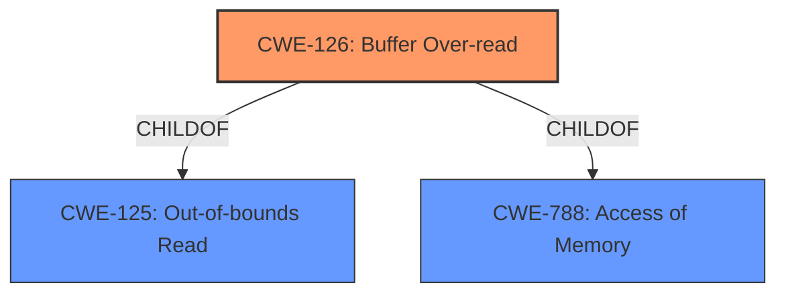

# Enhanced Analysis for CVE-2022-33252

# Summary
| CWE ID | CWE Name | Confidence | CWE Abstraction Level | CWE Vulnerability Mapping Label | CWE-Vulnerability Mapping Notes |
|---|---|---|---|---|---|
| CWE-126 | Buffer Over-read | 1.0 | Variant | Allowed | Primary CWE |

## Evidence and Confidence

*   **Confidence Score:** 1.0
*   **Evidence Strength:** HIGH

## Relationship Analysis
The primary relationship that influenced the decision was the ChildOf relationship between CWE-126 and CWE-125 (Out-of-bounds Read). CWE-126 is a variant of CWE-125, specifying that the read occurs *after* the targeted buffer. There were no relevant chain relationships.



## Vulnerability Chain
The vulnerability chain is straightforward:
1.  **Root Cause:** **Buffer Over-read** (CWE-126)
2.  **Impact:** Information disclosure

## Summary of Analysis
The initial analysis identified **buffer over-read** as the **rootcause** from the "Vulnerability Description Key Phrases". The retriever results highlighted CWE-126 (Buffer Over-read) as the top candidate. The vulnerability description explicitly states "Information disclosure due to **buffer over-read** in WLAN while handling IBSS beacons frame.".

CWE-126 is a Variant of CWE-125 and describes reading data past the end of a buffer. Since the vulnerability description explicitly indicates that the read is happening past the end of the buffer, CWE-126 is the most appropriate and specific choice. The MITRE mapping guidance allows for the usage of CWE-126.

Other CWEs were considered but deemed less suitable:

*   CWE-193 (Off-by-one Error): While an off-by-one error *could* lead to a buffer over-read, the description doesn't provide sufficient information to confirm this.
*   CWE-190 (Integer Overflow or Wraparound): This is not directly related to the description of the vulnerability.
*   CWE-1284 (Improper Validation of Specified Quantity in Input): While input validation might be a factor in preventing this vulnerability, the description focuses on the over-read itself, not the lack of validation.

The final selection of CWE-126 is based on the explicit mention of "buffer over-read" in the vulnerability description and its precise definition.


## CWE Relationship Analysis

Current CWEs represent these abstraction levels: .


### Vulnerability Chain Analysis

**Chain starting from CWE-190:**
- 190 (Integer Overflow or Wraparound) - ROOT


**Chain starting from CWE-193:**
- 193 (Off-by-one Error) - ROOT


### CWE Relationship Diagram

```mermaid
graph TD
    classDef primary fill:#f96,stroke:#333,stroke-width:2px
    classDef secondary fill:#69f,stroke:#333
    classDef tertiary fill:#9e9,stroke:#333
```