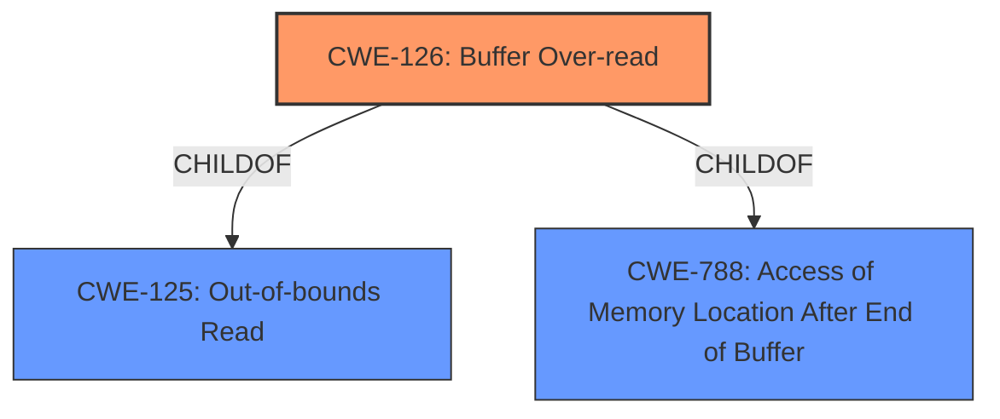

# Analysis Report for CVE-2022-33253

# Vulnerability Analysis Report: CVE-2022-33253

## Description


## Analysis (with Relationship Data)

# Summary
| CWE ID | CWE Name | Confidence | CWE Abstraction Level | CWE Vulnerability Mapping Label | CWE-Vulnerability Mapping Notes |
|---|---|---|---|---|---|
| CWE-126 | Buffer Over-read | 1.0 | Variant | Allowed | Primary CWE |
| CWE-125 | Out-of-bounds Read | 0.7 | Base | Allowed | Secondary Candidate |

## Evidence and Confidence

*   **Confidence Score:** 0.9
*   **Evidence Strength:** HIGH

## Relationship Analysis
The primary CWE, CWE-126, is a Variant of CWE-125 (Out-of-bounds Read) and CWE-788 (Access of Memory Location After End of Buffer). CWE-125 is a more general case of reading out of bounds. The vulnerability description specifically mentions a **buffer over-read**, making CWE-126 a more precise fit. There are no other relevant relationships.



## Vulnerability Chain
The vulnerability chain consists of:
1.  Parsing of corrupted NAN frames in WLAN.
2.  Resulting in a **buffer over-read** (CWE-126)
3.  Leading to a transient denial of service.

## Summary of Analysis
The analysis is strongly based on the evidence from the vulnerability description, which explicitly states "**buffer over-read**". This aligns directly with the description of CWE-126 (Buffer Over-read). The retriever results also list CWE-126 as the top candidate.

The selection of CWE-126 is at the optimal level of specificity because it accurately describes the vulnerability as a **buffer over-read**, which is a more specific case of the more general "out-of-bounds read" (CWE-125).

Relevant CWE Information:

# Enhanced Context (25 CWEs)

## CWE-126: Buffer Over-read
**Abstraction:** Variant
**Similarity Score**: 0.205 (from Retriever Results)

**Description**:
The product reads from a buffer using buffer access mechanisms such as indexes or pointers that reference memory locations after the targeted buffer.

The vulnerability description states "**buffer over-read**", which matches the description of CWE-126.

## CWE-125: Out-of-bounds Read
**Abstraction:** Base
**Similarity Score**: 5014.23 (from sparse retriever)

**Description**:
The product reads data past the end, or before the beginning, of the intended buffer.

CWE-125 is a broader category that includes both over-reads and under-reads. Since the vulnerability specifically involves an over-read, CWE-126 is a more specific and accurate classification, so CWE-125 is a secondary candidate.

## Other CWEs Considered and Rejected:

*   **CWE-190: Integer Overflow or Wraparound**: While integer overflows can sometimes lead to buffer overflows, there's no explicit mention or implication of integer overflow in the vulnerability description.
*   **CWE-193: Off-by-one Error**: An off-by-one error could potentially lead to a buffer over-read, but there's no direct evidence to support this.
*   **CWE-122: Heap-based Buffer Overflow** and **CWE-121: Stack-based Buffer Overflow**: These CWEs describe the location of the buffer, but the primary issue is the over-read, not the location of the buffer.
*   **CWE-805: Buffer Access with Incorrect Length Value**: This CWE is relevant to scenarios where an incorrect length value leads to out-of-bounds access. However, the description doesn't explicitly state that an incorrect length value caused the over-read. It could be caused by other issues, such as an off-by-one error, integer overflow, or incorrect pointer arithmetic.
*   **CWE-124: Buffer Underwrite ('Buffer Underflow')**: The vulnerability description explicitly states "**buffer over-read**," so this is not a correct classification.
*   **CWE-1284: Improper Validation of Specified Quantity in Input**: This CWE relates to improper validation of input quantities. While the corrupted NAN frames could involve invalid quantities, the direct cause is the **buffer over-read**, making CWE-126 the more precise classification.
*   **CWE-908: Use of Uninitialized Resource** and **CWE-909: Missing Initialization of Resource**: There is no mention of uninitialized resources.


## CWE Relationship Analysis

Current CWEs represent these abstraction levels: .


### Vulnerability Chain Analysis

**Chain starting from CWE-190:**
- 190 (Integer Overflow or Wraparound) - ROOT


**Chain starting from CWE-908:**
- 908 (Use of Uninitialized Resource) - ROOT


### CWE Relationship Diagram

```mermaid
graph TD
    classDef primary fill:#f96,stroke:#333,stroke-width:2px
    classDef secondary fill:#69f,stroke:#333
    classDef tertiary fill:#9e9,stroke:#333
```


*Report generated on 2025-03-31 11:02:39*
