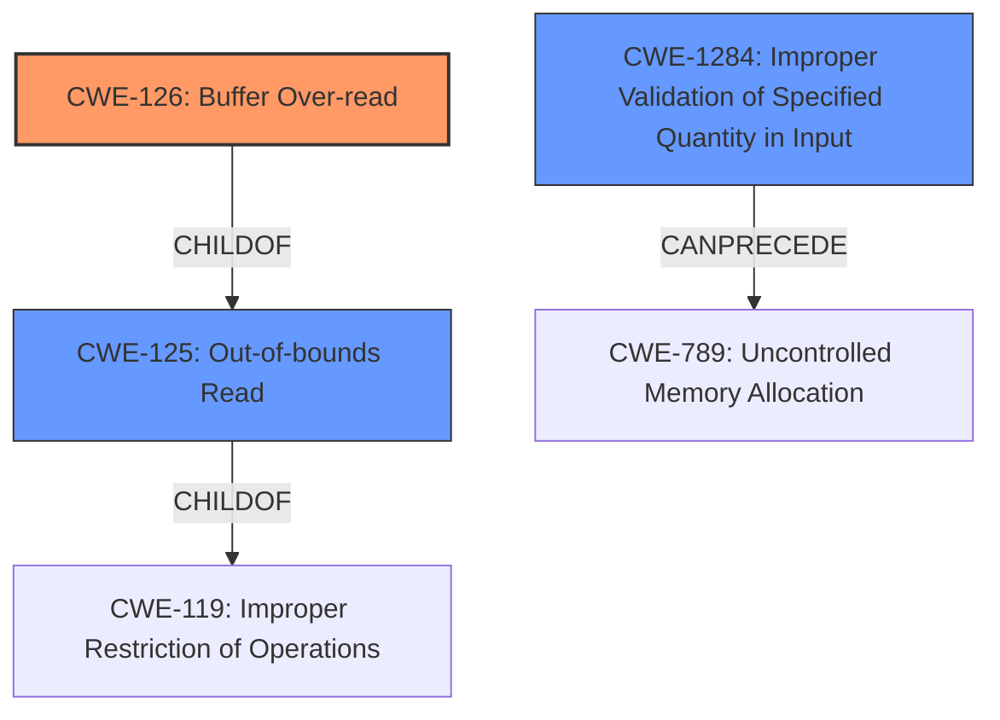

# Analysis Report for CVE-2022-33255

# Vulnerability Analysis Report: CVE-2022-33255

## Description


## Analysis (with Relationship Data)

# Summary
| CWE ID | CWE Name | Confidence | CWE Abstraction Level | CWE Vulnerability Mapping Label | CWE-Vulnerability Mapping Notes |
|---|---|---|---|---|---|
| CWE-126 | Buffer Over-read | 0.9 | Variant | Allowed | Primary CWE |
| CWE-125 | Out-of-bounds Read | 0.7 | Base | Allowed | Secondary Candidate |
| CWE-1284 | Improper Validation of Specified Quantity in Input | 0.6 | Base | Allowed | Secondary Candidate |

## Evidence and Confidence

*   **Confidence Score:** 0.9
*   **Evidence Strength:** HIGH

## Relationship Analysis
The primary CWE selected is CWE-126 (Buffer Over-read), a Variant of CWE-125 (Out-of-bounds Read). CWE-125 is a child of CWE-119 (Improper Restriction of Operations within the Bounds of a Memory Buffer).
CWE-1284 (Improper Validation of Specified Quantity in Input) can precede CWE-789 (Uncontrolled Memory Allocation) which can cause buffer overflows/over-reads. The selection favors the more specific Variant, CWE-126, aligning with the provided evidence.



## Vulnerability Chain
The vulnerability chain starts with a **buffer over-read** in the Bluetooth HOST while processing GetFolderItems and GetItemAttribute Cmds from a peer device, leading to information disclosure. The root cause is the **buffer over-read**, and the impact is information disclosure. There isn't enough evidence to link this to other CWEs in a specific chain.

## Summary of Analysis
The initial assessment identified a **buffer over-read** as the root cause, leading to information disclosure. The primary selection of CWE-126 (Buffer Over-read) is based on the explicit mention of "**buffer over-read**" in the vulnerability description. This aligns with the CWE description, which states, "The product reads from a buffer using buffer access mechanisms such as indexes or pointers that reference memory locations after the targeted buffer." The retriever results also list CWE-126 as the top candidate. CWE-125 (Out-of-bounds Read) was considered, as CWE-126 is a variant of CWE-125, however, CWE-126 is the better fit since the description specifically calls out an over-read condition.

CWE-1284 (Improper Validation of Specified Quantity in Input) was also considered, as a missing validation could lead to the allocation of an incorrect buffer size, leading to an over-read. However, without further evidence, CWE-126 remains the primary and most accurate classification. The final decision is based on direct evidence from the vulnerability description and the retriever results, favoring the most specific variant.


## CWE Relationship Analysis

Current CWEs represent these abstraction levels: .


### Vulnerability Chain Analysis

**Chain starting from CWE-1284:**
- 1284 (Improper Validation of Specified Quantity in Input) - ROOT


**Chain starting from CWE-119:**
- 119 (Improper Restriction of Operations within the Bounds of a Memory Buffer) - ROOT


### CWE Relationship Diagram

```mermaid
graph TD
    classDef primary fill:#f96,stroke:#333,stroke-width:2px
    classDef secondary fill:#69f,stroke:#333
    classDef tertiary fill:#9e9,stroke:#333
```


*Report generated on 2025-03-31 13:14:44*
