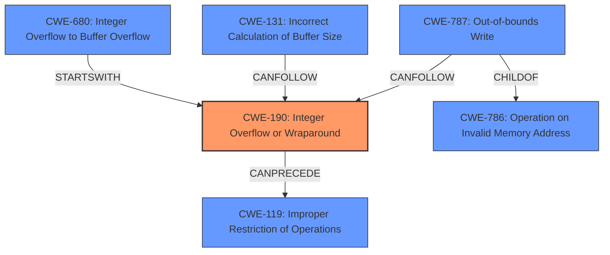

# Raw Analyzer Response for CVE-2022-33266

# Summary
| CWE ID  | CWE Name                                       | Confidence | CWE Abstraction Level | CWE Vulnerability Mapping Label | CWE-Vulnerability Mapping Notes |
| :------- | :--------------------------------------------- | :--------- | :---------------------- | :------------------------------ | :------------------------------ |
| CWE-190  | Integer Overflow or Wraparound                | 1          | Base                    | Allowed                       | Primary CWE                     |
| CWE-787  | Out-of-bounds Write                           | 0.7        | Base                    | Allowed                       | Secondary Candidate             |
| CWE-131  | Incorrect Calculation of Buffer Size          | 0.6        | Base                    | Allowed                       | Secondary Candidate             |
| CWE-680  | Integer Overflow to Buffer Overflow           | 0.5        | Compound                  | Discouraged                   | Secondary Candidate             |

## Evidence and Confidence

*   **Confidence Score:** 0.8
*   **Evidence Strength:** HIGH

## Relationship Analysis
The primary weakness is identified as CWE-190 (**Integer Overflow or Wraparound**), a **Base** level CWE. This can **precede** CWE-119 (**Improper Restriction of Operations within the Bounds of a Memory Buffer**). CWE-787 (**Out-of-bounds Write**) is a potential consequence of an integer overflow leading to an improperly sized buffer, and is a **ChildOf** CWE-786 (**Operation on an Invalid Memory Address**). The compound CWE-680 (**Integer Overflow to Buffer Overflow**) was considered but deemed less appropriate as it combines multiple weaknesses and is discouraged. CWE-131 (**Incorrect Calculation of Buffer Size**) is also a strong candidate, as it describes a common cause of buffer overflows related to integer handling.

## Vulnerability Chain
The vulnerability chain starts with an **integer overflow** (CWE-190). This **incorrect calculation** (possibly CWE-131) can lead to an undersized buffer being allocated. When data is written to this buffer, an **out-of-bounds write** (CWE-787) occurs, resulting in **memory corruption**.

## Summary of Analysis
The analysis is heavily based on the vulnerability description, which explicitly mentions "**integer overflow** to buffer overflow". This provides strong evidence for CWE-190 as the primary root cause. The description indicates that this **integer overflow** leads to **memory corruption**, suggesting a buffer overflow condition.

The retriever results also support this, with CWE-190 being the top-ranked CWE. While CWE-680 (**Integer Overflow to Buffer Overflow**) seems like a direct match, it is a Compound CWE and is discouraged. Mapping to the individual components (CWE-190 and CWE-787) provides more granularity.

CWE-131 (**Incorrect Calculation of Buffer Size**) is considered as a possible contributing factor, as the integer overflow could lead to an incorrect buffer size calculation.

The selection of CWE-190 is at the optimal level of specificity as it accurately captures the root cause of the vulnerability based on the provided evidence.

Relevant CWE Information:

# Enhanced Context (25 CWEs)
The following CWEs were identified as potentially relevant to this vulnerability:

## CWE-191: Integer Underflow (Wrap or Wraparound)
**Abstraction Level**: Base
**Similarity Score**: 0.80
**Source**: dense

**Description**:
The product subtracts one value from another, such that the result is less than the minimum allowable integer value, which produces a value that is not equal to the correct result.

**Mapping Guidance**:
- Usage: Allowed
- Rationale: This CWE entry is at the Base level of abstraction, which is a preferred level of abstraction for mapping to the root causes of vulnerabilities.

## CWE-681: Incorrect Conversion between Numeric Types
**Abstraction Level**: Base
**Similarity Score**: 0.79
**Source**: dense

**Description**:
When converting from one data type to another, such as long to integer, data can be omitted or translated in a way that produces unexpected values. If the resulting values are used in a sensitive context, then dangerous behaviors may occur.

**Mapping Guidance**:
- Usage: Allowed
- Rationale: This CWE entry is at the Base level of abstraction, which is a preferred level of abstraction for mapping to the root causes of vulnerabilities.

## CWE-680: Integer Overflow to Buffer Overflow
**Abstraction Level**: Compound
**Similarity Score**: 0.79
**Source**: dense

**Description**:
The product performs a calculation to determine how much memory to allocate, but an integer overflow can occur that causes less memory to be allocated than expected, leading to a buffer overflow.

**Mapping Guidance**:
- Usage: Discouraged
- Rationale: This CWE entry is a named chain, which combines multiple weaknesses.

## CWE-197: Numeric Truncation Error
**Abstraction Level**: Base
**Similarity Score**: 0.78
**Source**: dense

**Description**:
Truncation errors occur when a primitive is cast to a primitive of a smaller size and data is lost in the conversion.

**Mapping Guidance**:
- Usage: Allowed
- Rationale: This CWE entry is at the Base level of abstraction, which is a preferred level of abstraction for mapping to the root causes of vulnerabilities.

## CWE-131: Incorrect Calculation of Buffer Size
**Abstraction Level**: Base
**Similarity Score**: 0.78
**Source**: dense

**Description**:
The product does not correctly calculate the size to be used when allocating a buffer, which could lead to a buffer overflow.

**Mapping Guidance**:
- Usage: Allowed
- Rationale: This CWE entry is at the Base level of abstraction, which is a preferred level of abstraction for mapping to the root causes of vulnerabilities.

## CWE-124: Buffer Underwrite ('Buffer Underflow')
**Abstraction Level**: Base
**Similarity Score**: 0.77
**Source**: dense

**Description**:
The product writes to a buffer using an index or pointer that references a memory location prior to the beginning of the buffer.

**Mapping Guidance**:
- Usage: Allowed
- Rationale: This CWE entry is at the Base level of abstraction, which is a preferred level of abstraction for mapping to the root causes of vulnerabilities.

## CWE-190: Integer Overflow or Wraparound
**Abstraction Level**: Base
**Similarity Score**: 0.76
**Source**: dense

**Description**:
The product performs a calculation that can
         produce an integer overflow or wraparound when the logic
         assumes that the resulting value will always be larger than
         the original value. This occurs when an integer value is
         incremented to a value that is too large to store in the
         associated representation. When this occurs, the value may
         become a very small or negative number.

**Mapping Guidance**:
- Usage: Allowed
- Rationale: This CWE entry is at the Base level of abstraction, which is a preferred level of abstraction for mapping to the root causes of vulnerabilities.

## CWE-805: Buffer Access with Incorrect Length Value
**Abstraction Level**: Base
**Similarity Score**: 0.76
**Source**: dense

**Description**:
The product uses a sequential operation to read or write a buffer, but it uses an incorrect length value that causes it to access memory that is outside of the bounds of the buffer.

**Mapping Guidance**:
- Usage: Allowed
- Rationale: This CWE entry is at the Base level of abstraction, which is a preferred level of abstraction for mapping to the root causes of vulnerabilities.

## CWE-126: Buffer Over-read
**Abstraction Level**: Variant
**Similarity Score**: 0.74
**Source**: dense

**Description**:
The product reads from a buffer using buffer access mechanisms such as indexes or pointers that reference memory locations after the targeted buffer.

**Mapping Guidance**:
- Usage: Allowed
- Rationale: This CWE entry is at the Variant level of abstraction, which