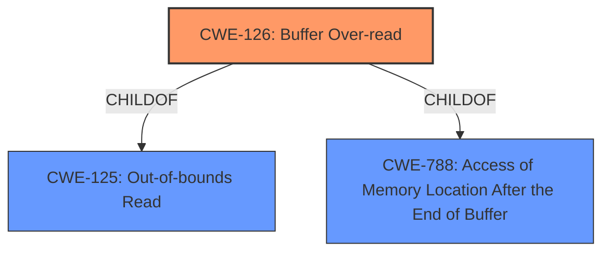

# Raw Analyzer Response for CVE-2022-33271

# Summary
| CWE ID | CWE Name | Confidence | CWE Abstraction Level | CWE Vulnerability Mapping Label | CWE-Vulnerability Mapping Notes |
|---|---|---|---|---|---|
| CWE-126 | Buffer Over-read | 1.0 | Variant | Allowed | Primary CWE |

## Evidence and Confidence

*   **Confidence Score:** 1.0
*   **Evidence Strength:** HIGH

## Relationship Analysis
The primary relationship considered was the ChildOf relationship between CWE-126 (Buffer Over-read) and its parents, CWE-125 (Out-of-bounds Read) and CWE-788 (Access of Memory Location After the End of Buffer). Since the description explicitly states "**buffer over-read**," selecting the variant CWE-126 is the most specific and appropriate choice.

## Vulnerability Chain
The vulnerability chain is simple: a **buffer over-read** leads to information disclosure.

## Summary of Analysis
The vulnerability description clearly indicates a **buffer over-read** condition. The Retriever Results list CWE-126 (Buffer Over-read) as the top candidate, and the CWE specifications confirm that it aligns perfectly with the provided description. The description states: "Information disclosure due to **buffer over-read** in WLAN while parsing NMF frame." CWE-126's description states: "The product reads from a buffer using buffer access mechanisms such as indexes or pointers that reference memory locations after the targeted buffer." This directly matches the vulnerability details. The CWE is at the Variant level of abstraction, which is the preferred level when it accurately represents the weakness.

Relevant CWE Information:

# Enhanced Context (25 CWEs)

## CWE-126: Buffer Over-read
**Abstraction:** Variant
**Status:** Draft

### Description
The product reads from a buffer using buffer access mechanisms such as indexes or pointers that reference memory locations after the targeted buffer.

### Mapping Guidance
**Usage:** Allowed
**Rationale:** This CWE entry is at the Variant level of abstraction, which is a preferred level of abstraction for mapping to the root causes of vulnerabilities.