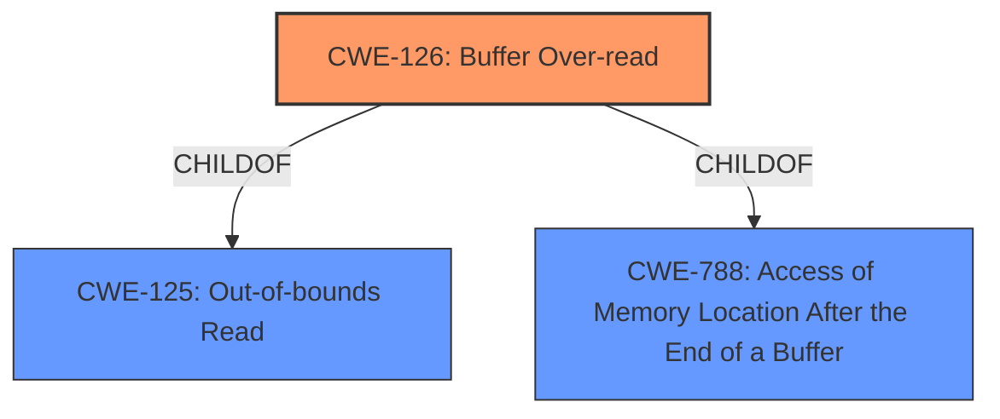

# Enhanced Analysis for CVE-2022-33284

# Summary
| CWE ID | CWE Name | Confidence | CWE Abstraction Level | CWE Vulnerability Mapping Label | CWE-Vulnerability Mapping Notes |
|---|---|---|---|---|---|
| CWE-126 | Buffer Over-read | 1.0 | Variant | Allowed | Primary CWE |

## Evidence and Confidence

*   **Confidence Score:** 1.0
*   **Evidence Strength:** HIGH

## Relationship Analysis
The primary relationship that influenced the decision was the ChildOf relationship between CWE-126 (Buffer Over-read) and its parent CWE-125 (Out-of-bounds Read). Since the description specifically mentions "**buffer over-read**," the more specific variant CWE-126 was chosen over the base CWE-125.



## Vulnerability Chain
The chain of events is as follows:
1.  A WLAN parsing routine attempts to process a BTM action frame.
2.  Due to a **buffer over-read**, the routine reads data beyond the allocated buffer.
3.  This leads to information disclosure.

The root cause is the **buffer over-read**, and the impact is information disclosure.

## Summary of Analysis
The vulnerability description clearly states "**buffer over-read**" as the root cause of the information disclosure. The Retriever Results also list CWE-126 (Buffer Over-read) as the top candidate.

The evidence supporting this decision is the "**rootcause:** **buffer over-read**" phrase in the Vulnerability Description Key Phrases section.

CWE-126 (Buffer Over-read) is at the Variant level of abstraction, which is the preferred level for mapping. The description of CWE-126 accurately reflects the vulnerability: "The product reads from a buffer using buffer access mechanisms such as indexes or pointers that reference memory locations after the targeted buffer."

CWE-125 (Out-of-bounds Read) was considered but deemed less specific than CWE-126. CWE-125 is a parent of CWE-126, and since the vulnerability description explicitly mentions an "over-read," CWE-126 is the more appropriate choice.

The other CWEs listed in the Retriever Results (CWE-190, CWE-193, CWE-1284, CWE-805, CWE-1339, CWE-909, CWE-122, CWE-908) were not selected because they do not directly address the **buffer over-read** issue.
Specifically, these are the reasons for exclusion:

*   CWE-190 (Integer Overflow or Wraparound): Relates to integer calculations, not buffer access.
*   CWE-193 (Off-by-one Error): Could lead to a buffer over-read but is not the direct cause described.
*   CWE-1284 (Improper Validation of Specified Quantity in Input): Involves quantity validation, which is not mentioned in the vulnerability description.
*   CWE-805 (Buffer Access with Incorrect Length Value): While related to buffer access, the description specifies that the access occurs because of an incorrect length value, not that the memory locations after the targeted buffer are read.
*   CWE-1339 (Insufficient Precision or Accuracy of a Real Number): Pertains to real number precision, not buffer handling.
*   CWE-909 (Missing Initialization of Resource): Addresses missing initialization, which is not the issue here.
*   CWE-122 (Heap-based Buffer Overflow): Specific to heap memory, while the description doesn't mention the memory location.
*   CWE-908 (Use of Uninitialized Resource): Focuses on using uninitialized resources, not buffer over-reads.

Relevant CWE Information:

# Enhanced Context (25 CWEs)

## CWE-226: Sensitive Information in Resource Not Removed Before Reuse
**Abstraction Level**: Base
**Similarity Score**: 0.78
**Source**: dense

**Description**:
The product releases a resource such as memory or a file so that it can be made available for reuse, but it does not clear or "zeroize" the information contained in the resource before the product performs a critical state transition or makes the resource available for reuse by other entities.

**Mapping Guidance**:
- Usage: Allowed
- Rationale: This CWE entry is at the Base level of abstraction, which is a preferred level of abstraction for mapping to the root causes of vulnerabilities.

## CWE-131: Incorrect Calculation of Buffer Size
**Abstraction Level**: Base
**Similarity Score**: 0.78
**Source**: dense

**Description**:
The product does not correctly calculate the size to be used when allocating a buffer, which could lead to a buffer overflow.

**Mapping Guidance**:
- Usage: Allowed
- Rationale: This CWE entry is at the Base level of abstraction, which is a preferred level of abstraction for mapping to the root causes of vulnerabilities.

## CWE-805: Buffer Access with Incorrect Length Value
**Abstraction Level**: Base
**Similarity Score**: 0.77
**Source**: dense

**Description**:
The product uses a sequential operation to read or write a buffer, but it uses an incorrect length value that causes it to access memory that is outside of the bounds of the buffer.

**Mapping Guidance**:
- Usage: Allowed
- Rationale: This CWE entry is at the Base level of abstraction, which is a preferred level of abstraction for mapping to the root causes of vulnerabilities.

## CWE-191: Integer Underflow (Wrap or Wraparound)
**Abstraction Level**: Base
**Similarity Score**: 0.77
**Source**: dense

**Description**:
The product subtracts one value from another, such that the result is less than the minimum allowable integer value, which produces a value that is not equal to the correct result.

**Mapping Guidance**:
- Usage: Allowed
- Rationale: This CWE entry is at the Base level of abstraction, which is a preferred level of abstraction for mapping to the root causes of vulnerabilities.

## CWE-909: Missing Initialization of Resource
**Abstraction Level**: Class
**Similarity Score**: 0.77
**Source**: dense

**Description**:
The product does not initialize a critical resource.

**Mapping Guidance**:
- Usage: Allowed-with-Review
- Rationale: This CWE entry is a Class and might have Base-level children that would be more appropriate

## CWE-404: Improper Resource Shutdown or Release
**Abstraction Level**: Class
**Similarity Score**: 0.77
**Source**: dense

**Description**:
The product does not release or incorrectly releases a resource before it is made available for re-use.

**Mapping Guidance**:
- Usage: Allowed-with-Review
- Rationale: This CWE entry is a Class and might have Base-level children that would be more appropriate

## CWE-126: Buffer Over-read
**Abstraction Level**: Variant
**Similarity Score**: 0.76
**Source**: dense

**Description**:
The product reads from a buffer using buffer access mechanisms such as indexes or pointers that reference memory locations after the targeted buffer.

**Mapping Guidance**:
- Usage: Allowed
- Rationale: This CWE entry is at the Variant level of abstraction, which is a preferred level of abstraction for mapping to the root causes of vulnerabilities.

## CWE-908: Use of Uninitialized Resource
**Abstraction Level**: Base
**Similarity Score**: 0.76
**Source**: dense

**Description**:
The product uses or accesses a resource that has not been initialized.

**Mapping Guidance**:
- Usage: Allowed
- Rationale: This CWE entry is at the Base level of abstraction, which is a preferred level of abstraction for mapping to the root causes of vulnerabilities.

## CWE-667: Improper Locking
**Abstraction Level**: Class
**Similarity Score**: 0.76
**Source**: dense

**Description**:
The product does not properly acquire or release a lock on a resource, leading to unexpected resource state changes and behaviors.

**Mapping Guidance**:
- Usage: Allowed-with-Review
- Rationale: This CWE entry is a Class and might have Base-level children that would be more appropriate

## CWE-125: Out-of-bounds Read
**Abstraction Level**: Base
**Similarity Score**: 0.76
**Source**: dense

**Description**:
The product reads data past the end, or before the beginning, of the intended buffer.

**Mapping Guidance**:
- Usage: Allowed
- Rationale: This CWE entry is at the Base level of abstraction, which


## CWE Relationship Analysis

Current CWEs represent these abstraction levels: .


### Vulnerability Chain Analysis

**Chain starting from CWE-190:**
- 190 (Integer Overflow or Wraparound) - ROOT


**Chain starting from CWE-226:**
- 226 (Sensitive Information in Resource Not Removed Before Reuse) - ROOT


### CWE Relationship Diagram

```mermaid
graph TD
    classDef primary fill:#f96,stroke:#333,stroke-width:2px
    classDef secondary fill:#69f,stroke:#333
    classDef tertiary fill:#9e9,stroke:#333
```