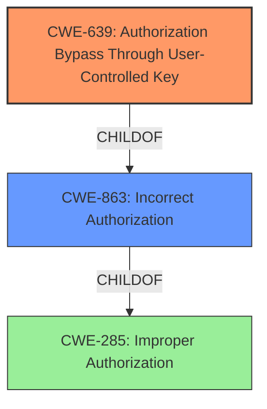

# Analysis for CVE-2022-3330

# Summary
| CWE ID  | CWE Name                                                  | Confidence | CWE Abstraction Level | CWE Vulnerability Mapping Label | CWE-Vulnerability Mapping Notes |
| :------- | :-------------------------------------------------------- | :--------- | :-------------------- | :------------------------------ | :------------------------------ |
| CWE-639 | Authorization Bypass Through User-Controlled Key       | 0.9        | Base                  | Allowed                         | Primary CWE                     |
| CWE-863 | Incorrect Authorization                                  | 0.7        | Class                 | Allowed-with-Review           | Secondary Candidate             |

## Evidence and Confidence

*   **Confidence Score:** 0.8
*   **Evidence Strength:** MEDIUM

## Relationship Analysis
The primary relationship that impacted the decision was the parent-child relationship between CWE-863 (Incorrect Authorization) and CWE-639 (Authorization Bypass Through User-Controlled Key). CWE-639 is a child of CWE-863, providing a more specific characterization of the authorization issue. The abstraction levels also influenced the decision, with the base level of CWE-639 being preferred over the class level of CWE-863.

## Vulnerability Chain
The vulnerability chain starts with the **incorrect authorization** mechanism, specifically allowing a guest user to read a todo targeting an inaccessible note. This leads to the impact of unauthorized information disclosure.

## Summary of Analysis
The initial analysis focused on identifying the root cause of the vulnerability: the ability of a guest user to access information they should not be authorized to see. The vulnerability description clearly states that a guest user can "read a todo targeting an inaccessible note." This points towards an authorization issue.

The Retriever Results highlighted several candidate CWEs, including:

*   CWE-285: Improper Authorization (Class, Discouraged)
*   CWE-400: Uncontrolled Resource Consumption (Class, Discouraged)
*   CWE-863: Incorrect Authorization (Class, Allowed-with-Review)
*   CWE-639: Authorization Bypass Through User-Controlled Key (Base, Allowed)

CWE-285 and CWE-400 were quickly discarded because they didn't accurately reflect the specific vulnerability. CWE-285 is too high-level, and CWE-400 relates to resource consumption, which isn't the primary issue here.

CWE-863 (Incorrect Authorization) is a strong candidate, but its class level suggests that there may be a more specific CWE available.

CWE-639 (Authorization Bypass Through User-Controlled Key) is a base-level CWE that describes a scenario where a user can gain access to another user's data by modifying a key value. While the description doesn't explicitly mention a "key," the ability of a guest user to access an inaccessible note strongly suggests that the authorization mechanism relies on some form of identifier that can be manipulated or bypassed. The description of CWE-639 fits the vulnerability well: "The system's authorization functionality does not prevent one user from gaining access to another user's data or record by modifying the key value identifying the data."

The final decision was to select CWE-639 as the primary CWE, with a confidence score of 0.9. CWE-863 is included as a secondary candidate (confidence 0.7) because it represents the broader category of authorization issues to which CWE-639 belongs.

The selection is based on the evidence from the vulnerability description and the guidance provided for each CWE. The choice of CWE-639 is at the optimal level of specificity, providing a more precise characterization of the vulnerability than the more general CWE-863.

Other CWEs Considered and Rejected:

*   CWE-285: Improper Authorization: Rejected because it is too high-level.
*   CWE-400: Uncontrolled Resource Consumption: Rejected because it does not relate to the described vulnerability.
*   CWE-696: Incorrect Behavior Order: Rejected because the vulnerability is not related to behavior order.
*   CWE-282: Improper Ownership Management: Rejected because it is not related to ownership management.
*   CWE-410: Insufficient Resource Pool: Rejected because it is not related to resource pool exhaustion.
*   CWE-1333: Inefficient Regular Expression Complexity: Rejected because it is not related to regular expression complexity.
*   CWE-93: Improper Neutralization of CRLF Sequences ('CRLF Injection'): Rejected because it is not related to CRLF injection.
*   CWE-1390: Weak Authentication: Rejected because the vulnerability is not about weak authentication, but rather an authorization bypass issue.