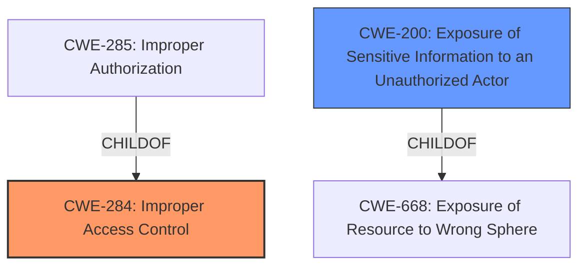

# Analysis Report for CVE-2022-33311

# Vulnerability Analysis Report: CVE-2022-33311

## Description


## Analysis (with Relationship Data)

# Summary
| CWE ID | CWE Name | Confidence | CWE Abstraction Level | CWE Vulnerability Mapping Label | CWE-Vulnerability Mapping Notes |
|---|---|---|---|---|---|
| CWE-284 | Improper Access Control | 0.9 | Pillar | Primary | Discouraged |
| CWE-200 | Exposure of Sensitive Information to an Unauthorized Actor | 0.7 | Class | Secondary | Discouraged |

## Evidence and Confidence

*   **Confidence Score:** 0.8
*   **Evidence Strength:** HIGH

## Relationship Analysis
The primary CWE selected is CWE-284, which is a Pillar-level CWE. While it is discouraged to map directly to a Pillar, the description clearly indicates a fundamental access control issue. The vulnerability description indicates a **browse restriction bypass**, and the CVE summary confirms **insufficient access control.** CWE-285, a child of CWE-284, was considered but deemed less appropriate as it focuses on incorrect authorization checks, while the description highlights a bypass of existing restrictions. CWE-200 was considered because the impact is the disclosure of Address Book data. However, the root cause is the **bypass** and not the disclosure.



## Vulnerability Chain
The vulnerability chain starts with **insufficient access control (CWE-284)**, leading to a **browse restriction bypass**. This bypass allows a remote authenticated attacker to **obtain Address Book data**, resulting in **exposure of sensitive information (CWE-200)**.

## Summary of Analysis
The initial assessment identified CWE-284 as the most relevant due to the **browse restriction bypass** and **insufficient access control**. The CVE summary explicitly mentions this. While CWE-284 is a Pillar, the evidence supports this high-level classification because the root cause is a fundamental flaw in how access is controlled. The alternative, CWE-285, was considered but rejected as it focuses on authorization checks, whereas the vulnerability is about bypassing restrictions. CWE-200 is a secondary concern because it describes the impact.

The decision is primarily based on the following evidence:

*   **Vulnerability Description Key Phrases:** "**browse restriction bypass**"
*   **CVE Reference Links Content Summary:** "The vulnerability is caused by an **insufficient access control** in the Address Book feature of Cybozu Office." and "**Browse Restriction Bypass (CWE-284)**: The vulnerability allows users to bypass intended access restrictions when browsing the Address Book."

The graph relationships influenced the decision by highlighting the parent-child relationship between CWE-284 and CWE-285, and CWE-200 being related to CWE-668, with different paths. The selection of CWE-284 is at the optimal level of specificity given the provided information, which points to a high-level access control issue rather than a specific type of authorization failure.

Relevant CWE Information:
- CWE-284: Improper Access Control
- CWE-200: Exposure of Sensitive Information to an Unauthorized Actor


## CWE Relationship Analysis

Current CWEs represent these abstraction levels: .


### Vulnerability Chain Analysis

**Chain starting from CWE-285:**
- 285 (Improper Authorization) - ROOT


**Chain starting from CWE-200:**
- 200 (Exposure of Sensitive Information to an Unauthorized Actor) - ROOT


### CWE Relationship Diagram

```mermaid
graph TD
    classDef primary fill:#f96,stroke:#333,stroke-width:2px
    classDef secondary fill:#69f,stroke:#333
    classDef tertiary fill:#9e9,stroke:#333
```


*Report generated on 2025-03-30 15:58:47*
