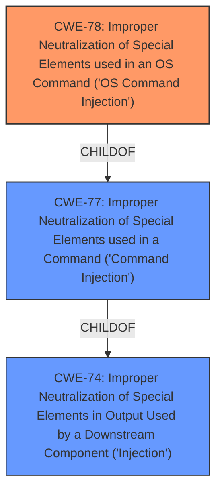

# Raw Analyzer Response for CVE-2022-33312

# Summary
| CWE ID | CWE Name | Confidence | CWE Abstraction Level | CWE Vulnerability Mapping Label | CWE-Vulnerability Mapping Notes |
|---|---|---|---|---|---|
| CWE-78 | Improper Neutralization of Special Elements used in an OS Command ('OS Command Injection') | 1.0 | Base | Allowed | Primary CWE |
| CWE-77 | Improper Neutralization of Special Elements used in a Command ('Command Injection') | 0.7 | Class | Allowed-with-Review | Secondary Candidate |

## Evidence and Confidence

*   **Confidence Score:** 1.0
*   **Evidence Strength:** HIGH

## Relationship Analysis
The primary relationship that influenced my decision was the child-of relationship between CWE-78 and CWE-77. CWE-78 is a more specific case of CWE-77, focusing specifically on OS commands. The vulnerability description clearly indicates that the **command injection** occurs in the context of OS commands. Therefore, selecting CWE-78 provides a more precise and accurate representation of the weakness.

## Vulnerability Chain
The vulnerability chain begins with the **improper neutralization** of special elements within the `path` parameter, leading directly to OS command injection and subsequent arbitrary command execution.

## Summary of Analysis
The initial analysis strongly pointed towards CWE-78 due to the presence of OS **command injection**. The vulnerability description and the CVE Reference Links Content Summary both provide explicit evidence of this. The `sysprintf` function, combined with the attacker-controlled `path` parameter, allows for the execution of arbitrary OS commands. The relationship analysis further solidified this choice, as CWE-78 is a specific type of CWE-77.

The final decision to prioritize CWE-78 was based on the following evidence from the provided text:

*   **Vulnerability Description Key Phrases:** "weakness: **command injection**"
*   **CVE Reference Links Content Summary:** "The `path` variable, which can be controlled by an attacker, is used in a `sysprintf` function call to create a directory using `mkdir -p %s`... leading to **command injection**."

This evidence clearly demonstrates that the **command injection** is happening at the OS level, making CWE-78 the most appropriate and specific classification. CWE-78 is at the optimal level of specificity because it directly addresses the root cause and nature of the vulnerability, which involves the **improper neutralization** of special elements used in an OS command.

Relevant CWE Information:

# Enhanced Context (25 CWEs)
The following CWEs were identified as potentially relevant to this vulnerability:

## CWE-1289: Improper Validation of Unsafe Equivalence in Input
**Abstraction Level**: Base
**Similarity Score**: 0.79

## CWE-74: Improper Neutralization of Special Elements in Output Used by a Downstream Component ('Injection')
**Abstraction Level**: Class
**Similarity Score**: 0.75

## CWE-138: Improper Neutralization of Special Elements
**Abstraction Level**: Class
**Similarity Score**: 0.75

## CWE-1288: Improper Validation of Consistency within Input
**Abstraction Level**: Base
**Similarity Score**: 0.75

## CWE-184: Incomplete List of Disallowed Inputs
**Abstraction Level**: Base
**Similarity Score**: 0.75

## CWE-807: Reliance on Untrusted Inputs in a Security Decision
**Abstraction Level**: Base
**Similarity Score**: 0.74

## CWE-1286: Improper Validation of Syntactic Correctness of Input
**Abstraction Level**: Base
**Similarity Score**: 0.74

## CWE-183: Permissive List of Allowed Inputs
**Abstraction Level**: Base
**Similarity Score**: 0.74

## CWE-134: Use of Externally-Controlled Format String
**Abstraction Level**: Base
**Similarity Score**: 0.73

## CWE-1173: Improper Use of Validation Framework
**Abstraction Level**: Base
**Similarity Score**: 0.73

## CWE-88: Improper Neutralization of Argument Delimiters in a Command ('Argument Injection')
**Abstraction Level**: Base
**Similarity Score**: 9094.62

## CWE-116: Improper Encoding or Escaping of Output
**Abstraction Level**: Class
**Similarity Score**: 8949.10

## CWE-138: Improper Neutralization of Special Elements
**Abstraction Level**: Class
**Similarity Score**: 8910.87

## CWE-22: Improper Limitation of a Pathname to a Restricted Directory ('Path Traversal')
**Abstraction Level**: Base
**Similarity Score**: 8864.29

## CWE-190: Integer Overflow or Wraparound
**Abstraction Level**: Base
**Similarity Score**: 8861.07

## CWE-78: Improper Neutralization of Special Elements used in an OS Command ('OS Command Injection')
**Abstraction Level**: base
**Similarity Score**: 5.03

## CWE-170: Improper Null Termination
**Abstraction Level**: base
**Similarity Score**: 5.03

## CWE-843: Access of Resource Using Incompatible Type ('Type Confusion')
**Abstraction Level**: base
**Similarity Score**: 5.03

## CWE-22: Improper Limitation of a Pathname to a Restricted Directory ('Path Traversal')
**Abstraction Level**: base
**Similarity Score**: 4.33

## CWE-770: Allocation of Resources Without Limits or Throttling
**Abstraction Level**: base
**Similarity Score**: 4.33

## CWE-190: Integer Overflow or Wraparound
**Abstraction Level**: base
**Similarity Score**: 4.33

## CWE-120: Buffer Copy without Checking Size of Input ('Classic Buffer Overflow')
**Abstraction Level**: base
**Similarity Score**: 4.33

## CWE-123: Write-what-where Condition
**Abstraction Level**: base
**Similarity Score**: 4.33

## CWE-131: Incorrect Calculation of Buffer Size
**Abstraction Level**: base
**Similarity Score**: 4.33

## CWE-89: Improper Neutralization of Special Elements used in an SQL Command ('SQL Injection')
**Abstraction Level**: base
**Similarity Score**: 3.89

### CWE-78: Improper Neutralization of Special Elements used in an OS Command ('OS Command Injection')
The product constructs all or part of an OS command using externally-influenced input from an upstream component, but it does not neutralize or incorrectly neutralizes special elements that could modify the intended OS command when it is sent to a downstream component.
*   **How the vulnerability's details match the CWE's characteristics:** The application uses the `sysprintf` function with a user-controlled `path` parameter to create a directory. This allows an attacker to inject arbitrary OS commands.
*   **The security implications and potential impact:** An attacker can execute arbitrary commands on the device with the privileges of the web server process.
*   **Any parent-child relationships or chain patterns that influenced your mapping:** CWE-78 is a child of CWE-77, which is a more general form of **command injection**.
*   **Whether the weakness is primary or secondary in the vulnerability:** Primary
*   **How the official MITRE mapping guidance influenced your decision:** The MITRE mapping guidance recommends using the base level of abstraction when possible, and CWE-78 is a base-level CWE.

### CWE-77: Improper Neutralization of Special Elements used in a Command ('Command Injection')
The product constructs all or part of a command using externally-influenced input from an upstream component, but it does not neutralize or incorrectly neutralizes special elements that could modify the intended command when it is sent to a downstream component.
*   **How the vulnerability's details match the CWE's characteristics:** The application constructs a command using the `sysprintf` function and a user-controlled `path` parameter.
*   **The security implications and potential impact:** An attacker can modify the intended command, leading to arbitrary command execution.
*   **Any parent-child relationships or chain patterns that influenced your mapping:** CWE-77 is a parent of CWE-78, which is a more specific type of **command injection**.
*   **Whether the weakness is primary or secondary in the vulnerability:** Secondary
*   **How the official MITRE mapping guidance influenced your decision:** The MITRE mapping guidance suggests using CWE-78 when the