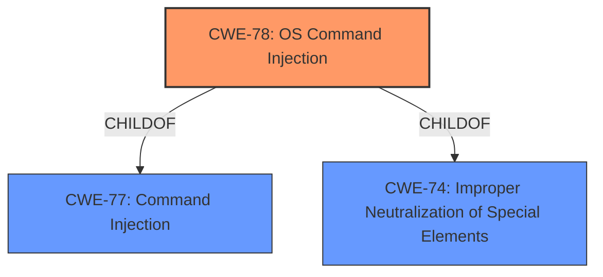

# Raw Analyzer Response for CVE-2022-33313

# Summary
| CWE ID | CWE Name | Confidence | CWE Abstraction Level | CWE Vulnerability Mapping Label | CWE-Vulnerability Mapping Notes |
|---|---|---|---|---|---|
| CWE-78 | Improper Neutralization of Special Elements used in an OS Command ('OS Command Injection') | 1.0 | Base | Allowed | Primary CWE |

## Evidence and Confidence

*   **Confidence Score:** 1.0
*   **Evidence Strength:** HIGH

## Relationship Analysis
The primary relationship influencing the decision is the ChildOf relationship between CWE-78 and CWE-77. While CWE-77 (Command Injection) is a broader class, CWE-78 (OS Command Injection) is a more specific base-level CWE that directly applies to the vulnerability since it involves OS commands. There are also other CWEs related to input validation that could have been used, but the root cause is the command injection.

## Vulnerability Chain
The vulnerability chain starts with the lack of proper input sanitization, leading to the ability to inject special elements into an OS command. This results in arbitrary command execution.

Lack of Input Sanitization -> OS Command Injection (CWE-78) -> Arbitrary Command Execution

## Summary of Analysis
The initial analysis pointed towards **command injection**. The retriever results strongly suggested CWE-78 (OS Command Injection), which aligns directly with the provided vulnerability description and the CVE Reference Links Content Summary.

The "CVE Reference Links Content Summary" explicitly states that the root cause is the use of user-controlled input within the `sysprintf` function, which executes a system command, leading to OS **command injection**. The `path_var` parameter in the `/action/import_https_cert_file/` endpoint is used to format a string and is then passed to `sysprintf`, which executes it as a system command.

The evidence directly supports the selection of CWE-78 because it describes the **improper neutralization** of special elements used in an OS command. The vulnerability allows an attacker to inject commands into the operating system by manipulating the `path_var` parameter.

The graph relationships confirm that CWE-78 is a specific type of command injection (ChildOf CWE-77), focusing on OS commands. It is also related to improper neutralization (ChildOf CWE-74). The decision to use CWE-78 is based on its specificity and direct match to the vulnerability details, making it the optimal choice.

Relevant CWE Information:

# Enhanced Context (25 CWEs)
The following CWEs were identified as potentially relevant to this vulnerability:

## CWE-1289: Improper Validation of Unsafe Equivalence in Input
**Abstraction Level**: Base
**Similarity Score**: 0.79
**Source**: dense

**Description**:
The product receives an input value that is used as a resource identifier or other type of reference, but it does not validate or incorrectly validates that the input is equivalent to a potentially-unsafe value.

**Mapping Guidance**:
- Usage: Allowed
- Rationale: This CWE entry is at the Base level of abstraction, which is a preferred level of abstraction for mapping to the root causes of vulnerabilities.

*Not Used:* While there might be an element of unsafe equivalence in how the path is handled, the primary issue is the direct injection of commands, making CWE-78 more relevant.

## CWE-74: Improper Neutralization of Special Elements in Output Used by a Downstream Component ('Injection')
**Abstraction Level**: Class
**Similarity Score**: 0.75
**Source**: dense

**Description**:
The product constructs all or part of a command, data structure, or record using externally-influenced input from an upstream component, but it does not neutralize or incorrectly neutralizes special elements that could modify how it is parsed or interpreted when it is sent to a downstream component.

**Mapping Guidance**:
- Usage: Discouraged
- Rationale: CWE-74 is high-level and often misused when lower-level weaknesses are more appropriate.

*Not Used:* CWE-74 is a class-level CWE and is too general. CWE-78 is a more specific, base-level CWE.

## CWE-138: Improper Neutralization of Special Elements
**Abstraction Level**: Class
**Similarity Score**: 0.75
**Source**: dense

**Description**:
The product receives input from an upstream component, but it does not neutralize or incorrectly neutralizes special elements that could be interpreted as control elements or syntactic markers when they are sent to a downstream component.

**Mapping Guidance**:
- Usage: Discouraged
- Rationale: This CWE entry is a level-1 Class (i.e., a child of a Pillar). It might have lower-level children that would be more appropriate

*Not Used:* CWE-138 is a class-level CWE and is too general. CWE-78 is a more specific, base-level CWE.

## CWE-1288: Improper Validation of Consistency within Input
**Abstraction Level**: Base
**Similarity Score**: 0.75
**Source**: dense

**Description**:
The product receives a complex input with multiple elements or fields that must be consistent with each other, but it does not validate or incorrectly validates that the input is actually consistent.

**Mapping Guidance**:
- Usage: Allowed
- Rationale: This CWE entry is at the Base level of abstraction, which is a preferred level of abstraction for mapping to the root causes of vulnerabilities.

*Not Used:* While input consistency might be a factor, the core issue is the lack of sanitization leading to command injection, making CWE-78 more fitting.

## CWE-184: Incomplete List of Disallowed Inputs
**Abstraction Level**: Base
**Similarity Score**: 0.75
**Source**: dense

**Description**:
The product implements a protection mechanism that relies on a list of inputs (or properties of inputs) that are not allowed by policy or otherwise require other action to neutralize before additional processing takes place, but the list is incomplete.

**Mapping Guidance**:
- Usage: Allowed
- Rationale: This CWE entry is at the Base level of abstraction, which is a preferred level of abstraction for mapping to the root causes of vulnerabilities.

*Not Used:* This could be related, but the root cause is still more directly tied to the **improper neutralization** of OS commands, as covered by CWE-78.

## CWE-807: Reliance on Untrusted Inputs in a Security Decision
**Abstraction Level**: Base
**Similarity Score**: 0.74
**Source**: dense

**Description**:
The product uses a protection mechanism that relies on the existence or values of an input, but the input can be modified by an untrusted actor in a way that bypasses the protection mechanism.

**Mapping Guidance**:
- Usage: Allowed
- Rationale: This CWE entry is at the Base level of abstraction, which is a preferred level of abstraction for mapping to the root causes of vulnerabilities.

*Not Used:* While the system relies on input, the core issue is not the reliance itself but the **improper neutralization**, leading to CWE-78 being a better fit.

## CWE-1286: Improper Validation of Syntactic Correctness of Input
**Abstraction Level**: Base
**Similarity Score**: 0.74
**Source**: dense

**Description**:
The product receives input that is expected to be well-formed - i.e., to comply with a certain syntax - but it does not validate or incorrectly validates that the input complies with the syntax.

**Mapping Guidance**:
- Usage: Allowed
- Rationale: This CWE entry is at the Base level of abstraction, which is a preferred level of abstraction for mapping to the root causes of vulnerabilities.

*Not Used:* While syntactic correctness is relevant, the primary weakness is the lack of sanitization for OS commands, making CWE-78 more applicable.

## CWE-183: Permissive List of Allowed Inputs
**Abstraction Level**: Base
**Similarity Score**: 0.74
**Source**: dense

**Description**:
The product implements a protection mechanism that relies on a list of inputs (or properties of inputs) that are explicitly allowed by policy because the inputs are assumed to be safe, but the list is too permissive - that is, it allows an input that is unsafe, leading to resultant weaknesses.

**Mapping Guidance**:
- Usage: Allowed
- Rationale: This CWE entry is at the Base level of abstraction, which is a preferred level of abstraction for mapping to the root causes of vulnerabilities.

*Not Used:* This CWE is about a permissive allow list, which is not the case here. The issue is the **improper neutralization**, pointing to CWE-78.

## CWE-1173: Improper Use of Validation Framework
**Abstraction Level**: Base
**Similarity Score**: 0.73
**Source**: dense