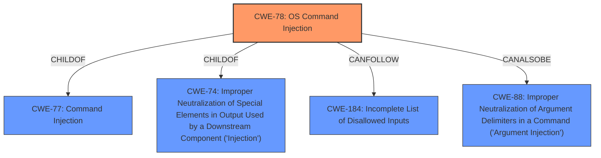

# Enhanced Analysis for CVE-2022-33314

# Summary
| CWE ID  | CWE Name | Confidence | CWE Abstraction Level | CWE Vulnerability Mapping Label | CWE-Vulnerability Mapping Notes |
|-----------------|---------------------------------------------------------------------------------------------------------------------------|-----------------|---------------------------|-----------------------------------|-------------------------------------------------------------------|
| CWE-78 | Improper Neutralization of Special Elements used in an OS Command ('OS Command Injection') | 1.0 | Base | Allowed | Primary CWE |
| CWE-77 | Improper Neutralization of Special Elements used in a Command ('Command Injection') | 0.7 | Class | Allowed-with-Review | Secondary Candidate |

## Evidence and Confidence

*   **Confidence Score:** 1.0
*   **Evidence Strength:** HIGH

## Relationship Analysis
The primary relationship impacting the decision is the hierarchical structure where CWE-78 (OS Command Injection) is a child of CWE-77 (Command Injection). This indicates that CWE-78 is a more specific case of CWE-77, dealing specifically with OS commands. Given the vulnerability description explicitly mentions the execution of arbitrary OS commands, CWE-78 is the more appropriate choice.



## Vulnerability Chain
The chain of events for this vulnerability can be described as follows:
1.  **Root Cause:** **Command Injection** due to missing or improper neutralization of special elements in the `path_param` variable.
2.  The attacker crafts a malicious network request to the `/action/import_sdk_file/` API, injecting OS commands into the `path_param`.
3.  The injected commands are executed by the `sysprintf` function, leading to arbitrary command execution on the device.
4.  **Impact:** Arbitrary command execution, potentially leading to full device compromise.

## Summary of Analysis
The initial assessment strongly points to **CWE-78 [Improper Neutralization of Special Elements used in an OS Command ('OS Command Injection')]** as the primary weakness. The vulnerability description explicitly mentions **command injection** in the `/action/import_sdk_file/` API, leading to arbitrary command execution. The CVE Reference Links Content Summary further confirms this, highlighting that the `path_param` variable is passed to `sysprintf` without proper sanitization, allowing attackers to inject malicious OS commands.

The retriever results also support this, with CWE-78 having a high score. The primary CWE match from similar CVE descriptions is also CWE-78.

The evidence from the vulnerability description is: "Multiple **command injection** vulnerabilities exist...A specially-crafted network request can lead to arbitrary command execution...The `/action/import_sdk_file/` API is affected by **command injection** vulnerability." The CVE Reference Links Content Summary states: "The primary vulnerability is OS **command injection** (CWE-78). The `path_param` variable is passed to `sysprintf`, which uses it in a `mkdir -p` command. Because the `path_param` is not sanitized, an attacker can inject malicious OS commands".

CWE-78 is chosen because the vulnerability involves the execution of OS commands, making it a more specific and accurate classification than its parent, CWE-77. The evidence supports the choice of CWE-78 as the root cause, as the injected commands are directly executed by the operating system.

CWE-77 [Improper Neutralization of Special Elements used in a Command ('Command Injection')] was considered but ultimately deemed less specific. While the vulnerability involves command injection, the commands are explicitly OS commands, making CWE-78 the more accurate choice. The MITRE mapping guidance for CWE-77 suggests that it is often misused when OS command injection (CWE-78) is intended, further solidifying the decision to choose CWE-78.

The selection of CWE-78 is at the optimal level of specificity, as it directly reflects the root cause of the vulnerability (OS command injection) and aligns with the evidence provided in the vulnerability description and CVE reference links.


## CWE Relationship Analysis

Current CWEs represent these abstraction levels: .


### Vulnerability Chain Analysis

**Chain starting from CWE-184:**
- 184 (Incomplete List of Disallowed Inputs) - ROOT


**Chain starting from CWE-78:**
- 78 (Improper Neutralization of Special Elements used in an OS Command ('OS Command Injection')) - ROOT


### CWE Relationship Diagram

```mermaid
graph TD
    classDef primary fill:#f96,stroke:#333,stroke-width:2px
    classDef secondary fill:#69f,stroke:#333
    classDef tertiary fill:#9e9,stroke:#333
```