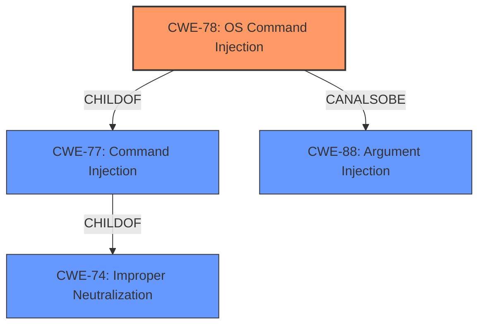

# Raw Analyzer Response for CVE-2022-33328

# Summary
| CWE ID | CWE Name | Confidence | CWE Abstraction Level | CWE Vulnerability Mapping Label | CWE-Vulnerability Mapping Notes |
|---|---|---|---|---|---|
| CWE-78 | Improper Neutralization of Special Elements used in an OS Command ('OS Command Injection') | 1 | Base | Allowed | Primary CWE |

## Evidence and Confidence

*   **Confidence Score:** 1
*   **Evidence Strength:** HIGH

## Relationship Analysis
The primary relationship that influenced the decision was the ChildOf relationship between CWE-78 and CWE-77, as well as its relationship to CWE-74. While CWE-77 (Command Injection) is a broader class, CWE-78 (OS Command Injection) is a more specific base-level CWE that accurately reflects the vulnerability details. The 'CanAlsoBe' relationship to CWE-88 (Argument Injection) was also considered, but the description aligns more directly with injecting entire OS commands rather than just arguments.



## Vulnerability Chain
The vulnerability chain starts with the **improper handling of user-supplied input**, specifically the `file_name` parameter in the `/ajax/remove/` API. This leads to **CWE-78**, where the input is directly incorporated into a system command without proper sanitization. The final impact is **arbitrary command execution**, allowing an attacker to run commands on the system.

## Summary of Analysis
The analysis is based on the provided evidence, primarily the "CVE Reference Links Content Summary" and "Vulnerability Description Key Phrases". The evidence clearly points to **OS Command Injection (CWE-78)** as the root cause. Specifically, the summary states: "The vulnerability stems from the use of user-provided input within a system command without proper sanitization. Specifically, the `file_name` parameter passed to the `/ajax/remove/` endpoint is used to construct a shell command using `sfmt` and `system` which allows for OS command injection."

The code snippet provided in the summary reinforces this, showing how the `file_name` parameter is directly used in the `system` call after a flawed `strstr` check:

```c
file_name = (char *)websGetVar(webs,"file_name",0);                                               [11]
if ((file_name != (char *)0x0) &&
    (shell_command = strstr(file_name,".."), shell_command == (char *)0x0)) {
    shell_command = (char *)sfmt("rm %s -rf",file_name);                                            [12]
    iVar1 = system(shell_command);                                                                  [13]
    [...]
}
```

The retriever results also support this, with CWE-78 being a top match.

The decision to select CWE-78 is based on the specific details of the vulnerability, which involve injecting OS commands. The CWE is at the optimal level of specificity (Base) as it directly describes the weakness. While CWE-77 (Command Injection) is a broader category, CWE-78 provides a more precise classification.

Relevant CWE Information:

# Enhanced Context (25 CWEs)
The following CWEs were identified as potentially relevant to this vulnerability:

## CWE-1289: Improper Validation of Unsafe Equivalence in Input
**Abstraction Level**: Base
**Similarity Score**: 0.76
**Source**: dense

**Description**:
The product receives an input value that is used as a resource identifier or other type of reference, but it does not validate or incorrectly validates that the input is equivalent to a potentially-unsafe value.

**Mapping Guidance**:
- Usage: Allowed
- Rationale: This CWE entry is at the Base level of abstraction, which is a preferred level of abstraction for mapping to the root causes of vulnerabilities.

**Why Not Used:** This CWE is not specific enough to the **command injection** issue.

## CWE-184: Incomplete List of Disallowed Inputs
**Abstraction Level**: Base
**Similarity Score**: 0.76
**Source**: dense

**Description**:
The product implements a protection mechanism that relies on a list of inputs (or properties of inputs) that are not allowed by policy or otherwise require other action to neutralize before additional processing takes place, but the list is incomplete.

**Mapping Guidance**:
- Usage: Allowed
- Rationale: This CWE entry is at the Base level of abstraction, which is a preferred level of abstraction for mapping to the root causes of vulnerabilities.

**Why Not Used:** While the `strstr` check on `..` could be considered an incomplete list, CWE-78 is a more direct match to the **command injection** vulnerability.

## CWE-138: Improper Neutralization of Special Elements
**Abstraction Level**: Class
**Similarity Score**: 0.76
**Source**: dense

**Description**:
The product receives input from an upstream component, but it does not neutralize or incorrectly neutralizes special elements that could be interpreted as control elements or syntactic markers when they are sent to a downstream component.

**Mapping Guidance**:
- Usage: Discouraged
- Rationale: This CWE entry is a level-1 Class (i.e., a child of a Pillar). It might have lower-level children that would be more appropriate

**Why Not Used:** CWE-138 is too generic. CWE-78 is a more specific base-level CWE that describes the improper neutralization of special elements in an OS command.

## CWE-74: Improper Neutralization of Special Elements in Output Used by a Downstream Component ('Injection')
**Abstraction Level**: Class
**Similarity Score**: 0.76
**Source**: dense

**Description**:
The product constructs all or part of a command, data structure, or record using externally-influenced input from an upstream component, but it does not neutralize or incorrectly neutralizes special elements that could modify how it is parsed or interpreted when it is sent to a downstream component.

**Mapping Guidance**:
- Usage: Discouraged
- Rationale: CWE-74 is high-level and often misused when lower-level weaknesses are more appropriate.

**Why Not Used:** CWE-74 is a class-level CWE and is too generic. CWE-78 is a more specific base-level CWE.

## CWE-150: Improper Neutralization of Escape, Meta, or Control Sequences
**Abstraction Level**: Variant
**Similarity Score**: 0.76
**Source**: dense

**Description**:
The product receives input from an upstream component, but it does not neutralize or incorrectly neutralizes special elements that could be interpreted as escape, meta, or control character sequences when they are sent to a downstream component.

**Mapping Guidance**:
- Usage: Allowed
- Rationale: This CWE entry is at the Variant level of abstraction, which is a preferred level of abstraction for mapping to the root causes of vulnerabilities.

**Why Not Used:** While technically correct, CWE-150 is not as direct a match as CWE-78. The description focuses on escape sequences, while the vulnerability involves injecting entire OS commands.

## CWE-134: Use of Externally-Controlled Format String
**Abstraction Level**: Base
**Similarity Score**: 0.75
**Source**: dense

**Description**:
The product uses a function that accepts a format string as an argument, but the format string originates from an external source.

**Mapping Guidance**:
- Usage: Allowed
- Rationale: This CWE entry is at the Base level of abstraction, which is a preferred level of abstraction for mapping to the root causes of vulnerabilities.

**Why Not Used:** This is specific to format string vulnerabilities, and the vulnerability involves **command injection**, not format string issues.

## CWE-162: Improper Neutralization of Trailing Special Elements
**Abstraction Level**: Variant
**Similarity Score**: 0.75
**Source**: dense

**Description**:
The product receives input from an upstream component, but it does not neutralize or incorrectly neutralizes trailing special elements that could be interpreted in unexpected ways when they are sent to a downstream component.

**Mapping Guidance**:
- Usage: Allowed
- Rationale: This CWE entry is at the Variant level of abstraction, which is a preferred level of abstraction for mapping to the root causes of vulnerabilities.

**Why Not Used:** This CWE is too specific and does not directly apply to the **command injection** vulnerability.

## CWE-80: Improper Neutralization of Script-Related HTML Tags in a Web Page (Basic XSS)
**Abstraction Level**: Variant
**Similarity Score**: 0.74
**Source