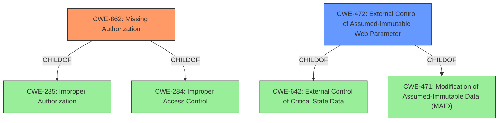

# Analysis for CVE-2022-3337

# Summary
| CWE ID | CWE Name | Confidence | CWE Abstraction Level | CWE Vulnerability Mapping Label | CWE-Vulnerability Mapping Notes |
|---|---|---|---|---|---|
| CWE-862 | Missing Authorization | 0.9 | Class | Allowed-with-Review | Primary CWE: The product does not perform an authorization check when an actor attempts to access a resource or perform an action. |
| CWE-472 | External Control of Assumed-Immutable Web Parameter | 0.7 | Base | Allowed | Secondary CWE: The web application does not sufficiently verify inputs that are assumed to be immutable but are actually externally controllable. |

## Evidence and Confidence

*   **Confidence Score:** 0.8
*   **Evidence Strength:** HIGH

## Relationship Analysis
The primary CWE is CWE-862 [CWE-862: Missing Authorization], which is a Class-level CWE. Its children, such as CWE-639 [CWE-639: Authorization Bypass Through User-Controlled Key], were considered but did not perfectly fit. CWE-472 [CWE-472: External Control of Assumed-Immutable Web Parameter] is a Base-level CWE and a child of CWE-642 and CWE-471, suggesting a potential reliance on client-side data.

## Vulnerability Chain
The vulnerability chain starts with a **missing authorization** check (CWE-862) on the WARP mobile client, leading to the ability to **delete a VPN profile**. This bypasses the intended restrictions enforced by the Zero Trust platform, ultimately leading to a loss of control and monitoring capabilities. The secondary weakness is the **external control of assumed-immutable web parameter** (CWE-472) where data passed from the client-side (e.g., a request to delete the profile) is not sufficiently validated, allowing the deletion to proceed despite the "Lock WARP switch" being enabled.

## Summary of Analysis
The initial assessment focused on the **missing authorization** (CWE-862) aspect, as highlighted by the vulnerability description stating that a user could **delete a VPN profile** despite the "Lock WARP switch" being enabled. This indicates that the application **fails to properly check if the user is authorized to perform the delete operation** under the given conditions.

The evidence supporting this includes:
- Vulnerability Description Key Phrases: "**weakness:** **delete a VPN profile from WARP mobile client**"
- CVE Reference Links Content Summary: "The vulnerability lies in the insufficient protection of the VPN profile from deletion, bypassing the intended restriction of the 'Lock WARP switch' feature."

The relationship analysis further reinforces this, as CWE-862 is a child of CWE-285 [CWE-285: Improper Authorization] and CWE-284 [CWE-284: Improper Access Control], indicating a broader issue of access control.

CWE-472 [CWE-472: External Control of Assumed-Immutable Web Parameter] was selected as a secondary CWE because the client is able to send a request that is not validated.

Other CWEs considered but not used:
- CWE-863 [CWE-863: Incorrect Authorization]: While relevant, CWE-862 is more precise because the authorization check is missing entirely rather than incorrectly performed.
- CWE-284 [CWE-284: Improper Access Control]: This is too high-level (Pillar) and doesn't provide sufficient specificity.
- CWE-1390 [CWE-1390: Weak Authentication], CWE-288 [CWE-288: Authentication Bypass Using an Alternate Path or Channel], CWE-290 [CWE-290: Authentication Bypass by Spoofing]: These relate to authentication bypass, which is not the primary issue here. The user is assumed to be authenticated but lacks proper authorization to delete the profile.
- CWE-319 [CWE-319: Cleartext Transmission of Sensitive Information], CWE-201 [CWE-201: Insertion of Sensitive Information Into Sent Data]: These relate to sensitive information handling, which is not the primary concern in this vulnerability.
- CWE-639 [CWE-639: Authorization Bypass Through User-Controlled Key]: Not the primary issue, which is a missing authorization check in the first place, regardless of user-controlled keys.
- CWE-425 [CWE-425: Direct Request ('Forced Browsing')]: This CWE is not applicable because the issue isn't about directly requesting resources without authorization, but rather the **missing authorization** check on a specific action (deleting the profile).
- CWE-471 [CWE-471: Modification of Assumed-Immutable Data (MAID)]: This CWE is less relevant because the core issue is not about modifying data that is assumed to be immutable, but rather the ability to delete a VPN profile due to **missing authorization**.

The selected CWEs are at the optimal level of specificity because they directly address the root cause (**missing authorization** check) and a contributing factor (**external control of assumed-immutable web parameter**) leading to the vulnerability. CWE-862 is a Class that can be more specific, but there isn't sufficient evidence.