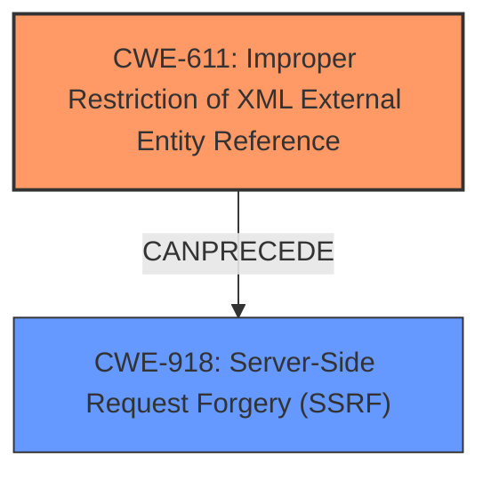

# Raw Analyzer Response for CVE-2022-3338

# Summary
| CWE ID | CWE Name | Confidence | CWE Abstraction Level | CWE Vulnerability Mapping Label | CWE-Vulnerability Mapping Notes |
|---|---|---|---|---|---|
| CWE-611 | Improper Restriction of XML External Entity Reference | 1.0 | Base | Allowed | Primary CWE |
| CWE-918 | Server-Side Request Forgery (SSRF) | 0.7 | Base | Allowed | Secondary Candidate |

## Evidence and Confidence

*   **Confidence Score:** 0.9
*   **Evidence Strength:** HIGH

## Relationship Analysis
The primary relationship influencing the decision is that CWE-611 **Improper Restriction of XML External Entity Reference** can lead to CWE-918 **Server-Side Request Forgery (SSRF)**. CWE-611 is chosen as the primary because the root cause is the **improper XML parsing** leading to **XXE**, and SSRF is a potential impact. Both are Base level CWEs.

## Vulnerability Chain
The vulnerability chain starts with the **improper XML parsing** (**XXE** - CWE-611), which allows an attacker to craft a malicious XML file. This crafted XML file can then be used to trigger a Server-Side Request Forgery attack (CWE-918). Thus, CWE-611 is the root cause and CWE-918 is a potential impact.

## Summary of Analysis
The initial analysis focused on identifying the root cause of the vulnerability. The vulnerability description clearly states that it is an External XML entity (**XXE**) vulnerability due to **improper XML parsing**. The "Vulnerability Description Key Phrases" section also explicitly mentions "**weakness:** **XXE**" and "**impact:** server-side request forgery".

The Retriever Results listed CWE-611 **Improper Restriction of XML External Entity Reference** as the top combined result with a score of 1.0, and CWE-918 **Server-Side Request Forgery (SSRF)** as the second highest ranked result.

The relationship between CWE-611 and CWE-918 is also highlighted in the "Additional Notes" section of CWE-611, stating: "**[Relationship]** CWE-918 (SSRF) and CWE-611 (XXE) are closely related, because they both involve web-related technologies and can launch outbound requests to unexpected destinations."

Given the evidence and the relationship analysis, CWE-611 is selected as the primary CWE because it represents the root cause of the vulnerability, and CWE-918 is a secondary CWE representing the potential impact. Both are Base level CWEs, providing the optimal level of specificity.

Relevant CWE Information:

# Enhanced Context (25 CWEs)

## CWE-611: Improper Restriction of XML External Entity Reference
**Abstraction Level**: Base
**Similarity Score**: 1.00 (Retriever Results)
**Source**: alternate_terms

**Description**:
The product processes an XML document that can contain XML entities with URIs that resolve to documents outside of the intended sphere of control, causing the product to embed incorrect documents into its output.

**Mapping Guidance**:
- Usage: Allowed
- Rationale: This CWE entry is at the Base level of abstraction, which is a preferred level of abstraction for mapping to the root causes of vulnerabilities.

## CWE-918: Server-Side Request Forgery (SSRF)
**Abstraction Level**: Base
**Similarity Score**: 0.321 (Retriever Results)
**Source**: sparse

**Description**:
The web server receives a URL or similar request from an upstream component and retrieves the contents of this URL, but it does not sufficiently ensure that the request is being sent to the expected destination.

**Mapping Guidance**:
- Usage: Allowed
- Rationale: This CWE entry is at the Base level of abstraction, which is a preferred level of abstraction for mapping to the root causes of vulnerabilities.

### CWEs Considered but Not Used:
- CWE-776: Improper Restriction of Recursive Entity References in DTDs ('XML Entity Expansion'): This CWE was considered because it deals with XML entity expansion, but the vulnerability description focuses on external entities, not recursive ones.
- CWE-134: Use of Externally-Controlled Format String: This CWE was considered because the vulnerability involves external input, but the vulnerability is specifically related to XML entities, not format strings.
- CWE-502: Deserialization of Untrusted Data: This CWE was considered but is not relevant because the vulnerability is about **improper XML parsing**, not deserialization of untrusted data.