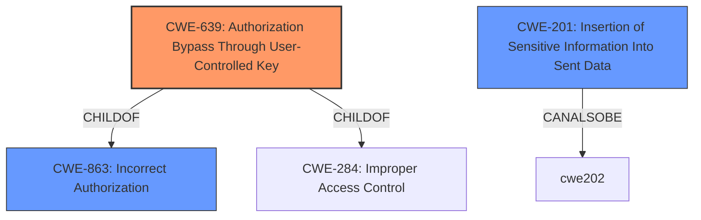

# Enhanced Analysis for CVE-2022-3348

# Summary
| CWE ID | CWE Name | Confidence | CWE Abstraction Level | CWE Vulnerability Mapping Label | CWE-Vulnerability Mapping Notes |
|---|---|---|---|---|---|
| CWE-639 | Authorization Bypass Through User-Controlled Key | 0.9 | Base | Allowed | Primary CWE |
| CWE-201 | Insertion of Sensitive Information Into Sent Data | 0.6 | Base | Allowed | Secondary Candidate |
| CWE-863 | Incorrect Authorization | 0.5 | Class | Allowed-with-Review | Secondary Candidate |

## Evidence and Confidence

*   **Confidence Score:** 0.9
*   **Evidence Strength:** HIGH

## Relationship Analysis
The primary CWE, CWE-639, is a child of CWE-863 (Incorrect Authorization) and CWE-284 (Improper Access Control). This parent-child relationship indicates that CWE-639 is a specific type of authorization issue. The retriever results suggest CWE-639 due to the potential for user-controlled keys being modified to access unauthorized data. CWE-201 (Insertion of Sensitive Information Into Sent Data) is considered because the root cause mentions the exposure of more user data than necessary.



## Vulnerability Chain
The vulnerability chain involves **data exposure** in the thread module, leading to **unnecessary data transfer**, potentially including sensitive data. This allows an attacker to make an API request to fetch threads and gain access to unauthorized user information, resulting in an **account takeover**. The chain starts with the **improper configuration** of eager loading and insufficient validation of user access rights.

## Summary of Analysis
The initial assessment identified the vulnerability as a potential **authorization bypass** issue, where an attacker could gain access to another user's account by exploiting **improper authorization** mechanisms. The primary CWE selected is CWE-639 (Authorization Bypass Through User-Controlled Key), which aligns with the vulnerability description and the evidence from the CVE reference links content summary. The "fix: hide user data from thread module" commit message, the removal of `eager: true` in `server/src/entities/thread.entity.ts`, and the modification of the query builder to select only required user fields in `server/src/services/thread.service.ts` all support this classification. The vulnerability allows an attacker to potentially access sensitive user information they are not authorized to view, leading to an account takeover. This is a direct match for CWE-639, which focuses on authorization bypass through modifying key values.

CWE-201 (Insertion of Sensitive Information Into Sent Data) was considered because the root cause mentions the exposure of more user data than necessary. However, the primary issue is not just the insertion of sensitive information, but the authorization bypass that allows access to that information.

CWE-863 (Incorrect Authorization) is a parent of CWE-639 and represents a broader category of authorization issues. While applicable, CWE-639 provides a more specific and accurate representation of the vulnerability.

The final decision to prioritize CWE-639 is based on the specific evidence of user-controlled keys and the authorization bypass mechanism. The retriever results and relationship analysis further support this selection. The chosen CWE is at the optimal level of specificity (Base) and aligns with the MITRE mapping guidance. The confidence score is high due to the direct evidence and clear alignment with the CWE description.


## CWE Relationship Analysis

Current CWEs represent these abstraction levels: .


### Vulnerability Chain Analysis

**Chain starting from CWE-201:**
- 201 (Insertion of Sensitive Information Into Sent Data) - ROOT


**Chain starting from CWE-639:**
- 639 (Authorization Bypass Through User-Controlled Key) - ROOT


### CWE Relationship Diagram

```mermaid
graph TD
    classDef primary fill:#f96,stroke:#333,stroke-width:2px
    classDef secondary fill:#69f,stroke:#333
    classDef tertiary fill:#9e9,stroke:#333
```