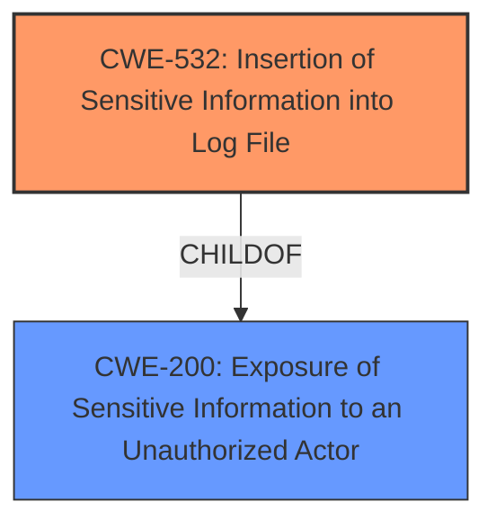

# Analysis for CVE-2022-33698

# Summary
| CWE ID  | CWE Name                                                                 | Confidence | CWE Abstraction Level | CWE Vulnerability Mapping Label | CWE-Vulnerability Mapping Notes |
| ------- | ------------------------------------------------------------------------ | ---------- | --------------------- | ------------------------------- | ------------------------------- |
| CWE-532 | Insertion of Sensitive Information into Log File                      | 0.9        | Base                  | Allowed                         | Primary CWE                     |
| CWE-200 | Exposure of Sensitive Information to an Unauthorized Actor | 0.7        | Class                 | Discouraged                         | Secondary Candidate               |

## Evidence and Confidence

*   **Confidence Score:** 0.9
*   **Evidence Strength:** HIGH

## Relationship Analysis
The primary CWE selected is CWE-532, which is a child of CWE-200. CWE-200 represents a more general class of vulnerability, while CWE-532 is more specific, describing the insertion of sensitive information into log files. The relationship between these CWEs helps clarify the nature of the vulnerability.

## Vulnerability Chain
The vulnerability chain starts with the **improper logging of sensitive information** (ICCID) into a log file. This leads to the **exposure of sensitive information** to local attackers who have access to the logs.
  - **Root Cause:** Improper logging of sensitive data (ICCID)
  - **Weakness:** Sensitive data written to a log file
  - **Impact:** Exposure of ICCID to local attackers via log access

## Summary of Analysis
The initial analysis focused on identifying the root cause and impact of the vulnerability based on the provided information. The **Vulnerability Description** clearly indicates an **Exposure of Sensitive Information** due to logging. The **CVE Reference Links Content Summary** further supports this by stating the root cause as "Exposure of sensitive information (ICCID) through logcat" and the weakness as "Improper logging of sensitive information."

The retriever results suggested several potential CWEs, including CWE-213, CWE-200, CWE-927, and CWE-532. After reviewing the descriptions of each CWE, CWE-532 (Insertion of Sensitive Information into Log File) was selected as the most appropriate because it directly addresses the **root cause** described in the vulnerability report: the insertion of sensitive information (ICCID) into a log file. CWE-200 (Exposure of Sensitive Information to an Unauthorized Actor) was considered as a secondary candidate, as it represents the broader class of information exposure vulnerabilities. However, CWE-532 provides a more specific description of the vulnerability.

The selection of CWE-532 is strongly supported by the provided evidence. The description explicitly mentions that the ICCID is accessible via logs. The evidence extracted from the description is:
- **Exposure of Sensitive Information** in Telecom application prior to SMR Jul-2022 Release 1 allows local attackers to access ICCID via log.
- **Root cause of vulnerability:** Exposure of sensitive information (ICCID) through logcat in the Telecom application.
- **Weaknesses/vulnerabilities present:**  Improper logging of sensitive information.
- **Impact of exploitation:** Local attackers can access the ICCID via log.

The retriever results also support this selection, with CWE-532 being a strong candidate. The usage for CWE-532 is "Allowed" and is at the Base level of abstraction, which is preferred.

The final decision to select CWE-532 is based on the direct evidence of sensitive information being logged, its accurate description of the vulnerability, and its alignment with the MITRE mapping guidance.

Relevant CWE Information:

# Enhanced Context (25 CWEs)

## CWE-497: Exposure of Sensitive System Information to an Unauthorized Control Sphere
**Abstraction Level**: Base
**Similarity Score**: 0.75
**Source**: dense

**Description**:
The product does not properly prevent sensitive system-level information from being accessed by unauthorized actors who do not have the same level of access to the underlying system as the product does.

**Mapping Guidance**:
- Usage: Allowed
- Rationale: This CWE entry is at the Base level of abstraction, which is a preferred level of abstraction for mapping to the root causes of vulnerabilities.

## CWE-213: Exposure of Sensitive Information Due to Incompatible Policies
**Abstraction Level**: Base
**Similarity Score**: 0.75
**Source**: dense

**Description**:
The product's intended functionality exposes information to certain actors in accordance with the developer's security policy, but this information is regarded as sensitive according to the intended security policies of other stakeholders such as the product's administrator, users, or others whose information is being processed.

**Mapping Guidance**:
- Usage: Allowed
- Rationale: This CWE entry is at the Base level of abstraction, which is a preferred level of abstraction for mapping to the root causes of vulnerabilities.

## CWE-668: Exposure of Resource to Wrong Sphere
**Abstraction Level**: Class
**Similarity Score**: 0.75
**Source**: dense

**Description**:
The product exposes a resource to the wrong control sphere, providing unintended actors with inappropriate access to the resource.

**Mapping Guidance**:
- Usage: Discouraged
- Rationale: CWE-668 is high-level and is often misused as a catch-all when lower-level CWE IDs might be applicable. It is sometimes used for low-information vulnerability reports [REF-1287]. It is a level-1 Class (i.e., a child of a Pillar). It is not useful for trend analysis.

## CWE-538: Insertion of Sensitive Information into Externally-Accessible File or Directory
**Abstraction Level**: Base
**Similarity Score**: 0.74
**Source**: dense

**Description**:
The product places sensitive information into files or directories that are accessible to actors who are allowed to have access to the files, but not to the sensitive information.

**Mapping Guidance**:
- Usage: Allowed
- Rationale: This CWE entry is at the Base level of abstraction, which is a preferred level of abstraction for mapping to the root causes of vulnerabilities.

## CWE-203: Observable Discrepancy
**Abstraction Level**: Base
**Similarity Score**: 0.74
**Source**: dense

**Description**:
The product behaves differently or sends different responses under different circumstances in a way that is observable to an unauthorized actor, which exposes security-relevant information about the state of the product, such as whether a particular operation was successful or not.

**Mapping Guidance**:
- Usage: Allowed
- Rationale: This CWE entry is at the Base level of abstraction, which is a preferred level of abstraction for mapping to the root causes of vulnerabilities.

## CWE-200: Exposure of Sensitive Information to an Unauthorized Actor
**Abstraction Level**: Class
**Similarity Score**: 0.74
**Source**: dense

**Description**:
The product exposes sensitive information to an actor that is not explicitly authorized to have access to that information.

**Mapping Guidance**:
- Usage: Discouraged
- Rationale: CWE-200 is commonly misused to represent the loss of confidentiality in a vulnerability, but confidentiality loss is a technical impact - not a root cause error. As of CWE 4.9, over 400 CWE entries can lead to a loss of confidentiality. Other options are often available. [REF-1287].

## CWE-345: Insufficient Verification of Data Authenticity
**Abstraction Level**: Class
**Similarity Score**: 0.74
**Source**: dense

**Description**:
The product does not sufficiently verify the origin or authenticity of data, in a way that causes it to accept invalid data.

**Mapping Guidance**:
- Usage: Discouraged
- Rationale: This CWE entry is a level-1 Class (i.e., a child of a Pillar). It might have lower-level children that would be more appropriate

## CWE-754: Improper Check for Unusual or Exceptional Conditions
**Abstraction Level**: Class
**Similarity Score**: 0.73
**Source**: dense

**Description**:
The product does not check or incorrectly checks for unusual or exceptional conditions that are not expected to occur frequently during day to day operation of the product.

**Mapping Guidance**:
- Usage: Allowed-with-Review
- Rationale: This CWE entry is a Class and might have Base-level children that would be more appropriate

## CWE-226: Sensitive Information in Resource Not Removed Before Reuse
**Abstraction Level**: Base
**Similarity Score**: 0.73
**Source**: dense

**Description**:
The product releases a resource such as memory or a file so that it can be made available for reuse, but it does not clear or "zeroize" the information contained in the resource before the product performs a critical state transition or makes the resource available for reuse by other entities.

**Mapping Guidance**:
- Usage: