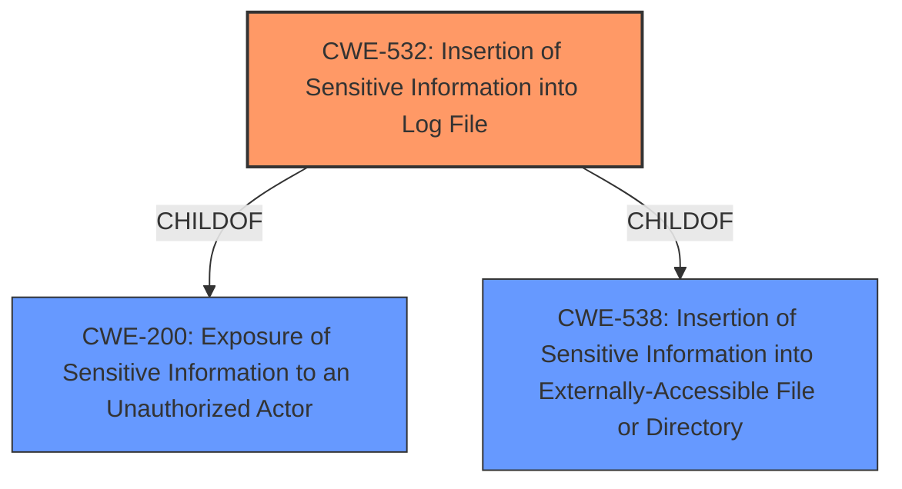

# Raw Analyzer Response for CVE-2022-33699

# Summary
| CWE ID | CWE Name | Confidence | CWE Abstraction Level | CWE Vulnerability Mapping Label | CWE-Vulnerability Mapping Notes |
|---|---|---|---|---|---|
| CWE-532 | Insertion of Sensitive Information into Log File | 1 | Base | Allowed | Primary CWE |
| CWE-200 | Exposure of Sensitive Information to an Unauthorized Actor | 0.7 | Class | Discouraged | Secondary Candidate |

## Evidence and Confidence

*   **Confidence Score:** 0.9
*   **Evidence Strength:** HIGH

## Relationship Analysis
The primary relationship that influenced the selection was the ChildOf relationship between CWE-532 and CWE-200. CWE-532 is a specific type of information exposure, which is why it was favored over the more general CWE-200. The vulnerability involves sensitive data being written to a log file, aligning perfectly with CWE-532. CWE-532 is a child of both CWE-538 and CWE-200.

## Vulnerability Chain
The vulnerability chain starts with the **incorrect** insertion of sensitive information (IMSI) into the log file (**ROOT CAUSE**), leading to the **exposure of sensitive information** to a local attacker (**IMPACT**).

## Summary of Analysis
The initial analysis correctly identified the **exposure of sensitive information** as the primary concern. However, the root cause is more specifically the insertion of this information into a log file. The vulnerability description mentions "access imsi via log", which strongly suggests CWE-532. The retriever results also listed CWE-532 as a candidate.

The final selection of CWE-532 is based on the evidence from the vulnerability description and the CWE specifications. CWE-532 is at the optimal level of specificity because it accurately describes the **root cause** of the vulnerability: the **insertion of sensitive information into a log file**.

Relevant CWE Information:

# Enhanced Context (25 CWEs)
The following CWEs were identified as potentially relevant to this vulnerability:

## CWE-532: Insertion of Sensitive Information into Log File
**Abstraction Level**: Base
**Similarity Score**: 2.47
**Source**: graph

**Description**:
CWE-532: Insertion of Sensitive Information into Log File

**Mapping Guidance**:
- Usage: Allowed
- Rationale: This CWE entry is at the Base level of abstraction, which is a preferred level of abstraction for mapping to the root causes of vulnerabilities.

**Relationships**:
- CHILDOF -> CWE-200
- CHILDOF -> CWE-538
- PARENTOF -> CWE-532
- PARENTOF -> CWE-532

## CWE-532: Insertion of Sensitive Information into Log File
CWE-532, "Insertion of Sensitive Information into Log File," is the primary CWE. The vulnerability description states that a local attacker can "access imsi via log," indicating that the sensitive IMSI data is being written to a log file. This aligns directly with the description of CWE-532, which states that "The product writes sensitive information to a log file." The security implication is that a local attacker with access to the device's logs can obtain the IMSI, potentially leading to tracking or other malicious activities. CWE-532 is a base-level CWE and a child of CWE-200 and CWE-538. The MITRE mapping guidance allows for the use of this CWE.

## CWE-200: Exposure of Sensitive Information to an Unauthorized Actor
CWE-200, "Exposure of Sensitive Information to an Unauthorized Actor," was considered as a more general CWE. While the vulnerability does involve the exposure of sensitive information, CWE-532 provides a more specific description of how the information is exposed (i.e., through a log file). Therefore, CWE-200 is a secondary candidate. The MITRE mapping guidance discourages the use of CWE-200 when more specific options are available.