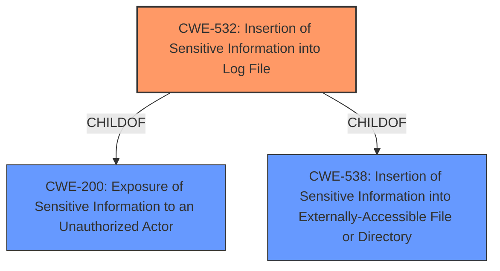

# Enhanced Analysis for CVE-2022-33700

# Summary
| CWE ID | CWE Name | Confidence | CWE Abstraction Level | CWE Vulnerability Mapping Label | CWE-Vulnerability Mapping Notes |
|---|---|---|---|---|---|
| CWE-532 | Insertion of Sensitive Information into Log File | 1.0 | Base | Allowed | Primary CWE |
| CWE-200 | Exposure of Sensitive Information to an Unauthorized Actor | 0.7 | Class | Discouraged | Secondary Candidate |

## Evidence and Confidence

*   **Confidence Score:** 0.9
*   **Evidence Strength:** HIGH

## Relationship Analysis
The primary relationship that influenced the CWE selection is the ChildOf relationship between CWE-532 and CWE-200, with CWE-532 being a more specific case of information exposure via log files. While CWE-200 is a broader class, CWE-532 directly addresses the vulnerability's root cause, making it the more appropriate choice.



## Vulnerability Chain
The vulnerability chain consists of the following sequence:
1.  **Root Cause:** Insertion of sensitive information (IMSI) into logs due to **improper logging practices**.
2.  **Weakness:** The sensitive information in the log file is accessible to a local attacker.
3.  **Impact:** A local attacker gains access to the IMSI, which can lead to privacy violations.

## Summary of Analysis
The initial assessment focused on the exposure of sensitive information due to **improper logging**. The primary CWE considered was CWE-532 (Insertion of Sensitive Information into Log File), which aligns directly with the vulnerability description. The retriever results also support this choice.

The vulnerability description clearly states that a local attacker can access the IMSI via logs due to **improper logging** in the `putDsaSimImsi` function. The CVE reference link content summary confirms that the **root cause** is the exposure of sensitive information due to **improper logging practices** and a **lack of proper sanitization** before logging.

The relationship analysis shows that CWE-532 is a child of CWE-200 (Exposure of Sensitive Information to an Unauthorized Actor), but CWE-532 is more specific. The mapping guidance for CWE-200 discourages its use when more specific options are available.

The final decision to use CWE-532 is based on its direct relevance to the **root cause** described in the vulnerability description and the CVE reference summary. CWE-532 is the most specific and accurate representation of the vulnerability.

Relevant CWE Information:

# Enhanced Context (25 CWEs)
The following CWEs were identified as potentially relevant to this vulnerability:

## CWE-532: Insertion of Sensitive Information into Log File
**CWE-532** is selected as the primary CWE because it directly addresses the vulnerability: the product writes sensitive information to a log file. This aligns with the vulnerability description and the CVE reference link summary, which indicates that the **root cause** is due to **improper logging practices**.
*   **How it matches:** The vulnerability description explicitly mentions that a local attacker can access the IMSI via logs.
*   **Security Implications:** Exposure of sensitive information can lead to privacy violations.
*   **Relationships:** Child of CWE-200, making it a specific type of information exposure.

## CWE-200: Exposure of Sensitive Information to an Unauthorized Actor
**CWE-200** was considered, as the overall impact of the vulnerability is an exposure of sensitive information. However, CWE-200 is a more general class of weakness.
*   **Why not selected as primary:** Mapping guidance for CWE-200 discourages its use when more specific options are available. Since CWE-532 directly addresses the logging aspect, it is a better fit.
*   **Security Implications:** Exposure of sensitive information can lead to privacy violations.
*   **Relationships:** Parent of CWE-532.


## CWE Relationship Analysis

Current CWEs represent these abstraction levels: .


### Vulnerability Chain Analysis

**Chain starting from CWE-200:**
- 200 (Exposure of Sensitive Information to an Unauthorized Actor) - ROOT


**Chain starting from CWE-532:**
- 532 (Insertion of Sensitive Information into Log File) - ROOT


### CWE Relationship Diagram

```mermaid
graph TD
    classDef primary fill:#f96,stroke:#333,stroke-width:2px
    classDef secondary fill:#69f,stroke:#333
    classDef tertiary fill:#9e9,stroke:#333
```