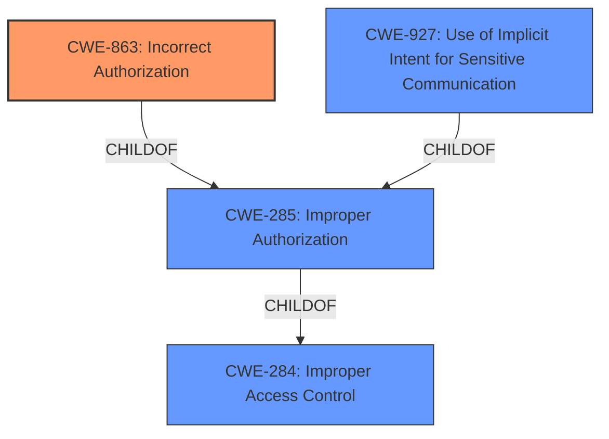

# Raw Analyzer Response for CVE-2022-33701

# Summary
| CWE ID | CWE Name | Confidence | CWE Abstraction Level | CWE Vulnerability Mapping Label | CWE-Vulnerability Mapping Notes |
|---|---|---|---|---|---|
| CWE-863 | Incorrect Authorization | 0.9 | Class | Primary | Allowed-with-Review |
| CWE-285 | Improper Authorization | 0.7 | Class | Secondary | Discouraged |
| CWE-284 | Improper Access Control | 0.6 | Pillar | Secondary | Discouraged |
| CWE-927 | Use of Implicit Intent for Sensitive Communication | 0.5 | Variant | Secondary | Allowed |

## Evidence and Confidence

*   **Confidence Score:** 0.9
*   **Evidence Strength:** HIGH

## Relationship Analysis
The primary CWE selected is CWE-863, "Incorrect Authorization," which is a child of the more general CWE-285, "Improper Authorization," which in turn is a child of CWE-284, "Improper Access Control." This reflects a hierarchical relationship where CWE-863 provides a more specific classification than its parents. While CWE-284 and CWE-285 were considered, CWE-863 was chosen because it accurately describes the **incorrect** authorization check.

## Vulnerability Chain
The vulnerability chain starts with the **improper access control** (**incorrect authorization**), leading to the ability for an attacker to call a protected method (`PowerManaer.goToSleep`) via a broadcast intent, resulting in a denial-of-service impact (device going to sleep).

## Summary of Analysis
The initial assessment identified **improper access control** as the root cause. The retriever results suggested several potential CWEs, including CWE-284, CWE-285, CWE-863, and CWE-927.

CWE-284 ("Improper Access Control") is too high-level (Pillar) and is discouraged by MITRE due to frequent misuse.

CWE-285 ("Improper Authorization") is a Class-level CWE, and while more specific than CWE-284, it's still a parent. The description states: "The product does not perform or incorrectly performs an authorization check when an actor attempts to access a resource or perform an action." Since the vulnerability description explicitly mentions **improper access control**, which implies that an authorization check was attempted but performed incorrectly, CWE-863, "Incorrect Authorization", is a more precise fit.

CWE-863 ("Incorrect Authorization") is a Class-level CWE that describes the scenario where "The product performs an authorization check when an actor attempts to access a resource or perform an action, but it does not correctly perform the check." This aligns perfectly with the vulnerability description. The MITRE mapping guidance suggests reviewing child CWEs for a better fit, but in this case, no more specific child CWEs are available.

CWE-927 ("Use of Implicit Intent for Sensitive Communication") is a Variant-level CWE. While the vulnerability involves sending a broadcast intent, the core issue is the **improper authorization**, not the use of implicit intents *per se*. The implicit intent is merely the vector used to exploit the authorization flaw. Therefore, CWE-927 is a secondary concern.

The final decision is based on the explicit mention of "**improper access control**" and the fact that the attack involves calling a protected method (`PowerManaer.goToSleep`) without proper authorization. CWE-863 is the most accurate and specific representation of this weakness.

Relevant CWE Information:

# Enhanced Context (25 CWEs)
The following CWEs were identified as potentially relevant to this vulnerability:

## CWE-274: Improper Handling of Insufficient Privileges
**Abstraction Level**: Base
**Similarity Score**: 0.76
**Source**: dense

**Description**:
The product does not handle or incorrectly handles when it has insufficient privileges to perform an operation, leading to resultant weaknesses.

**Mapping Guidance**:
- Usage: Discouraged
- Rationale: This CWE entry could be deprecated in a future version of CWE.

## CWE-703: Improper Check or Handling of Exceptional Conditions
**Abstraction Level**: Pillar
**Similarity Score**: 0.76
**Source**: dense

**Description**:
The product does not properly anticipate or handle exceptional conditions that rarely occur during normal operation of the product.

**Mapping Guidance**:
- Usage: Discouraged
- Rationale: This CWE entry is extremely high-level, a Pillar.

## CWE-280: Improper Handling of Insufficient Permissions or Privileges 
**Abstraction Level**: Base
**Similarity Score**: 0.76
**Source**: dense

**Description**:
The product does not handle or incorrectly handles when it has insufficient privileges to access resources or functionality as specified by their permissions. This may cause it to follow unexpected code paths that may leave the product in an invalid state.

**Mapping Guidance**:
- Usage: Allowed
- Rationale: This CWE entry is at the Base level of abstraction, which is a preferred level of abstraction for mapping to the root causes of vulnerabilities.

## CWE-754: Improper Check for Unusual or Exceptional Conditions
**Abstraction Level**: Class
**Similarity Score**: 0.76
**Source**: dense

**Description**:
The product does not check or incorrectly checks for unusual or exceptional conditions that are not expected to occur frequently during day to day operation of the product.

**Mapping Guidance**:
- Usage: Allowed-with-Review
- Rationale: This CWE entry is a Class and might have Base-level children that would be more appropriate

## CWE-653: Improper Isolation or Compartmentalization
**Abstraction Level**: Class
**Similarity Score**: 0.75
**Source**: dense

**Description**:
The product does not properly compartmentalize or isolate functionality, processes, or resources that require different privilege levels, rights, or permissions.

**Mapping Guidance**:
- Usage: Allowed
- Rationale: This CWE entry is at the Base level of abstraction, which is a preferred level of abstraction for mapping to the root causes of vulnerabilities.

## CWE-691: Insufficient Control Flow Management
**Abstraction Level**: Pillar
**Similarity Score**: 0.75
**Source**: dense

**Description**:
The code does not sufficiently manage its control flow during execution, creating conditions in which the control flow can be modified in unexpected ways.

**Mapping Guidance**:
- Usage: Discouraged
- Rationale: This CWE entry is extremely high-level, a Pillar. However, classification research is limited for weaknesses of this type, so there can be gaps or organizational difficulties within CWE that force use of this weakness, even at such a high level of abstraction.

## CWE-1220: Insufficient Granularity of Access Control
**Abstraction Level**: Base
**Similarity Score**: 0.74
**Source**: dense

**Description**:
The product implements access controls via a policy or other feature with the intention to disable or restrict accesses (reads and/or writes) to assets in a system from untrusted agents. However, implemented access controls lack required granularity, which renders the control policy too broad because it allows accesses from unauthorized agents to the security-sensitive assets.

**Mapping Guidance**:
- Usage: Allowed
- Rationale: This CWE entry is at the Base level of abstraction, which is a preferred level of abstraction for mapping to the root causes of vulnerabilities.

## CWE-668: Exposure of Resource to Wrong Sphere
**Abstraction Level**: Class
**Similarity Score**: 0.74
**Source**: dense

**Description**:
The product exposes a resource to the wrong control sphere, providing unintended actors with inappropriate access to the resource.

**Mapping Guidance**:
- Usage: Discouraged
- Rationale: CWE-668 is high-level and is often misused as a catch-all when lower-level CWE IDs might be applicable. It is sometimes used for low-information vulnerability reports [REF-1287]. It is a level-1 Class (i.e., a child of a Pillar). It is not useful for trend analysis.

## CWE-664: Improper Control of a Resource Through its Lifetime
**Abstraction Level**: Pillar
**Similarity Score**: 0.74
**Source**: dense

**Description**:
The product does not maintain or incorrectly maintains control over a resource throughout its lifetime of creation, use, and release.

**Mapping Guidance**:
- Usage: