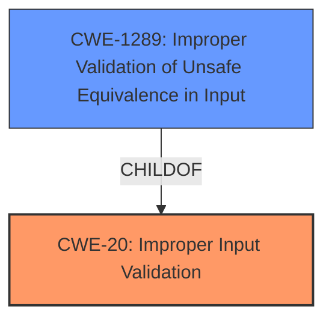

# Analysis Report for CVE-2022-33703

# Vulnerability Analysis Report: CVE-2022-33703

## Description


## Analysis (with Relationship Data)

# Summary
| CWE ID | CWE Name | Confidence | CWE Abstraction Level | CWE Vulnerability Mapping Label | CWE-Vulnerability Mapping Notes |
|---|---|---|---|---|---|
| CWE-20 | Improper Input Validation | 0.9 | Class | Primary | Discouraged |
| CWE-1289 | Improper Validation of Unsafe Equivalence in Input | 0.7 | Base | Secondary | Allowed |

## Evidence and Confidence

*   **Confidence Score:** 0.8
*   **Evidence Strength:** HIGH

## Relationship Analysis
The primary CWE is CWE-20 which is a class and has a child CWE-1289, which provides more detail about the **improper validation**. While CWE-20 is discouraged, a direct child of CWE-20, such as CWE-1289, would be appropriate.



## Vulnerability Chain
The vulnerability chain begins with **improper validation** (CWE-20/CWE-1289) in `CACertificateInfo`, leading to attackers being able to "launch certain activities."
- Root Cause: CWE-20/CWE-1289 (**Improper validation**)
- Impact: Attackers can launch certain activities, implying potential privilege escalation or unauthorized access.

## Summary of Analysis
The initial assessment identified **improper validation** as the root cause. This is primarily based on the Vulnerability Description Key Phrases section, which explicitly mentions "**Improper validation**" as the **rootcause**, and the CVE Reference Links Content Summary, which states, "Root Cause of Vulnerability: **Improper validation** in the `CACertificateInfo` component."

The retriever results suggested CWE-20 (Improper Input Validation) and CWE-1289 (Improper Validation of Unsafe Equivalence in Input). Given the description, both are relevant. However, CWE-20 is a Class, and the mapping guidance discourages its use when more specific options are available. CWE-1289 is more specific, as it describes the **improper validation** in terms of unsafe equivalence in input.

The final selection is CWE-20 as the primary, given that the description does not specify the type of **improper validation**, with CWE-1289 as a secondary candidate since it is a child of CWE-20 and a more specific Base weakness.

Relevant CWE Information:

# Enhanced Context (25 CWEs)
The following CWEs were identified as potentially relevant to this vulnerability:

## CWE-1289: Improper Validation of Unsafe Equivalence in Input
**Abstraction Level**: Base
**Similarity Score**: 0.77
**Source**: dense

**Description**:
The product receives an input value that is used as a resource identifier or other type of reference, but it does not validate or incorrectly validates that the input is equivalent to a potentially-unsafe value.

**Mapping Guidance**:
- Usage: Allowed
- Rationale: This CWE entry is at the Base level of abstraction, which is a preferred level of abstraction for mapping to the root causes of vulnerabilities.

## CWE-20: Improper Input Validation
**Abstraction Level**: Class
**Similarity Score**: 2.98
**Source**: graph

**Description**:
CWE-20: Improper Input Validation

**Mapping Guidance**:
- Usage: Discouraged
- Rationale: CWE-20 is commonly misused in low-information vulnerability reports when lower-level CWEs could be used instead, or when more details about the vulnerability are available [REF-1287]. It is not useful for trend analysis. It is also a level-1 Class (i.e., a child of a Pillar).

**Relationships**:
- CHILDOF -> CWE-707
- PEEROF -> CWE-345
- CANPRECEDE -> CWE-22
- CANPRECEDE -> CWE-41
- CANPRECEDE -> CWE-74


## CWE Relationship Analysis

Current CWEs represent these abstraction levels: .


### Vulnerability Chain Analysis

**Chain starting from CWE-41:**
- 41 (Improper Resolution of Path Equivalence) - ROOT


**Chain starting from CWE-20:**
- 20 (Improper Input Validation) - ROOT


### CWE Relationship Diagram

```mermaid
graph TD
    classDef primary fill:#f96,stroke:#333,stroke-width:2px
    classDef secondary fill:#69f,stroke:#333
    classDef tertiary fill:#9e9,stroke:#333
```


*Report generated on 2025-03-31 05:46:56*
