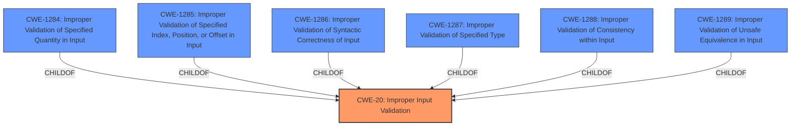

# Enhanced Analysis for CVE-2022-33704

# Summary
| CWE ID | CWE Name | Confidence | CWE Abstraction Level | CWE Vulnerability Mapping Label | CWE-Vulnerability Mapping Notes |
|---|---|---|---|---|---|
| CWE-20 | Improper Input Validation | 0.8 | Class | Primary | Discouraged |

## Evidence and Confidence

*   **Confidence Score:** 0.8
*   **Evidence Strength:** HIGH

## Relationship Analysis
The primary CWE selected is CWE-20 which is a class-level CWE. It has child CWEs that provide more specific details about the type of input that is not validated. The retriever results also suggest CWE-1285 (Improper Validation of Specified Index, Position, or Offset in Input), however, the description does not give enough information to determine whether an index, position, or offset is involved, therefore, the more general CWE-20 is chosen.



## Vulnerability Chain
The chain of root cause and weaknesses that followed for the Vulnerability Description:
1.  The **root cause** is **improper validation** in ucmRetParcelable of KnoxSDK
2.  The **weakness** allows attackers to launch certain activities.

## Summary of Analysis
The vulnerability description indicates an **improper validation** issue within the `ucmRetParcelable` component of KnoxSDK. This **improper validation** allows attackers to launch certain activities. The CVE Reference Links Content Summary confirms that the **root cause** is **improper input validation**.

The Retriever Results identify CWE-20 [CWE-20: Improper Input Validation] as a potential match. The description of CWE-20 states, "The product receives input or data, but it does not validate or incorrectly validates that the input has the properties that are required to process the data safely and correctly." This aligns with the vulnerability description, which indicates an **improper validation** issue.

CWE-20 is a Class-level CWE and the mapping guidance discourages its use when more specific CWEs are available. However, based on the provided information, it is not possible to determine the specific type of input that is not being validated. Therefore, CWE-20 is the most appropriate choice.

Other CWEs considered from the Retriever Results include:

*   CWE-213: Exposure of Sensitive Information Due to Incompatible Policies - This CWE does not align with the vulnerability description, as it focuses on the exposure of sensitive information.
*   CWE-926: Improper Export of Android Application Components - This CWE does not align with the vulnerability description, as it focuses on exported Android application components.
*   CWE-285: Improper Authorization - This CWE is too general and doesn't fit the specific **improper validation** issue.
*   CWE-1285: Improper Validation of Specified Index, Position, or Offset in Input - It is not clear if the validation issue is about an index, position or offset.
*   CWE-269: Improper Privilege Management - The evidence shows this is an input validation issue and not necessarily a privilege management issue, since a required validation is missing.
*   CWE-613: Insufficient Session Expiration - This CWE does not align with the vulnerability description.
*   CWE-927: Use of Implicit Intent for Sensitive Communication - This CWE does not align with the vulnerability description.
*   CWE-284: Improper Access Control - This CWE is too general and doesn't fit the specific **improper validation** issue.
*   CWE-287: Improper Authentication - This CWE does not align with the vulnerability description.


## CWE Relationship Analysis

Current CWEs represent these abstraction levels: .


### Vulnerability Chain Analysis

**Chain starting from CWE-613:**
- 613 (Insufficient Session Expiration) - ROOT


**Chain starting from CWE-284:**
- 284 (Improper Access Control) - ROOT


### CWE Relationship Diagram

```mermaid
graph TD
    classDef primary fill:#f96,stroke:#333,stroke-width:2px
    classDef secondary fill:#69f,stroke:#333
    classDef tertiary fill:#9e9,stroke:#333
```