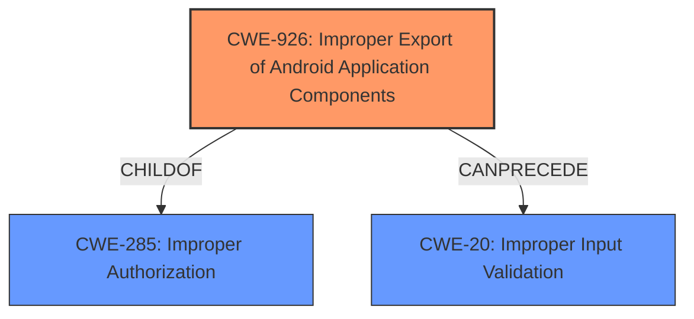

# Analysis for CVE-2022-33708

# Summary

| CWE ID | CWE Name | Confidence | CWE Abstraction Level | CWE Vulnerability Mapping Label | CWE-Vulnerability Mapping Notes |
|---|---|---|---|---|---|
| CWE-926 | Improper Export of Android Application Components | 0.9 | Variant | Allowed | Primary CWE |
| CWE-20 | Improper Input Validation | 0.6 | Class | Discouraged | Secondary Candidate |

## Evidence and Confidence

*   **Confidence Score:** 0.9
*   **Evidence Strength:** HIGH

## Relationship Analysis

The primary relationship influencing my decision is that CWE-926 is a child of CWE-285 (Improper Authorization). This indicates a more specific scenario within the broader context of authorization issues. The vulnerability description points to a failure in restricting access to an exported component, aligning directly with the definition of CWE-926. While CWE-20 (Improper Input Validation) is also relevant, it's a more general class, and the specific issue is related to component access control rather than general input handling.

## Vulnerability Chain

The vulnerability chain starts with the **improper input validation**, which leads to launching activities as Galaxy Store privilege.
  - The root cause is the lack of proper restrictions on exported components.
  - This results in a privilege escalation, where a local attacker can launch activities with Galaxy Store privileges.

## Summary of Analysis

My assessment is strongly based on the provided evidence, particularly the **Vulnerability Description Key Phrases**, which highlight **"Improper input validation"** as the root cause and "launch activities as Galaxy Store privilege" as the impact. The description explicitly mentions that the vulnerability allows local attackers to launch activities as Galaxy Store privilege, indicating a problem with how the application's components are exposed and accessed. This aligns well with CWE-926, which specifically addresses the improper export of Android application components.

The graph relationships highlight that CWE-926 is a specific type of improper authorization (CWE-285), making it a more precise fit than the general input validation issue (CWE-20). While **improper input validation** is mentioned, the core issue lies in the fact that a local attacker can launch activities as Galaxy Store privilege.

I've selected CWE-926 because it directly addresses the vulnerability described: an Android application component is improperly exported, allowing unauthorized access and privilege escalation. This is at the optimal level of specificity (Variant), as it is more specific than its parent class, and the evidence provided supports this level of detail.

Relevant CWE Information:

# Enhanced Context (25 CWEs)

## CWE-226: Sensitive Information in Resource Not Removed Before Reuse
**Abstraction Level**: Base
**Similarity Score**: 0.75
**Source**: dense

**Description**:
The product releases a resource such as memory or a file so that it can be made available for reuse, but it does not clear or "zeroize" the information contained in the resource before the product performs a critical state transition or makes the resource available for reuse by other entities.

**Mapping Guidance**:
- Usage: Allowed
- Rationale: This CWE entry is at the Base level of abstraction, which is a preferred level of abstraction for mapping to the root causes of vulnerabilities.

*Not Selected*: This CWE relates to sensitive information not being removed before reuse of a resource. This does not fit the vulnerability description.

## CWE-1289: Improper Validation of Unsafe Equivalence in Input
**Abstraction Level**: Base
**Similarity Score**: 0.75
**Source**: dense

**Description**:
The product receives an input value that is used as a resource identifier or other type of reference, but it does not validate or incorrectly validates that the input is equivalent to a potentially-unsafe value.

**Mapping Guidance**:
- Usage: Allowed
- Rationale: This CWE entry is at the Base level of abstraction, which is a preferred level of abstraction for mapping to the root causes of vulnerabilities.

*Not Selected*: This CWE relates to improper validation of unsafe equivalence in input. This does not fit the vulnerability description.

## CWE-212: Improper Removal of Sensitive Information Before Storage or Transfer
**Abstraction Level**: Base
**Similarity Score**: 0.74
**Source**: dense

**Description**:
The product stores, transfers, or shares a resource that contains sensitive information, but it does not properly remove that information before the product makes the resource available to unauthorized actors.

**Mapping Guidance**:
- Usage: Allowed
- Rationale: This CWE entry is at the Base level of abstraction, which is a preferred level of abstraction for mapping to the root causes of vulnerabilities.

*Not Selected*: This CWE relates to sensitive information not being removed before storage or transfer. This does not fit the vulnerability description.

## CWE-538: Insertion of Sensitive Information into Externally-Accessible File or Directory
**Abstraction Level**: Base
**Similarity Score**: 0.74
**Source**: dense

**Description**:
The product places sensitive information into files or directories that are accessible to actors who are allowed to have access to the files, but not to the sensitive information.

**Mapping Guidance**:
- Usage: Allowed
- Rationale: This CWE entry is at the Base level of abstraction, which is a preferred level of abstraction for mapping to the root causes of vulnerabilities.

*Not Selected*: This CWE relates to the insertion of sensitive information into externally accessible files or directories. This does not fit the vulnerability description.

## CWE-404: Improper Resource Shutdown or Release
**Abstraction Level**: Class
**Similarity Score**: 0.74
**Source**: dense

**Description**:
The product does not release or incorrectly releases a resource before it is made available for re-use.

**Mapping Guidance**:
- Usage: Allowed-with-Review
- Rationale: This CWE entry is a Class and might have Base-level children that would be more appropriate

*Not Selected*: This CWE relates to improper resource shutdown or release. This does not fit the vulnerability description.

## CWE-668: Exposure of Resource to Wrong Sphere
**Abstraction Level**: Class
**Similarity Score**: 0.74
**Source**: dense

**Description**:
The product exposes a resource to the wrong control sphere, providing unintended actors with inappropriate access to the resource.

**Mapping Guidance**:
- Usage: Discouraged
- Rationale: CWE-668 is high-level and is often misused as a catch-all when lower-level CWE IDs might be applicable. It is sometimes used for low-information vulnerability reports [REF-1287]. It is a level-1 Class (i.e., a child of a Pillar). It is not useful for trend analysis.

*Not Selected*: While this CWE is somewhat relevant, it is too high-level and discouraged. CWE-926 is a better fit.

## CWE-131: Incorrect Calculation of Buffer Size
**Abstraction Level**: Base
**Similarity Score**: 0.73
**Source**: dense

**Description**:
The product does not correctly calculate the size to be used when allocating a buffer, which could lead to a buffer overflow.

**Mapping Guidance**:
- Usage: Allowed
- Rationale: This CWE entry is at the Base level of abstraction, which is a preferred level of abstraction for mapping to the root causes of vulnerabilities.

*Not Selected*: This CWE relates to incorrect calculation of buffer size. This does not fit the vulnerability description.

## CWE-667: Improper Locking
**Abstraction Level**: Class
**Similarity Score**: 0.73
**Source**: dense

**Description**:
The product does not properly acquire or release a lock on a resource, leading to unexpected resource state changes and behaviors.

**Mapping Guidance**:
- Usage: Allowed-with-Review
- Rationale: This CWE entry is a Class and might have Base-level children that would be more appropriate

*Not Selected*: This CWE relates to improper locking. This does not fit the vulnerability description.

## CWE-345: Insufficient Verification of Data Authenticity
**Abstraction Level**: Class
**Similarity Score**: 0.73
**Source**: dense

**Description**:
The product does not sufficiently verify the origin or authenticity of data, in a way that causes it to accept invalid data.

**Mapping Guidance**:
- Usage: Discouraged
- Rationale: This CWE entry is a level-1 Class (i.e., a child of a Pillar). It might have lower-level children that would be more appropriate

*Not Selected*: This CWE relates to insufficient verification of data authenticity. While related to security, the specific problem is not addressed.

## CWE-129: Improper Validation of Array Index
**Abstraction Level**: Variant