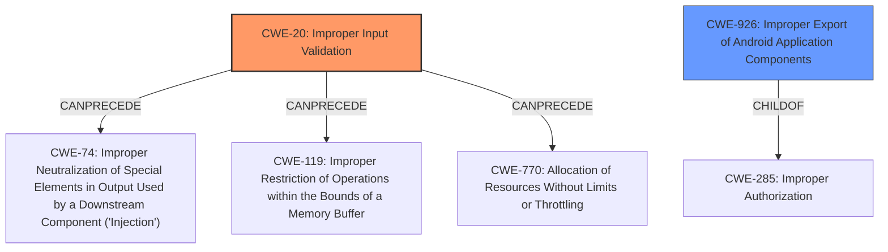

# Analysis Report for CVE-2022-33709

# Vulnerability Analysis Report: CVE-2022-33709

## Description


## Analysis (with Relationship Data)

# Summary
| CWE ID | CWE Name | Confidence | CWE Abstraction Level | CWE Vulnerability Mapping Label | CWE-Vulnerability Mapping Notes |
|---|---|---|---|---|---|
| CWE-20 | Improper Input Validation | 0.8 | Class | Primary | Discouraged: Consider lower-level children. |
| CWE-926 | Improper Export of Android Application Components | 0.6 | Variant | Secondary | Allowed |

## Evidence and Confidence

*   **Confidence Score:** 0.7
*   **Evidence Strength:** MEDIUM

## Relationship Analysis
The primary relationship influencing the decision is that CWE-20 is a Class-level CWE and has many potential children that could be more specific. While CWE-926 is a Variant and potentially more specific, there's not enough information to definitively say that the exported component is an Android application component.



## Vulnerability Chain
The chain starts with **improper input validation** (CWE-20), which allows a local attacker to launch activities as Galaxy Store privilege. It's a fairly short chain.

## Summary of Analysis
The initial assessment focused on the **improper input validation** as the root cause. The description explicitly mentions this weakness. The content of CVE reference links is unrelated, so it doesn't affect the assessment. The retriever results suggest several CWEs, including CWE-20, CWE-200, CWE-345, and CWE-73.

CWE-20 is selected as the primary CWE because the vulnerability description clearly states **"Improper input validation"**. However, CWE-20 is a Class-level CWE, and the mapping guidance discourages its use when more specific CWEs are available. But the available evidence is not strong enough to pinpoint a more specific variant.

CWE-926 (Improper Export of Android Application Components) is considered as a secondary CWE because the vulnerability affects ApexPackageInstaller in Galaxy Store, which suggests an Android application context. However, there isn't enough information to definitively confirm that the **improper input validation** directly leads to the improper export of an application component.

Therefore, CWE-20 is chosen as the primary CWE with a confidence of 0.8, and CWE-926 is a secondary consideration with a confidence of 0.6. The final selection is based on balancing the explicit evidence of **improper input validation** with the need for specificity, given the limited information available.

Relevant CWE Information:

# Enhanced Context (25 CWEs)

## CWE-20: Improper Input Validation
**Abstraction Level:** Class
**Similarity Score**: 0.148

**Description**:
The product receives input or data, but it does
        not validate or incorrectly validates that the input has the
        properties that are required to process the data safely and
        correctly.

**Mapping Guidance**:
**Usage:** Discouraged
**Rationale:** CWE-20 is commonly misused in low-information vulnerability reports when lower-level CWEs could be used instead, or when more details about the vulnerability are available [REF-1287]. It is not useful for trend analysis. It is also a level-1 Class (i.e., a child of a Pillar).
**Comments:** Consider lower-level children such as Improper Use of Validation Framework (CWE-1173) or improper validation involving specific types or properties of input such as Specified Quantity (CWE-1284); Specified Index, Position, or Offset (CWE-1285); Syntactic Correctness (CWE-1286); Specified Type (CWE-1287); Consistency within Input (CWE-1288); or Unsafe Equivalence (CWE-1289).

## CWE-926: Improper Export of Android Application Components
**Abstraction Level:** Variant
**Similarity Score**: 0.532

**Description**:
The Android application exports a component for use by other applications, but does not properly restrict which applications can launch the component or access the data it contains.

**Mapping Guidance**:
**Usage:** Allowed


## CWE Relationship Analysis

Current CWEs represent these abstraction levels: .


### Vulnerability Chain Analysis

**Chain starting from CWE-200:**
- 200 (Exposure of Sensitive Information to an Unauthorized Actor) - ROOT


**Chain starting from CWE-20:**
- 20 (Improper Input Validation) - ROOT


### CWE Relationship Diagram

```mermaid
graph TD
    classDef primary fill:#f96,stroke:#333,stroke-width:2px
    classDef secondary fill:#69f,stroke:#333
    classDef tertiary fill:#9e9,stroke:#333
```


*Report generated on 2025-03-30 23:04:38*
