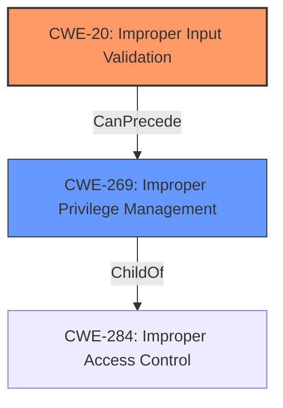

# Enhanced Analysis for CVE-2022-33710

# Summary
| CWE ID  | CWE Name                                                       | Confidence | CWE Abstraction Level | CWE Vulnerability Mapping Label | CWE-Vulnerability Mapping Notes |
| :-------- | :------------------------------------------------------------- | :--------- | :---------------------- | :------------------------------ | :------------------------------ |
| CWE-20  | Improper Input Validation                                         | 0.75       | Class                   | Primary                         | Discouraged                    |
| CWE-269 | Improper Privilege Management                      | 0.50      | Class                   | Secondary                         | Discouraged                    |

## Evidence and Confidence

*   **Confidence Score:** 0.70
*   **Evidence Strength:** MEDIUM

## Relationship Analysis
The primary relationship that impacted my decision was the parent-child relationship between CWE-20 **Improper Input Validation** and its potential child CWEs. While the description mentions **"Improper input validation"**, it lacks specifics, making it difficult to pinpoint a more precise variant. CWE-269 **Improper Privilege Management** is related as a potential impact of the **improper input validation**, if the **improper input validation** allows the attacker to gain elevated privileges, but this is not explicitly stated.



## Vulnerability Chain
The vulnerability chain starts with **improper input validation** (CWE-20), potentially leading to the ability to launch activities as Galaxy Store privilege.

## Summary of Analysis
The initial analysis identified **improper input validation** as the root cause, with the impact being the ability to "launch activities as Galaxy Store privilege." The retriever results and similar CVE descriptions suggested CWE-269 **Improper Privilege Management** due to the privilege escalation aspect.

However, based on the evidence provided, the vulnerability description focuses on the **improper input validation** which is the root cause. The launching of "activities as Galaxy Store privilege" is the impact.

The decision to assign CWE-20 is based on the explicit mention of **"Improper input validation"** in the vulnerability description. However, due to the lack of detail, a more specific CWE could not be identified. The usage is **Discouraged** but the evidence is directly available.

CWE-269 **Improper Privilege Management** was considered because the vulnerability allows local attackers to "launch activities as Galaxy Store privilege," suggesting a privilege-related issue. However, CWE-269 is more about the incorrect assignment, modification, tracking, or checking of privileges, rather than a consequence of **improper input validation**. Without more information, I am not confident to assign this.

Relevant CWE Information:

# Enhanced Context (25 CWEs)
The following CWEs were identified as potentially relevant to this vulnerability:

## CWE-1289: Improper Validation of Unsafe Equivalence in Input
**Abstraction Level**: Base
**Similarity Score**: 0.75
**Source**: dense

**Description**:
The product receives an input value that is used as a resource identifier or other type of reference, but it does not validate or incorrectly validates that the input is equivalent to a potentially-unsafe value.

**Mapping Guidance**:
- Usage: Allowed
- Rationale: This CWE entry is at the Base level of abstraction, which is a preferred level of abstraction for mapping to the root causes of vulnerabilities.
## CWE-20: Improper Input Validation
**Abstraction:** Class
**Status:** Stable

### Description
The product receives input or data, but it does
        not validate or incorrectly validates that the input has the
        properties that are required to process the data safely and
        correctly.

### Extended Description
Input validation is a frequently-used technique for checking potentially dangerous inputs in order to ensure that the inputs are safe for processing within the code, or when communicating with other components. When software does not validate input properly, an attacker is able to craft the input in a form that is not expected by the rest of the application. This will lead to parts of the system receiving unintended input, which may result in altered control flow, arbitrary control of a resource, or arbitrary code execution.
### Mapping Guidance
**Usage:** Discouraged
**Rationale:** CWE-20 is commonly misused in low-information vulnerability reports when lower-level CWEs could be used instead, or when more details about the vulnerability are available [REF-1287]. It is not useful for trend analysis. It is also a level-1 Class (i.e., a child of a Pillar).
**Comments:** Consider lower-level children such as Improper Use of Validation Framework (CWE-1173) or improper validation involving specific types or properties of input such as Specified Quantity (CWE-1284); Specified Index, Position, or Offset (CWE-1285); Syntactic Correctness (CWE-1286); Specified Type (CWE-1287); Consistency within Input (CWE-1288); or Unsafe Equivalence (CWE-1289).

## CWE-269: Improper Privilege Management
**Abstraction:** Class
**Status:** Draft

### Description
The product does not properly assign, modify, track, or check privileges for an actor, creating an unintended sphere of control for that actor.

### Extended Description
Not provided

### Mapping Guidance
**Usage:** Discouraged
**Rationale:** CWE-269 is commonly misused. It can be conflated with "privilege escalation," which is a technical impact that is listed in many low-information vulnerability reports [REF-1287]. It is not useful for trend analysis.
**Comments:** If an error or mistake allows privilege escalation, then use the CWE ID for that mistake. Avoid using CWE-269 when only phrases such as "privilege escalation" or "gain privileges" are available, as these indicate technical impact of the vulnerability - not the root cause weakness. If the root cause seems to be directly related to privileges, then examine the children of CWE-269 for additional hints, such as Execution with Unnecessary Privileges (CWE-250) or Incorrect Privilege Assignment (CWE-266).

**CWE-20: Improper Input Validation** is selected as the primary CWE because the vulnerability description explicitly states **"Improper input validation"**. While it's a broad class, the provided evidence doesn't offer enough detail to narrow it down to a more specific variant. The MITRE mapping guidance discourages its use due to its generality, but the direct mention in the description makes it the most appropriate choice given the limited information.

**CWE-269: Improper Privilege Management** is considered as a secondary candidate because the vulnerability allows attackers to "launch activities as Galaxy Store privilege." However, this is more of an impact than a root cause. The **improper input validation** leads to this privilege escalation, but the description doesn't detail how privileges are mishandled directly.

I considered some of the children of CWE-20, such as CWE-1285 (Improper Validation of Specified Index, Position, or Offset in Input) and CWE-1284 (Improper Validation of Specified Quantity in Input), but there was no specific evidence to support these more granular classifications. The description lacks details about the type of input being validated or the specific validation failures.


## CWE Relationship Analysis

Current CWEs represent these abstraction levels: .


### Vulnerability Chain Analysis

**Chain starting from CWE-266:**
- 266 (Incorrect Privilege Assignment) - ROOT


**Chain starting from CWE-250:**
- 250 (Execution with Unnecessary Privileges) - ROOT


### CWE Relationship Diagram

```mermaid
graph TD
    classDef primary fill:#f96,stroke:#333,stroke-width:2px
    classDef secondary fill:#69f,stroke:#333
    classDef tertiary fill:#9e9,stroke:#333
```