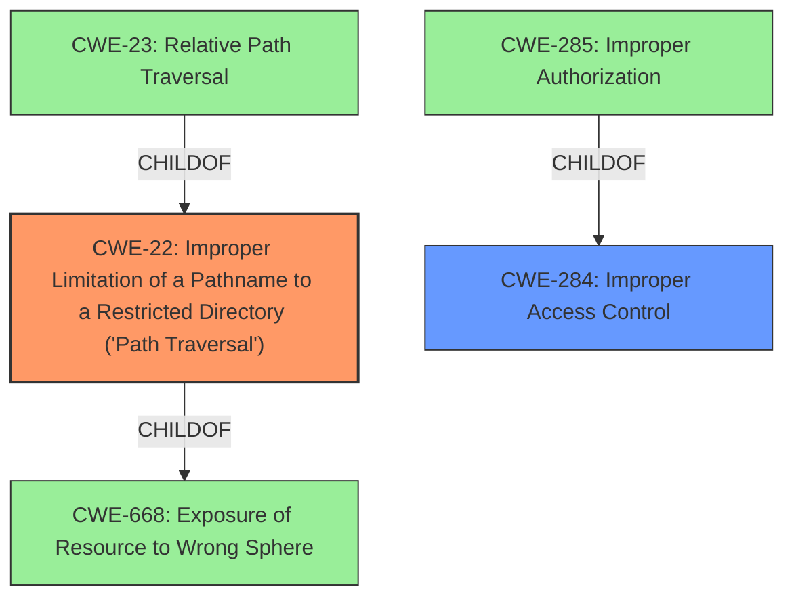

# Raw Analyzer Response for CVE-2022-33715

# Summary
| CWE ID | CWE Name | Confidence | CWE Abstraction Level | CWE Vulnerability Mapping Label | CWE-Vulnerability Mapping Notes |
|---|---|---|---|---|---|
| CWE-22 | Improper Limitation of a Pathname to a Restricted Directory ('Path Traversal') | 1.0 | Base | Allowed | Primary CWE |
| CWE-284 | Improper Access Control | 0.7 | Pillar | Discouraged | Secondary Candidate |

## Evidence and Confidence

*   **Confidence Score:** 0.9
*   **Evidence Strength:** HIGH

## Relationship Analysis
The primary CWE is CWE-22, which is a Base level CWE. It has parent CWEs that are more abstract like CWE-668, and child CWEs which are more specific. The relationship analysis shows the importance of selecting the right level of abstraction. CWE-284 is a Pillar which is too high level.



## Vulnerability Chain
The vulnerability chain starts with **Improper access control and path traversal**, leading to a local attacker being able to access files of One UI. The chain is:
1.  **Improper access control** (leads to)
2.  **Path traversal** (leads to)
3.  Access to unauthorized files.

## Summary of Analysis
The initial assessment identified both CWE-22 and CWE-284 as potential candidates based on the vulnerability description containing "**Improper access control and path traversal**".

The vulnerability description states: "**Improper access control and path traversal** vulnerability in LauncherProvider prior to SMR Aug-2022 Release 1 allow local attacker to access files of One UI."

The "CVE Reference Links Content Summary" section confirms this:
```
{
  "vulnerability_details": [
    {
      "cve_id": "CVE-2022-33715",
      "root_cause": "Improper access control and path traversal vulnerability in LauncherProvider",
      "weaknesses": [
        "Improper access control",
        "Path traversal"
      ],
      "impact": "Local attacker to access files of One UI.",
       "attack_vectors": [
        "Local access"
      ],
      "required_capabilities": "Local attacker",
      "reference": "SVE-2022-0897"
    }
  ]
}
```

The Retriever Results also list CWE-22 and CWE-284 as candidates. However, CWE-284 is a Pillar and is discouraged. The evidence points to both **improper access control** and **path traversal** being present. However, **path traversal** is a more specific weakness and the **improper access control** may be a prerequisite for the **path traversal** to be exploited.

Therefore, the final decision is to select CWE-22 as the primary CWE, representing the **path traversal** vulnerability and CWE-284 as a secondary candidate.

CWE-23 (Relative Path Traversal) was considered as a child of CWE-22, but there was no specific evidence to indicate the path traversal was "relative".
CWE-285 (Improper Authorization) was considered as a child of CWE-284, but there was no specific evidence to indicate that authorization checks were performed incorrectly.
CWE-926 (Improper Export of Android Application Components) was considered given the specific context of Android applications, but the description is more general than just an exported component.

Relevant CWE Information:

# Enhanced Context (25 CWEs)

## CWE-22: Improper Limitation of a Pathname to a Restricted Directory ('Path Traversal')

**Abstraction:** Base
**Status:** Stable

### Description
The product uses external input to construct a pathname that is intended to identify a file or directory that is located underneath a restricted parent directory, but the product does not properly neutralize special elements within the pathname that can cause the pathname to resolve to a location that is outside of the restricted directory.

## CWE-284: Improper Access Control

**Abstraction:** Pillar
**Status:** Incomplete

### Description
The product does not restrict or incorrectly restricts access to a resource from an unauthorized actor.