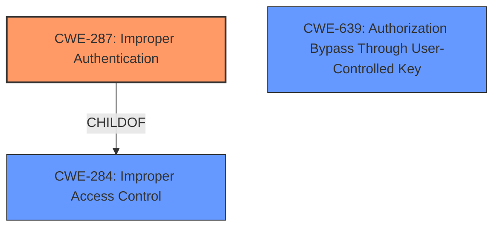

# Enhanced Analysis for CVE-2022-33720

# Summary
| CWE ID | CWE Name | Confidence | CWE Abstraction Level | CWE Vulnerability Mapping Label | CWE-Vulnerability Mapping Notes |
|---|---|---|---|---|---|
| CWE-287 | Improper Authentication | 1.0 | Class | Primary | Allowed |
| CWE-639 | Authorization Bypass Through User-Controlled Key | 0.7 | Base | Secondary | Allowed |

## Evidence and Confidence

*   **Confidence Score:** 0.9
*   **Evidence Strength:** HIGH

## Relationship Analysis
The primary CWE is CWE-287, "Improper Authentication," which is a Class-level CWE. It is a child of CWE-284, "Improper Access Control," a Pillar-level CWE. CWE-639, "Authorization Bypass Through User-Controlled Key," is a Base-level CWE and a potential secondary mapping as the key AppLock authentication is bypassed.



## Vulnerability Chain
The vulnerability chain starts with **improper authentication** (CWE-287), which leads to the ability for a physical attacker to bypass AppLock and access Chrome. The **root cause** is the **improper authentication**, and the impact is unauthorized access to a locked application.

## Summary of Analysis
The initial assessment identified CWE-287 as the primary candidate due to the explicit mention of **"Improper authentication"** in both the vulnerability description and the CVE Reference Links Content Summary. The description clearly states, "**Improper authentication** vulnerability in AppLock prior to SMR Aug-2022 Release 1 allows physical attacker to access Chrome locked by AppLock via new tap shortcut." The CVE Reference Links Content Summary confirms this: "**Root cause of vulnerability:** **Improper authentication** vulnerability in AppLock."

CWE-287's description, "When an actor claims to have a given identity, the product does not prove or insufficiently proves that the claim is correct," directly aligns with the vulnerability. A physical attacker is bypassing the authentication mechanism of AppLock.

CWE-639, "Authorization Bypass Through User-Controlled Key," was considered as a secondary CWE because the attack involved bypassing the AppLock mechanism, which could be viewed as an authorization bypass.

CWE-285, "Improper Authorization," was considered but ultimately not selected as the primary CWE because the **root cause** is more specifically related to the initial authentication process rather than a general authorization failure after authentication. CWE-287 is a child of CWE-285.

CWE-284, "Improper Access Control," was also considered but deemed too high-level. The vulnerability is specifically about **improper authentication**, making CWE-287 a more precise fit.

CWE-1390, "Weak Authentication" was not selected because the description does not mention a weak authentication mechanism. The description mentions a bypass, implying a more fundamental flaw in the authentication process.

The decision to prioritize CWE-287 is strongly supported by the evidence provided and the CWE's description. The confidence level is high (0.9) due to the clear alignment between the vulnerability details and the CWE definition. The selection of CWE-287 as the primary CWE is at the optimal level of specificity, focusing on the **root cause** of the vulnerability.


## CWE Relationship Analysis

Current CWEs represent these abstraction levels: .


### Vulnerability Chain Analysis

**Chain starting from CWE-1390:**
- 1390 (Weak Authentication) - ROOT


**Chain starting from CWE-639:**
- 639 (Authorization Bypass Through User-Controlled Key) - ROOT


### CWE Relationship Diagram

```mermaid
graph TD
    classDef primary fill:#f96,stroke:#333,stroke-width:2px
    classDef secondary fill:#69f,stroke:#333
    classDef tertiary fill:#9e9,stroke:#333
```