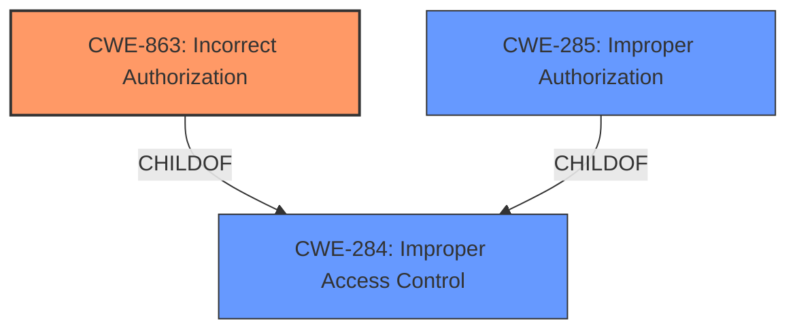

# Enhanced Analysis for CVE-2022-33732

# Summary
| CWE ID | CWE Name | Confidence | CWE Abstraction Level | CWE Vulnerability Mapping Label | CWE-Vulnerability Mapping Notes |
|---|---|---|---|---|---|
| CWE-863 | Incorrect Authorization | 0.9 | Class | Primary | Allowed-with-Review |
| CWE-285 | Improper Authorization | 0.7 | Class | Secondary | Discouraged |
| CWE-284 | Improper Access Control | 0.6 | Pillar | Secondary | Discouraged |

## Evidence and Confidence

*   **Confidence Score:** 0.9
*   **Evidence Strength:** HIGH

## Relationship Analysis
The primary CWE selected is CWE-863, "Incorrect Authorization," which is a child of CWE-284, "Improper Access Control". CWE-285, "Improper Authorization" is also a child of CWE-284. The relationship shows a progression from a high-level access control issue to a more specific authorization problem. CWE-863 is chosen because the vulnerability description specifies that the access control mechanism is present but is performed incorrectly.


## Vulnerability Chain
The vulnerability chain begins with the root cause of **improper access control**, specifically an **incorrect authorization** mechanism. This leads to the impact of a local attacker being able to scan and connect to a PC via an unprotected binder call.

## Summary of Analysis
The initial analysis identified **improper access control** as the root cause, based on the vulnerability description and CVE reference summary. The retriever results suggested CWE-285, "Improper Authorization," but the description also indicates the authorization is incorrectly performed. Thus, CWE-863, "Incorrect Authorization," a more specific child of CWE-284 is more appropriate.

The selection of CWE-863 is based on the following evidence:
*   "Improper access control vulnerability" - Vulnerability Description and CVE Reference Links Content Summary
*   "allows local attackers to scan and connect to PC by unprotected binder call" - Vulnerability Description and CVE Reference Links Content Summary

CWE-285 and CWE-284 were considered but deemed too high-level. The decision is supported by the MITRE mapping guidance, which discourages the use of high-level CWEs when more specific options exist.

Relevant CWE Information:

# Enhanced Context (25 CWEs)

## CWE-538: Insertion of Sensitive Information into Externally-Accessible File or Directory
**Abstraction Level**: Base
**Similarity Score**: 0.77
**Source**: dense
Not selected, as the vulnerability is related to improper authorization, not insertion of sensitive information.

## CWE-497: Exposure of Sensitive System Information to an Unauthorized Control Sphere
**Abstraction Level**: Base
**Similarity Score**: 0.77
**Source**: dense
Not selected, as the vulnerability is related to improper authorization, not exposure of system information.

## CWE-226: Sensitive Information in Resource Not Removed Before Reuse
**Abstraction Level**: Base
**Similarity Score**: 0.76
**Source**: dense
Not selected, as the vulnerability is related to improper authorization, not reuse of sensitive information.

## CWE-668: Exposure of Resource to Wrong Sphere
**Abstraction Level**: Class
**Similarity Score**: 0.76
**Source**: dense
Not selected because it is too high level of an abstraction and other options were available.

## CWE-274: Improper Handling of Insufficient Privileges
**Abstraction Level**: Base
**Similarity Score**: 0.76
**Source**: dense
Not selected, as the vulnerability is related to incorrect authorization, not the handling of insufficient privileges.

## CWE-280: Improper Handling of Insufficient Permissions or Privileges 
**Abstraction Level**: Base
**Similarity Score**: 0.76
**Source**: dense
Not selected, as the vulnerability is related to incorrect authorization, not the handling of insufficient permissions or privileges.

## CWE-653: Improper Isolation or Compartmentalization
**Abstraction Level**: Class
**Similarity Score**: 0.75
**Source**: dense
Not selected because it is too high level of an abstraction and other options were available.

## CWE-552: Files or Directories Accessible to External Parties
**Abstraction Level**: Base
**Similarity Score**: 0.75
**Source**: dense
Not selected, as the vulnerability is related to improper authorization, not making files or directories accessible to external parties.

## CWE-200: Exposure of Sensitive Information to an Unauthorized Actor
**Abstraction Level**: Class
**Similarity Score**: 0.75
**Source**: dense
Not selected, as the vulnerability is primarily about access control, not exposure of sensitive information as the root cause.

## CWE-203: Observable Discrepancy
**Abstraction Level**: Base
**Similarity Score**: 0.75
**Source**: dense
Not selected, as the vulnerability is related to improper authorization, not an observable discrepancy.

## CWE-863: Incorrect Authorization
**Abstraction Level**: Class
**Similarity Score**: 6759.49
**Source**: sparse

**Description**:
The product performs an authorization check when an actor attempts to access a resource or perform an action, but it does not correctly perform the check.

**Mapping Guidance**:
- Usage: Allowed-with-Review
- Rationale: This CWE entry is a Class and might have Base-level children that would be more appropriate
Selected as the primary CWE because the vulnerability involves an authorization check that is performed incorrectly.

## CWE-285: Improper Authorization
**Abstraction Level**: Class
**Similarity Score**: 6757.89
**Source**: sparse

**Description**:
The product does not perform or incorrectly performs an authorization check when an actor attempts to access a resource or perform an action.

**Mapping Guidance**:
- Usage: Discouraged
- Rationale: CWE-285 is high-level and lower-level CWEs can frequently be used instead. It is a level-1 Class (i.e., a child of a Pillar).
Selected as a secondary CWE because the vulnerability involves an authorization check that is performed incorrectly.

## CWE-200: Exposure of Sensitive Information to an Unauthorized Actor
**Abstraction Level**: Class
**Similarity Score**: 6750.16
**Source**: sparse

**Description**:
The product exposes sensitive information to an actor that is not explicitly authorized to have access to that information.

**Mapping Guidance**:
- Usage: Discouraged
- Rationale: CWE-200 is commonly misused to represent the loss of confidentiality in a vulnerability, but confidentiality loss is a technical impact - not a root cause error. As of CWE 4.9, over 400 CWE entries can lead to a loss of confidentiality. Other options are often available. [REF-1287].
Not selected, as the vulnerability is primarily about access control, not exposure of sensitive information as the root cause.

## CWE-639: Authorization Bypass Through User-Controlled Key
**Abstraction Level**: Base
**Similarity Score**: 6631.43
**Source**: sparse

**Description**:
The system's authorization functionality does not prevent one user from gaining access to another user's data or record by modifying the key value identifying the data.

**Mapping Guidance**:
- Usage: Allowed
- Rationale: This CWE entry is at the Base level of abstraction, which is a preferred level of abstraction for mapping to the root causes of vulnerabilities.
Not selected, as there is no explicit mention of user-controlled keys in the vulnerability description.

## CWE-287: Improper Authentication
**Abstraction Level**: Class
**Similarity Score**: 6570.58
**Source**: sparse

**Description**:
When an actor claims to have a given identity, the product does not prove or insufficiently proves that the claim is correct.

**Mapping Guidance**:
- Usage: Discouraged
- Rationale: This CWE entry might be misused when lower-level CWE entries are likely to be applicable. It is a level-1 Class (i.e., a child of a Pillar).
Not selected, as the vulnerability is specifically about authorization, not authentication.

## CWE-22: Improper Limitation of a Pathname to a Restricted Directory ('Path Traversal')
**Abstraction Level**: base
**Similarity Score**: 4.33
**Source**: graph
Not selected, as the vulnerability is related to improper authorization, not path traversal.

## CWE-59: Improper Link Resolution Before File Access ('Link Following')
**Abstraction Level**: base
**Similarity Score**: 4.33
**Source**: graph
Not selected, as the vulnerability is related to


## CWE Relationship Analysis

Current CWEs represent these abstraction levels: .


### Vulnerability Chain Analysis

**Chain starting from CWE-552:**
- 552 (Files or Directories Accessible to External Parties) - ROOT


**Chain starting from CWE-200:**
- 200 (Exposure of Sensitive Information to an Unauthorized Actor) - ROOT


### CWE Relationship Diagram

```mermaid
graph TD
    classDef primary fill:#f96,stroke:#333,stroke-width:2px
    classDef secondary fill:#69f,stroke:#333
    classDef tertiary fill:#9e9,stroke:#333
```