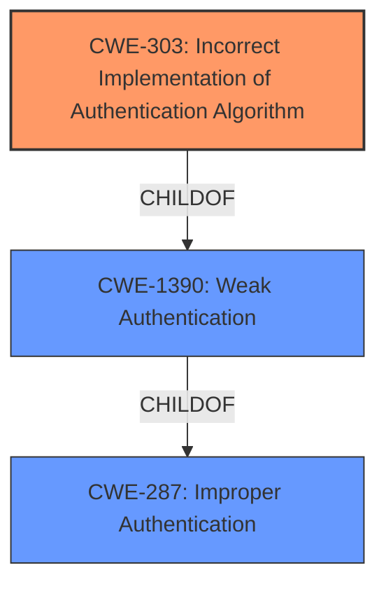

# Enhanced Analysis for CVE-2022-33736

# Summary
| CWE ID | CWE Name | Confidence | CWE Abstraction Level | CWE Vulnerability Mapping Label | CWE-Vulnerability Mapping Notes |
|---|---|---|---|---|---|
| CWE-303 | Incorrect Implementation of Authentication Algorithm | 0.9 | Base | Allowed | Primary CWE |
| CWE-287 | Improper Authentication | 0.7 | Class | Discouraged | Secondary Candidate |
| CWE-1390 | Weak Authentication | 0.6 | Class | Allowed-with-Review | Secondary Candidate |

## Evidence and Confidence

*   **Confidence Score:** 0.9
*   **Evidence Strength:** HIGH

## Relationship Analysis
The primary CWE, CWE-303 (**Incorrect Implementation of Authentication Algorithm**), is a base-level CWE that directly addresses the **rootcause** of the vulnerability: the affected applications do not properly validate login information during authentication. This weakness is a child of CWE-1390 (**Weak Authentication**), indicating that it's a specific type of weak authentication. CWE-287 (**Improper Authentication**) is a more general class that encompasses both CWE-1390 and CWE-306 (**Missing Authentication for Critical Function**).


## Vulnerability Chain
The vulnerability chain starts with the **improper validation of login information** (CWE-303), which leads to an authentication bypass. This bypass allows unauthenticated remote attackers to successfully login without credentials, potentially leading to unauthorized actions and a denial of service condition for existing users.

## Summary of Analysis
The initial analysis and criticism, along with the provided evidence, strongly support the selection of CWE-303 as the primary CWE. The vulnerability description clearly states that the applications do not properly validate login information during authentication. The CVE Reference Links Content Summary reinforces this, stating that the root cause of the vulnerability is the **improper validation of login information**. The retriever results also list CWE-303 as the top candidate.

The graph relationships influenced the decision by providing context on how the chosen CWE relates to other authentication-related weaknesses. While CWE-287 and CWE-1390 are relevant, they are less specific than CWE-303.

The selected CWE is at the optimal level of specificity because it directly reflects the root cause of the vulnerability, which is the **incorrect implementation of the authentication algorithm**.

Relevant CWE Information:

# Enhanced Context (25 CWEs)
The following CWEs were identified as potentially relevant to this vulnerability:

## CWE-303: Incorrect Implementation of Authentication Algorithm
**Abstraction Level**: Base
**Similarity Score**: 0.78
**Source**: dense

**Description**:
The requirements for the product dictate the use of an established authentication algorithm, but the implementation of the algorithm is incorrect.

**Mapping Guidance**:
- Usage: Allowed
- Rationale: This CWE entry is at the Base level of abstraction, which is a preferred level of abstraction for mapping to the root causes of vulnerabilities.

## CWE-287: Improper Authentication
**Abstraction Level**: Class
**Status:** Draft

### Description
When an actor claims to have a given identity, the product does not prove or insufficiently proves that the claim is correct.

### Mapping Guidance
**Usage:** Discouraged
**Rationale:** This CWE entry might be misused when lower-level CWE entries are likely to be applicable. It is a level-1 Class (i.e., a child of a Pillar).
**Comments:** Consider children or descendants, beginning with CWE-1390: Weak Authentication or CWE-306: Missing Authentication for Critical Function.

## CWE-1390: Weak Authentication
**Abstraction Level**: Class
**Status:** Incomplete

### Description
The product uses an authentication mechanism to restrict access to specific users or identities, but the mechanism does not sufficiently prove that the claimed identity is correct.

### Mapping Guidance
**Usage:** Allowed-with-Review
**Rationale:** This CWE entry is a Class and might have Base-level children that would be more appropriate
**Comments:** Examine children of this entry to see if there is a better fit

**CWE-20 Improper Input Validation**: This was considered because the **improper validation of login information** could be seen as a lack of proper input validation. However, CWE-303 is more specific because it pinpoints the **incorrect implementation of the authentication algorithm**, which goes beyond merely lacking input validation. Therefore, CWE-20 was rejected for being too general.

**CWE-306 Missing Authentication for Critical Function**: This was not selected because the application does have authentication, but it is **incorrectly implemented**, according to the root cause. The authentication exists, but it is flawed.

**CWE-89 Improper Neutralization of Special Elements used in an SQL Command ('SQL Injection')**: This was considered but rejected because the vulnerability description does not mention SQL injection.


## CWE Relationship Analysis

Current CWEs represent these abstraction levels: .


### Vulnerability Chain Analysis

**Chain starting from CWE-89:**
- 89 (Improper Neutralization of Special Elements used in an SQL Command ('SQL Injection')) - ROOT


**Chain starting from CWE-1390:**
- 1390 (Weak Authentication) - ROOT


### CWE Relationship Diagram

```mermaid
graph TD
    classDef primary fill:#f96,stroke:#333,stroke-width:2px
    classDef secondary fill:#69f,stroke:#333
    classDef tertiary fill:#9e9,stroke:#333
```