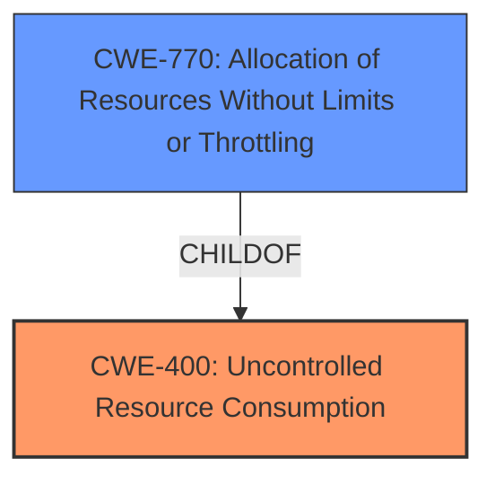

# Analysis for CVE-2022-33746

# Summary

| CWE ID | CWE Name | Confidence | CWE Abstraction Level | CWE Vulnerability Mapping Label | CWE-Vulnerability Mapping Notes |
|---|---|---|---|---|---|
| CWE-400 | Uncontrolled Resource Consumption | 0.8 | Class | Primary | Allowed-with-Review |
| CWE-770 | Allocation of Resources Without Limits or Throttling | 0.7 | Base | Secondary | Allowed |

## Evidence and Confidence

*   **Confidence Score:** 0.75
*   **Evidence Strength:** HIGH

## Relationship Analysis
The primary relationship that impacted my decision was the parent-child relationship between CWE-400 and CWE-770. While CWE-770 is more specific, the description also indicates the resource (CPU time) is not being released in a timely manner.

## Vulnerability Chain
The chain of root cause and weaknesses for the Vulnerability Description is as follows:
1.  **Root Cause:** **missing intermediate preemption checks** during P2M pool freeing.
2.  **Weakness:** Allocation of Resources Without Limits or Throttling (CWE-770)
3.  **Impact:** Uncontrolled Resource Consumption (CWE-400) leading to excessive CPU consumption and Denial of Service.

## Summary of Analysis
Initially, I considered CWE-770 (Allocation of Resources Without Limits or Throttling) due to the **missing preemption checks** which allows the P2M pool freeing process to monopolize a CPU core for an extended period. However, the vulnerability description also mentions that the freeing may take more time than is reasonable which indicates that the resource (CPU) is being held for too long, which leads to uncontrolled resource consumption.

The evidence for this assessment is primarily based on the "Vulnerability Description Key Phrases" and "CVE Reference Links Content Summary." Specifically, the root cause is identified as "**missing intermediate preemption checks**," and the impact is "excessively long P2M pool freeing."

Given the above, the best match is CWE-400 (Uncontrolled Resource Consumption) because it represents the overall impact of the vulnerability (Denial of Service) resulting from the missing preemption checks.

Relevant CWE Information:

# Enhanced Context (25 CWEs)

## CWE-404: Improper Resource Shutdown or Release
**Abstraction Level**: Class
**Similarity Score**: 0.80
**Source**: dense

**Description**:
The product does not release or incorrectly releases a resource before it is made available for re-use.

**Mapping Guidance**:
- Usage: Allowed-with-Review
- Rationale: This CWE entry is a Class and might have Base-level children that would be more appropriate

## CWE-400: Uncontrolled Resource Consumption
**Abstraction:** Class
**Status:** Draft

### Description
The product consumes more resources than it should, or it does not properly release resources after they are no longer needed. This can result in a denial-of-service (DoS) condition.

### Extended Description
This weakness covers a wide variety of resource consumption problems. In general, if a program continues to allocate or utilize resources without freeing them, then the program might eventually crash, or it might become unresponsive and prevent other programs from running.

### Alternative Terms
Resource Exhaustion

### Relationships
ChildOf -> CWE-399
PeerOf -> CWE-405
PeerOf -> CWE-770
CanPrecede -> CWE-410
CanFollow -> CWE-410

### Mapping Guidance
**Usage:** Allowed-with-Review
**Rationale:** This CWE entry is a Class and might have Base-level children that would be more appropriate
**Comments:** Examine children of this entry to see if there is a better fit
**Reasons:**
- Abstraction

### Additional Notes
**[Relationship]** CWE-400 overlaps with other resource-related weaknesses such as CWE-404 (Improper Resource Shutdown or Release) and CWE-770 (Allocation of Resources Without Limits or Throttling), because problems with resource management can lead to resource consumption problems.

**[Relationship]** Note that this CWE is related to resource exhaustion in general, and is not limited to memory.

### Observed Examples
- **CVE-2009-0581:** Web server allocates memory for uploaded files without limiting their size, which leads to denial of service.
- **CVE-2004-0391:** An IMAP server does not properly handle large arguments to the LIST command, leading to excessive memory consumption.
- **CVE-2001-1373:** Chain: web server module is vulnerable to directory traversal (CWE-22) via "..", causing access of arbitrary files (CWE-73), leading to excessive consumption of inodes/resources (CWE-400) by listing a very large number of files.

## CWE-770: Allocation of Resources Without Limits or Throttling
**Abstraction:** Base
**Status:** Incomplete

### Description
The product allocates a reusable resource or group of resources on behalf of an actor without imposing any restrictions on the size or number of resources that can be allocated, in violation of the intended security policy for that actor.

### Extended Description
Code frequently has to work with limited resources, so programmers must be careful to ensure that resources are not consumed too quickly, or too easily. Without use of quotas, resource limits, or other protection mechanisms, it can be easy for an attacker to consume many resources by rapidly making many requests, or causing larger resources to be used than is needed. When too many resources are allocated, or if a single resource is too large, then it can prevent the code from working correctly, possibly leading to a denial of service.

### Alternative Terms
None

### Relationships
ChildOf -> CWE-400
ChildOf -> CWE-665
ChildOf -> CWE-400

### Mapping Guidance
**Usage:** Allowed
**Rationale:** This CWE entry is at the Base level of abstraction, which is a preferred level of abstraction for mapping to the root causes of vulnerabilities.
**Comments:** Carefully read both the name and description to ensure that this mapping is an appropriate fit. Do not try to 'force' a mapping to a lower-level Base/Variant simply to comply with this preferred level of abstraction.
**Reasons:**
- Acceptable-Use

### Additional Notes
**[Relationship]** This entry is different from uncontrolled resource consumption (CWE-400) in that there are other weaknesses that are related to inability to control resource consumption, such as holding on to a resource too long after use, or not correctly keeping track of active resources so that they can be managed and released when they are finished (CWE-771).

**[Theoretical]** Vulnerability theory is largely about how behaviors and resources interact. "Resource exhaustion" can be regarded as either a consequence or an attack, depending on the perspective. This entry is an attempt to reflect one of the underlying weaknesses that enable these attacks (or consequences) to take place.

### Observed Examples
- **CVE-2022-21668:** Chain: Python library does not limit the resources used to process images that specify a very large number of bands (CWE-1284), leading to excessive memory consumption (CWE-789) or an integer overflow (CWE-190).
- **CVE-2009-4017:** Language interpreter does not restrict the number of temporary files being created when handling a MIME request with a large number of parts..
- **CVE-2009-2726:** Driver does not use a maximum width when invoking sscanf style functions, causing stack consumption.

## CWE-400: Uncontrolled Resource Consumption
The product consumes more resources than it should, or it does not properly release resources after they are no longer needed, potentially leading to a denial-of-service (DoS) condition. The **missing preemption checks** means the resource is held for too long.

## CWE-770: Allocation of Resources Without Limits or Throttling
The product allocates resources without limits or throttling, which allows an attacker to consume many resources by rapidly making many requests, or causing larger resources to be used than is needed. In this case, the allocation of CPU time is not properly managed.

CWE-404, CWE-410, CWE-619, CWE-1284, CWE-295, CWE-131, CWE-1342, and CWE-409 were considered but do not accurately represent the **root cause** of the vulnerability based on the provided evidence.