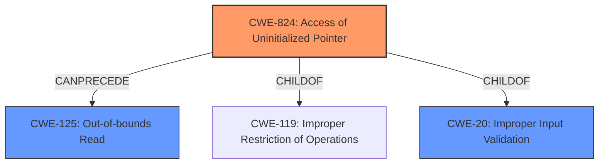

# Analysis for CVE-2022-3377

# Summary
| CWE ID | CWE Name | Confidence | CWE Abstraction Level | CWE Vulnerability Mapping Label | CWE-Vulnerability Mapping Notes |
|---|---|---|---|---|---|
| CWE-824 | Access of Uninitialized Pointer | 1.0 | Base | Primary | Allowed |
| CWE-125 | Out-of-bounds Read | 0.75 | Base | Secondary | Allowed |
| CWE-20 | Improper Input Validation | 0.4 | Class | Secondary | Discouraged |

## Evidence and Confidence

*   **Confidence Score:** 0.85
*   **Evidence Strength:** HIGH

## Relationship Analysis
The primary relationship is that CWE-824 [Access of Uninitialized Pointer] leads to CWE-125 [Out-of-bounds Read]. CWE-824 is a child of CWE-119 [Improper Restriction of Operations Within the Bounds of a Memory Buffer], indicating a memory-related issue. CWE-20 [Improper Input Validation] is a high-level class that could be considered, but the more specific CWE-824 is more appropriate.

## Vulnerability Chain
The chain of events is as follows:
1.  **Improper Input Validation (CWE-20):** The application **does not properly validate user-supplied data** from a maliciously formed FNT file.
2.  **Access of Uninitialized Pointer (CWE-824):** Due to the lack of input validation, the application attempts to use an **uninitialized pointer**.
3.  **Out-of-bounds Read (CWE-125):** Accessing the uninitialized pointer leads to an **out-of-bounds memory read**.

The root cause is the lack of input validation, which leads to the use of an uninitialized pointer, ultimately resulting in an out-of-bounds read.

## Summary of Analysis
The initial assessment strongly points to CWE-824 [Access of Uninitialized Pointer] as the primary weakness, due to the explicit mention of an "uninitialized pointer" in the vulnerability description. The description states, "Horner Automations Cscape version 9.90 SP 6 and prior **does not properly validate user-supplied data**. If a user opens a maliciously formed FNT file, then an attacker could execute arbitrary code within the current process by accessing an **uninitialized pointer**, leading to an out-of-bounds memory read." The CVE reference link content summary also confirms this, stating, "The core issue is that the software attempts to use a pointer that has not been properly initialized, leading to unpredictable memory access," and indicating "CWE-824: Access of Uninitialized Pointer: The core issue is that the software attempts to use a pointer that has not been properly initialized, leading to unpredictable memory access."

CWE-125 [Out-of-bounds Read] is a direct consequence of accessing the uninitialized pointer and is therefore a secondary weakness. "Accessing an **uninitialized pointer**, leading to an **out-of-bounds memory read**".

CWE-20 [Improper Input Validation] is present because the vulnerability description states the application **does not properly validate user-supplied data**". However, CWE-20 is a very broad, high-level Class, and the more specific CWE-824 is a better fit for the primary weakness.

The selection of CWE-824 is at the optimal level of specificity, as it directly addresses the root cause of the vulnerability: the access of an uninitialized pointer. The other considered CWEs, such as CWE-20, are either too general or represent the impact rather than the root cause.