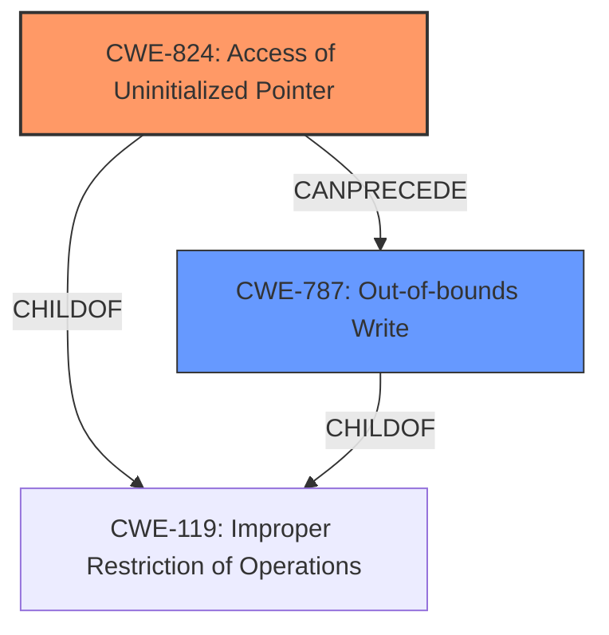

# Enhanced Analysis for CVE-2022-3378

# Summary
| CWE ID | CWE Name | Confidence | CWE Abstraction Level | CWE Vulnerability Mapping Label | CWE-Vulnerability Mapping Notes |
|---|---|---|---|---|---|
| CWE-824 | Access of Uninitialized Pointer | 0.9 | Base | Primary CWE | Allowed |
| CWE-787 | Out-of-bounds Write | 0.7 | Base | Secondary Candidate | Allowed |

## Evidence and Confidence

*   **Confidence Score:** 0.8
*   **Evidence Strength:** HIGH

## Relationship Analysis
The primary weakness is **CWE-824 (Access of Uninitialized Pointer)** which directly stems from the software's failure to initialize a pointer before its use. This can lead to unpredictable behavior and memory corruption. The resulting impact, an out-of-bounds write (**CWE-787**), is a consequence of the initial pointer issue. Therefore, CWE-824 precedes CWE-787 in the vulnerability chain.



## Vulnerability Chain
The vulnerability chain starts with the **lack of initialization of a pointer (CWE-824)**. This **uninitialized pointer** is then accessed, leading to an **out-of-bounds memory write (CWE-787)**. The root cause is CWE-824, and the impact is CWE-787.

## Summary of Analysis
Initially, CWE-787 was considered due to its prevalence in similar CVE descriptions. However, after closer examination of the vulnerability description and the supporting evidence, it became clear that the root cause is the **access of an uninitialized pointer (CWE-824)**, which then leads to the out-of-bounds write.

The vulnerability description clearly states: "If a user opens a maliciously formed FNT file, then an attacker could execute arbitrary code within the current process by accessing an **uninitialized pointer**, leading to an out-of-bounds memory write." This statement explicitly identifies the **uninitialized pointer** as the root cause and the out-of-bounds write as the consequence.

The "CVE Reference Links Content Summary" section reinforces this by stating: "The vulnerability stems from the affected product, Cscape, not properly validating user-supplied data within FNT files. Specifically, the software accesses an **uninitialized pointer**... Weaknesses/vulnerabilities present: Access of an uninitialized pointer (CWE-824) leading to an out-of-bounds memory write."

Therefore, the primary CWE is CWE-824, as it directly addresses the root cause of the vulnerability. CWE-787 is a secondary consequence.

The relationship graph highlights that CWE-824 can precede CWE-787, further supporting the chosen classification. The abstraction levels are appropriate as both CWEs are at the Base level.

Relevant CWE Information:

# Enhanced Context (25 CWEs)

## CWE-1289: Improper Validation of Unsafe Equivalence in Input
**Abstraction Level**: Base
**Similarity Score**: 0.79
**Source**: dense

**Description**:
The product receives an input value that is used as a resource identifier or other type of reference, but it does not validate or incorrectly validates that the input is equivalent to a potentially-unsafe value.
- Not Selected: This CWE is about improper validation of input. While the vulnerability involves a maliciously formed file, the core issue is the use of an uninitialized pointer, not the validation of input equivalence.

## CWE-252: Unchecked Return Value
**Abstraction Level**: Base
**Similarity Score**: 0.77
**Source**: dense

**Description**:
The product does not check the return value from a method or function, which can prevent it from detecting unexpected states and conditions.
- Not Selected: This CWE is not directly related to the root cause of the vulnerability. The vulnerability is due to accessing an uninitialized pointer, not due to an unchecked return value.

## CWE-457: Use of Uninitialized Variable
**Abstraction Level**: Variant
**Similarity Score**: 0.76
**Source**: dense

**Description**:
The code uses a variable that has not been initialized, leading to unpredictable or unintended results.
- Not Selected: The description mentions an uninitialized *pointer*, making CWE-824 a more precise fit than the more general "variable".

## CWE-606: Unchecked Input for Loop Condition
**Abstraction Level**: Base
**Similarity Score**: 0.75
**Source**: dense

**Description**:
The product does not properly check inputs that are used for loop conditions, potentially leading to a denial of service or other consequences because of excessive looping.
- Not Selected: This CWE is about unchecked input for loop conditions, which is not relevant to the described vulnerability.

## CWE-824: Access of Uninitialized Pointer
**Abstraction Level**: Base
**Similarity Score**: 0.75
**Source**: dense

**Description**:
The product accesses or uses a pointer that has not been initialized.
- Selected: This CWE directly matches the root cause of the vulnerability, where the software accesses an uninitialized pointer.

## CWE-703: Improper Check or Handling of Exceptional Conditions
**Abstraction Level**: Pillar
**Similarity Score**: 0.75
**Source**: dense

**Description**:
The product does not properly anticipate or handle exceptional conditions that rarely occur during normal operation of the product.
- Not Selected: This CWE is too general and high-level. The vulnerability is more specifically related to accessing an uninitialized pointer.

## CWE-691: Insufficient Control Flow Management
**Abstraction Level**: Pillar
**Similarity Score**: 0.75
**Source**: dense

**Description**:
The code does not sufficiently manage its control flow during execution, creating conditions in which the control flow can be modified in unexpected ways.
- Not Selected: This CWE is too general and high-level. The vulnerability is more specifically related to accessing an uninitialized pointer.

## CWE-183: Permissive List of Allowed Inputs
**Abstraction Level**: Base
**Similarity Score**: 0.75
**Source**: dense

**Description**:
The product implements a protection mechanism that relies on a list of inputs (or properties of inputs) that are explicitly allowed by policy because the inputs are assumed to be safe, but the list is too permissive - that is, it allows an input that is unsafe, leading to resultant weaknesses.
- Not Selected: This CWE is about a permissive list of allowed inputs, which is not relevant to the described vulnerability.

## CWE-754: Improper Check for Unusual or Exceptional Conditions
**Abstraction Level**: Class
**Similarity Score**: 0.75
**Source**: dense

**Description**:
The product does not check or incorrectly checks for unusual or exceptional conditions that are not expected to occur frequently during day to day operation of the product.
- Not Selected: This CWE is a class and is too general for this specific vulnerability.

## CWE-73: External Control of File Name or Path
**Abstraction Level**: Base
**Similarity Score**: 0.75
**Source**: dense

**Description**:
The product allows user input to control or influence paths or file names that are used in filesystem operations.
- Not Selected: While the vulnerability is triggered by opening a file, the root cause is not related to external control of the file name or path.

## CWE-476: NULL Pointer Dereference
**Abstraction Level**: base
**Similarity Score**: 4.33
**Source**: graph

**Description**:
CWE-476: NULL Pointer Dereference
- Not Selected: While similar, CWE-824 is more accurate. The pointer may not be NULL, but rather point to an arbitrary memory location. The description indicates an *uninitialized* pointer, not necessarily a *NULL* pointer.

## CWE-787: Out-of-bounds Write
**Abstraction Level**: base
**Similarity Score**: 4.33
**Source**: graph

**Description**:
CWE-787: Out-of-bounds Write
- Selected as Secondary: The **uninitialized pointer** results in the **out-of-bounds write**. This is the impact of the root cause, which is CWE-824.


## CWE Relationship Analysis

Current CWEs represent these abstraction levels: .


### Vulnerability Chain Analysis

**Chain starting from CWE-476:**
- 476 (NULL Pointer Dereference) - ROOT


**Chain starting from CWE-457:**
- 457 (Use of Uninitialized Variable) - ROOT


### CWE Relationship Diagram

```mermaid
graph TD
    classDef primary fill:#f96,stroke:#333,stroke-width:2px
    classDef secondary fill:#69f,stroke:#333
    classDef tertiary fill:#9e9,stroke:#333
```